# Building the Trium Printer

The reference information for Trium construction is the E-Mergin Innovation [User Manual (Ver 0.15)](https://emergin.net//user-manual/)  and the assortment of  [videos  on YouTube](https://www.youtube.com/watch?v=81HdwWcrpt0&list=PLMmAHPJoXlL8cp_-7R_6Hdb887jVPCUp3).

This document is supplementary to the E-Mergin reference documentation and serves to capture some of the information
-  found on the [Trium ProBoard web site](http://trium3d.proboards.com),
-  found on the [Trium Facebook page](https://www.facebook.com/groups/emergin/) (For my own part, I find the Facebook interface confusing and I don't spend much time there), 
-  learned by a few builders when contructing their Trium printers, and 
-  found on the internet,

Several Trium users also freely share their findings and proposals for improvement. MiR did a good job of documenting the build process [here](http://trium3d.proboards.com/thread/67/notes-building-trium-standard-diamond).  This document borrows text and pictures freely from MiR's write up. Several others also contribute freely to the forum and the facebook page and also made comments to this document, these users include janlu, Rajaa Kahel, mikeeitel, Bill B, digid, and others.

References to page numbers in the Trium User Manual (Rev 0.15) are given as pNN.

I am not yet finished building my Trium, neiter am I in too much of a hurry to do this quickly. The document will be updated every day or two with the latest information as I proceed. Visit here often to make sure you get the latest version.

This is my first printer and, despite my prior reading, the opened box posed quite a daunting picture. I enjoy writing and sharing  ([here](http://spie.org/Publications/Book/2021423) and [here](https://github.com/NelisW/ComputationalRadiometry)), so I decided to write up my experiences and learning  building up the printer. This document is offered in an effort to help others - especially novice 3d printer builders. My own status as a novice means that I can address some of your questions. I do not provide any guarantee, nor do I assume any liability for the content herein.  If it helps you I am happy, some other day perhaps you can help someone else. This is what open source is all about.

**Note:** Most of the work we do on the Top Plate electronics and extruder is in the upside-down orientation, which means that left and right are switched.  I frequently found myself forgetting this - always think about the Top Plate assembly orientation when considering left/right or the tower naming convention.

**Note:** Test and review at every step along the build process. You want to catch issues early and not at the end, forcing you to disassemble the printer.  If something is not clear,  search for information: Google is your friend!

http://reprapandme.blogspot.co.za/2013/12/the-basics.html

# Tools and consumables

During the course of the build process you would purchase some parts or materials to complete some actions. Most of these are listed below in context of the building process. I recommend that you also consider purchasing the following in some cases you only need a pinch or small scrap! Most of these I would never use in the printer itself, but if you need an M2x25 in the middle of the night, you will be glad having these around.

- A set of machine screws, nuts and washers.  I bough 10 each of M2x6, M2x10, M2x16, M2x20, M2x25, M3x6, M3x10, M3x16, M3x20, M3x25,  M4x6, M4x10, M4x16, M4x20, M4x25, M5x6, M4x10. With as many nuts and washers. 
- A 2 cm strip of thin double sided  tape (not the kind you mount mirrors with).
- A 10 cm strip of magic sticky tape.
- A roll or two of non-adhesive teflon plumbing tape.
- Heat conducting paste (check the operating temperature range, you need at least 260 deg C).
- Cable ties (small) to bind cables into bundles.
- Heat shrink in a variety of sizes.
- Thin machine oil for the ball joints - use sparingly!
- Optional: a six way screw-down terminal block
- Optional: latex or nitrile (medical) gloves  when you work with sticky or lubrication products.
- Optional: in case you need this, some 14 SWG (or 2.5mm2) wire and 22 SWG hookup wire in black and red.
- Optional: some self-adhesive Kapton tape.
- Optional: Loctite thread lock or equivalent - but be careful, once stuck it is hard to remove a screw.

The following tools will come in handy:

- A set of Allen keys.
- A set of spanners or wrenches, down to 5 mm. A 7 mm spanner is required to fit the nozzle.
- A set of jeweller's screw drivers with Allen, Philips and flat heads.
- Tweezers.
- Two long nose pliers (short and long).
- Side cutter.
- Small regular pliers.
- Set of flat and Philip screwdrivers.
- Pencil-style craft knife.
- Hand drill and drill bits - only used a few times.
- Optional but highly recommended!: a multimeter that can measure AC volts, DC volts, resistance, and possible temperature with a thermocouple.
- Optional: Cutting board or other work surface (don't work on your Oak or Rhodesian Teak dining table).
- Optional but really useful: Heat gun for shrink sleeving. Also used later to heat up the print bed or prints.
- Optional but really useful: Digital or manual vernier caliper. Also used later when calibrating the printer.
- Optional: a k-type thermocouple thermometer that can operate up to 300 deg C. Required to build trust in/calibrate the thermistor.
- Optional: Dremel, but this is just really to play with. I used it once in the TRIUM construction.
- Optional: a set of feeler guages to use instead of the sheet of paper when setting up the nozzle-bed distance.

You may also find it necessary to have some parts printed using a printing service, simply because your own printer is not working yet.

# Conventions

E-Mergin refers to the three vertical parts as "beams".  Beams, in construction, refer to a part that experiences lateral forces. Such parts are normally horizontal and carry downward forces such as weight.  In this document I prefer to use the word "tower" or "column", which signifies a vertical structure.

Label cables for future reference.

There could be confusion with delta printers because the towers are designated by X, Y, and Z, and the cartesian printer coordinates are also designated by the same three letters.  For the purposes of this document the towers are defined in capital letters X,Y, and Z, whereas the coordinate system axes are designated by lower case letters x, y, and z.

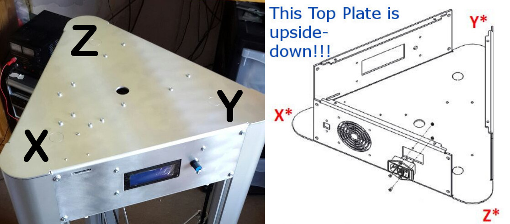
[Looking at the front of the printer](https://groups.google.com/forum/#!msg/deltabot/nGpbRPdhAz0/kueyazbXeXAJ) with the LCD facing you (p16):
- X tower is on the front left, Y tower is on the front right, and Z tower is in the middle back.
- The origin (x,y)=(0,0) is in the center between the towers.  This is different from a Cartesian printer where the origin is in some corner.
- Increasing x is left to right, movement to the left of center is -x, and movement to the right is +x
- Increasing y is front to back (toward Z tower). Movement towards the front is -y, movement toward the back is +y.
- z movement is up and down. Touching the print surface is z=0, z_zero or z_min.
- All axis home in the MAX direction
- In the firmware `configuration.h` file the x,y Min/Max values are defined as
		#define DELTA_PRINTABLE_RADIUS 110.0
		#define X_MAX_POS DELTA_PRINTABLE_RADIUS
		#define X_MIN_POS -(DELTA_PRINTABLE_RADIUS)
		#define Y_MAX_POS DELTA_PRINTABLE_RADIUS
		#define Y_MIN_POS -(DELTA_PRINTABLE_RADIUS)
- issue G1 X-50 Y0, Z0: then X will move up, Y will move down and Z will not move. You can also manually move the end effector with the power off and verify it.

The following picture obtained [here](https://print3d.com.pk/wp-content/uploads/2015/09/Delta-Kossi-Build-Manual.pdf) shows the coordinate system (not the tower naming) convention in graphical form:
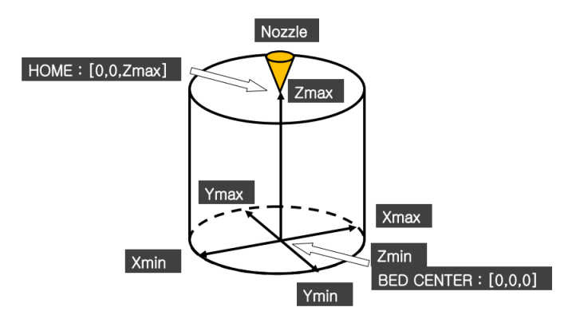

# Notes

## Software

This document does not cover software issues.  Before using the printer be careful to [set up the software](https://www.youtube.com/watch?v=bPBlYPV2sME&index=19&list=PLMmAHPJoXlL8cp_-7R_6Hdb887jVPCUp3) to the correct settings. In particular, the slicers must be set up for the Trium delta printer defaults.  The slicer software does *not* work correctly by default straight from the box.

## Noise damping

The all-metal Trium frame is superbly stiff and stable.  However the stiffness means that it resonates well (and at high frequency) and hence propagates vibration noise very, very well. This increases the overall noise level: anything that moves anywhere causes some resonance noise somewhere else.  For this reason apply vibration damping where ever you can. A case in point: slide a metal object across the Top Plate air vents; they ring very nicely at a high frequency. Fixing some rubber or silicon to the inside of the vent strips should reduce this particular vibration mode.  Fortunately, because of the superb frame stiffness the resonance frequencies are quite high - which means small displacements with lower energy; which should be easier to dampen.
- There is  a [design for a set of damping foot pads](https://www.facebook.com/groups/emergin/permalink/1870842983153461/) on [thingiverse](http://www.thingiverse.com/thing:2041200).
- You can use noise dampers on the tower stepper motors (see below).
- Rajaa replaced the rod-retaining springs with a rubber band to reduce spring noise.
- Replacing the DRV8825 drivers with [TMC2100 drivers]( https://www.facebook.com/groups/emergin/permalink/1869317553306004/) (not yet fully sorted out).
- Add an inline switch to the print cooling fans so that they can be switched off when not used. Do *not* switch off the fans on the electronics or print head heat sink.
- Jean Marc Cierniewski investigated using [small o-rings when mounting fan ducts](https://www.facebook.com/groups/emergin/permalink/1871767846394308/), but believes that there is more vibration on the rods.  However, using these o-rings on the main cooling fan mounted to the aluminium frame made a big difference.  You could also use rubber grommets to mount the fan.
- I pushed in a narrow strip of high density packing foam between the power supply and the Top Plate air vents to dampen the vibration of the vent strips.  There is a little vibration, but it diminishes quickly.
- I also put compacted  plastic foam sheeting inside each tower to dampen the ringing.

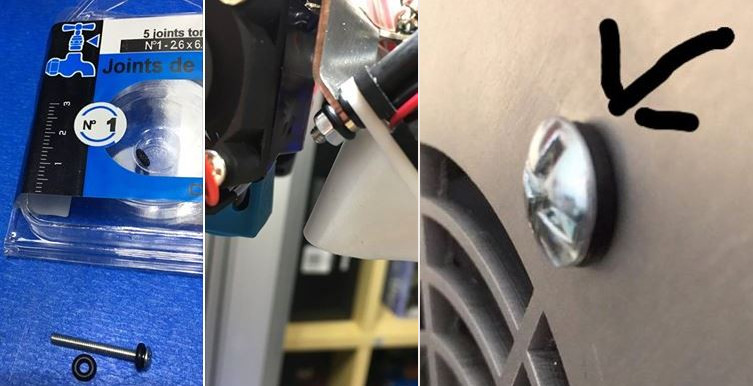 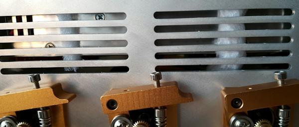

## Electrical supply safety

If wired correctly, the electricity supply convention in most parts of the world (except the US, it seems) is as follows:

- The green (or green/yellow) wire is 'ground'/'earth',  linked to a low resistance peg driven into the soil at your house, fixed to a conducting water pipe or linked to a peg driven into the soil at your electricity utility connection point (in the street or at a local substation).  This is the best reference of zero voltage under normal conditions.   If your feet are touching wet soil and you touch the earth/ground wire nothing will happen.
- The blue wire is 'neutral' (also known as null) meaning that it should normally be at a low voltage relative to earth. Depending on the local electricity safety code, neutral is normally connected to earth/ground at the point where the electricity enters your house. If your feet are touching wet soil and you touch the neutral wire nothing will happen under normal circumstances.
- The brown wire is 'live' and is at 115 or 230 V relative to neutral. This is the dangerous wire. Under normal circumstances the electricity flows between live and neutral. No current from live/brown ever flows to the green/earth wire (if it does, this is called a fault condition). If your feet are touching wet soil and you touch the live (brown) wire the electricity will flow from live, through your body and feet into the earth/ground, potentially killing you in a most unpleasant manner.
- Most electricity safety codes require a device (residual current device or earth leakage relay) which measures the difference in current flow between live and neutral. If this current exceeds some small value (20 mA) it means that some current from live is flowing to earth: an undesired fault condition.  The device then breaks the electricity supply - not because of over-current but because of current earth leakage.

All of the above apply when a three-pin connection is made to the electricity supply. If your country only have a two-pin supply or if your cable only has two pins and no earth conductor, the situation is very different. The wall plug can be plugged in in any orientation: there is no disctinction between Live and Neutral any more. And even worse, there is no Earth connection.  Also, despite electricity safety codes' requirements, it may be that in some cases the Live and Neutral wires are exchanged, so that the terminal labelled with 'Neutral' may in fact be live.  This can happen is someone wired a plug the wrong way around - which happens frequently.  

According to [this video](https://www.youtube.com/watch?v=Bqar4cuVF_A), the colour code (or is it color code?) in the US is as follows. So please translate the colours to your local custom.  Please take the time and watch this video.

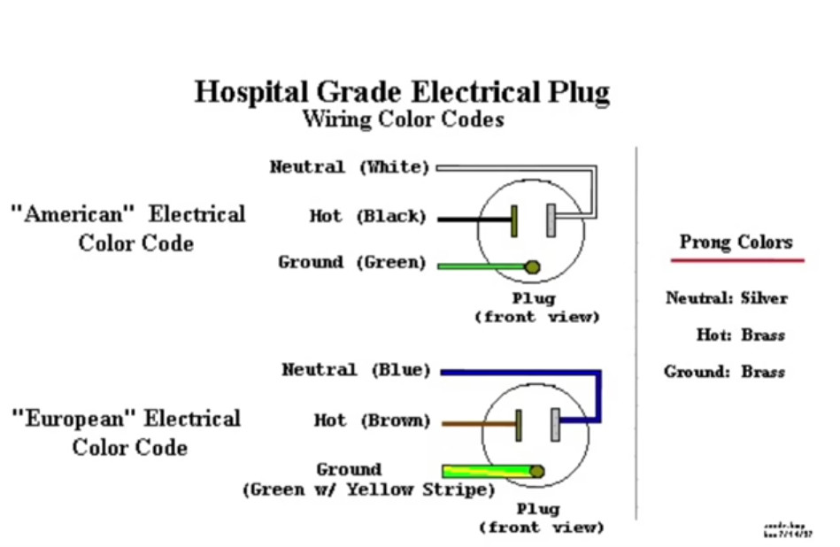

**So please consider the Neutral/Null and Live wiring in your printer as equally dangerous. Always afford Neutral the same respect you would show Live!**

**Never connect Neutral/Null or Live to Earth in the printer, it may lead to earth leakage conditions.**  Connecting Earth to Neutral is your electricity supply utility company's concern, they will do it according to their codes. Don't violate their codes by doing it yourself in your house or in your printer.

**Never connect Neutral/Null or Live to your Trium case,  or if your supply only has two wires, don't connect either to the case.**

### Connecting the Trium frame/case
At this point the issue of case earthing or grounding should be considered. The question is which of these do you connect and why?  There are three 'zero' potential locations to consider:

- Your 115/230V earth/ground, the green (green/yellow) wire from the house network (if Earth is available).
-  The Trium metal case.
-  The power supply zero voltage terminal (by convention zero voltage is normally the negative (black or -) terminal in the bipolar power supply, whereas the positive (red or +) is at some nonzero voltage (12V in this case).

The User Manual does not prescribe any connection: all three a disconnected from each other (if there are no connections inside the power supply, which is normally the case).  All three therefore 'float' with respect to each other: there can be some voltage between any of these.

If you are at all unsure, follow the Trium instruction, but just be very careful with the mains wiring!

For more information see [here](http://www.ese.upenn.edu/detkin/instruments/misctutorials/Ground/grd.html), [here](https://celectronics.com/pdf/IEEE11-9-05.pdf), and [here](http://www.allaboutcircuits.com/textbook/direct-current/chpt-3/safe-circuit-design/). See also [this video](https://www.youtube.com/watch?v=Bqar4cuVF_A)

#### Earth connection
If you have a three-pin electricity supply: 
Let us review connecting the electricity supply Earth to the Trium case with a secure and low resistance bond.  In this case the earth leakage protection will work if you accidentally touch the case and live.  The procedure is normally followed in domestic devices containing metal frames (bed lamps, clothing irons, stoves, kettles, etc.).  From a human safety and fire hazard perspective this is the safest approach.  You make your own decision.

If you have a two-pin electricity supply, there is no Earth to connect to the case. **Don't connect either of the two wires to the case**.

#### Power supply connection

It the printer electronics PSU module zero (black wire) is not connected to the frame, it means that the electronics reference floats with respect to the frame.  Any part of the electronics can touch the frame with no ill effect.  The disadvantage of this approach is the EMI is harder to control because the frame/case is floating with respect to the electronics.

If the power supply 0V negative/black is securely connected to the chassis, the case is not floating with respect of the electronics and EMI is easier to contain. However, because the frame is now at the 0V reference, if the +12V or some electronics output now touch the frame it will result in a short circuit fault, possibly destroying electronics components. For this reason some people prefer to fit a low resistance 100-1000 Ohm between the case and negative/black which will somewhat limit the current flow under fault conditions, but prevent electrostatic voltage buildup damage to the electronics.

#### Where to connect to the frame/case

Generally speaking, bonding the Earth (if done) and the printer power module to the case should be done at one point and one point only. Do not rely on the case to provide ground current flow (this will lead to earth loops and the EMi will be worse). So the electronics ground wiring should never touch the frame, except at this one point. In some cases it may have benefits to have the frame as ground plane, but it requires very careful design and is outside the scope of this project.

My preference would be to take two wires (one from green/earth and one from negative black) and connect both to a single point on the chassis.  You decide for yourself.

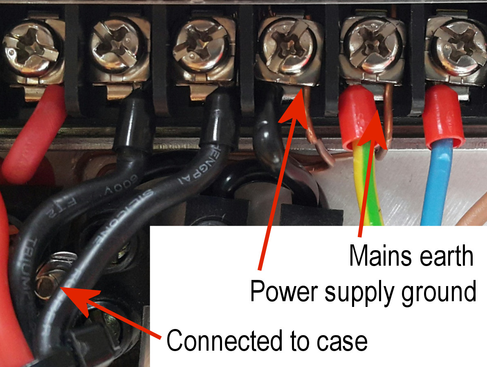

### Supply wiring safety test

**Please do this test!**  
*In the entire procedure below the printer should not be plugged into the electricity supply in the wall.*  We want to measure the wires that normally carry lethal voltages when plugged into the wall. So please pull the plug and keep it pulled.  In this procedure we assume that your house wiring is done correctly and we now want to verify that the printer and cable used with the printer is set up correctly.
- Unplug the black printer supply cable from your mains connector in the wall.  In other words, pull the mains plug well free from the electricity suppply.  And keep it free for the entire test.
- Plug the kettle cord side into the C14 connector on your printer (the C14 is the thing in the pictures below).
- Switch off the C14 switch on the printer (0 position).
- Use the table below and measure the continuity between the pins on the plug that normally goes into the wall (but don't plug it into the wall!!!) and the wires on terminal on the printer's power supply (picture above).

|- | Earth (green/yellow)| Neutral (blue)| Live (brown)|Frame|
|----|:----:|:----:| :----:|:----:|
|Earth pin on plug| *conduct* |**open**| **open**|your choice|
|Neutral  pin on plug|**open**|*conduct*|**open**|**open**|
| Live  pin on plug|**open**| **open**|*conduct* if C14 'on'|**open**|
| Live  pin on plug|**open**| **open**|*open* if C14 'off'|**open**|

- Depending on whether the C14 switch is on or off the live should conduct or open.
- Measure the full matrix of possibilities above and make sure that your results exactly match the table above.  If you have a *conduct* on any position where it should be **open** please take your printer to a certified electrician to correct. This really important and you could kill yourself or a member of your family if you are reckless in this regard.
- Now remove all measurement equipment from the printer, ensure that there are no wires touching the Neutral or Live wiring in the printer.
- Tip: never make temporary connections to Live or Neutral with the intent to remove it later.  The devil will have it that such wires stay and you may hurt yourself, despite your best intentions.

## The light in the power switch

The power switch has a light to indicate the power status.  The Trium Manual does not show how to wire the switch for activating the light when power is on.  [Justin Smith shows](http://www.doityourself.com/forum/electrical-ac-dc/529348-need-help-wiring-inlet-male-power-rocker-switch-lighted.html) how to connect the light. However, his description was the wrong way around for my switch!  After some sparks and one power over-current trip I came to the conclusion that there are two possible wiring options, depending on the orientation of the switch (see below).

Only deviate from the Trium-proposed wiring if you really know what you are doing (or get a certified electrician to do this for you).

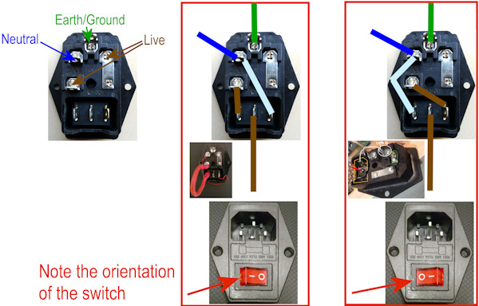

## Printer PSU Operating voltage

The Trium printer uses a 12 V power supply.  Under certain circumstances you may want to increase the power supply voltage up to 14 V.  The Arduino board has a voltage regulator and can take higher voltages.  None of the components on the RAMPS board could destruct at 14 V, so it seems nominally safe to operate at up to 14 volts.

Why would you want to do this?  The heaters in the hot end and hot print bed have fixed resistance values. By increasing the supply voltage they can reach higher temperatures. Increasing the supply from 12V to 14V will increase the power dissipation by 36%, which is substantial.  

Keep in mind, however that many components (LED lamps, fans, etc) are rated for 12 V operation, so you would need to lower the voltage on these by a secondary regulator or by dropping the positive supply voltage with three diodes in series (3x0.6V=1.8V).

Generally speaking you lower electronic/electric component failure rates by working at the lowest current or voltage where the device still works correctly.

## Electric mains spikes, filters and USB

Spikes on the mains supply can cause problems with electronic equipment, see [here](http://7ms.com/enr/online/2010/02/notebook.shtml) and [here](http://www.emcfastpass.com/avoid-the-most-common-failures-with-these-7-essential-emc-design-rules/). Something switched on in the house somewhere causes some effect in the printer. Apparently this effect is worse [when using USB](https://m.facebook.com/groups/1798144480423312?view=permalink&id=1863328043904955), see also [here](http://www.st.com/content/ccc/resource/technical/document/datasheet/ae/09/87/c5/c7/6b/4e/8a/CD00002023.pdf/files/CD00002023.pdf/jcr:content/translations/en.CD00002023.pdf).  The failure appears randomly in the print, not always one the same layer.  Obviously, the longer the print time, the bigger the risk that the print might be interrupted.  Try so see if a better quality USB cable can prevent the problem.

If the spikes arrive via the mains power supply, the best solution is to install a EMI filter or spike protection device in the mains power supply.  This EMI filter is not the same as a surge arrestor.  The surge arrestor prevent over-voltage conditions (i.e., lightning) by short circuiting itself.  The EMI filter has no effect on the supply voltage, but suppresses spikes or other high frequency noise on the supply wires.  The use a and design of these filters are given [here](http://www.eetimes.com/document.asp?doc_id=1230404) and [here] (http://www.emfrelief.com/capacitive-filters.html).  These filters are not often built into mains extension leads or distribution panels.  The filters can be bought in [PCB format](http://www.ebay.co.uk/itm/3900W-EMI-18A-High-Frequency-Power-Filter-Board-DIY-Kits-For-Speaker-Amplifier/262372720254?_trksid=p5713.c100284.m3505&_trkparms=aid%3D111001%26algo%3DREC.SEED%26ao%3D11%26asc%3D20140905073823%26meid%3D8e1126b342874e4db679d35183853806%26pid%3D100284%26rk%3D2%26rkt%3D10%26sd%3D262372720254) or packaged in a [small case](http://www.ebay.co.uk/itm/TDK-Lambda-250V-10A-EMC-EMI-Line-Noise-Filter-IEC-Socket-/172143349786?hash=item28148b101a:g:3b0AAOxycmBS7xwu) or even a [C14 switch](http://www.ebay.co.uk/itm/CW1D-10A-T-IEC-320-C14-EMI-filter-AC115V-250V-w-Boat-Switch-w-Fuse-Holder-/121724133961?hash=item1c5752e249:m:mxn_Yfl1MzTqc_dv1-_I4UA).  When you buy such a filter, just make sure that it can operate at the power ratings used in 3D printers.

## Auto shut off

Given the heat a 3D printer can generate, even when idle, Jeremie Francois would better [auto switch it off](http://www.tridimake.com/2012/11/auto-shutoff-at-end-of-print.html)  than let it powered unattended. In the case of Trium printers, I would also like to switch off when the magnetic bearings disengage.  Francois  used a relay to control the mains power supply. He controls the relay with the `A0` pin on the Arduino. The printer is started with a push button which powers on the printer, making `A0` go high.  The `A0` pin fires up the relay and power is sustained through the relay (`A0` remains high).  To auto switch off, add the `M81` command as the last command in the gcode. This command makes the pin `A0` go low and the relay releases, dropping power to the printer.

## Trium modifications to the Marlin firmware

The standard Marlin open source firmware source is available [here](github.com/MarlinFirmware/Marlin) or one of the Release Candidate versions [here](http://marlinfw.org/meta/download/).  The E-Mergin web site provides a **modified** version of RC7, but note that the GitHub version has moved beyond RC7 (RC8 has *many* differences with RC7).  Be very careful to replace the TRIUM RC7 firmware with RC8 firmware. Ensure that you understand the differences between RC7 and RC8 as it pertains to the TRIUM.  E-Mergin provided the following [instruction](http://trium3d.proboards.com/thread/68/upgrade-marlin-1-rc8-planned) to upgrade from RC7 to RC8: download RC8, and replace the configuration.h and configuration_adv.h files using the the previous version files.

At least the following files are modified in the Trium hot end version of RC7 (relative to the Marlin standard RC7):
-  `_Bootscreen.h`: a new file not present in the standard Marlin distro (possibly showing the Trium or E-Mergin logo?)
-  `Configuration.h`: a heavily modified file, for TRIUM printer info.
-  `Configuration_adv.h`: slightly modified for TRIUM printer info.
-  `Marlin.ino`: no significant changes, only TRIUMs weak attempt to time stamp.
-  `pins.h`: modified to only include the `pin_RAMPS.h` file, other file includes are removed
-  `pin_RAMPS.h`: slightly modified for TRIUM printer info.
-  `pins_xxxxx.h` a large number of pin definition files are removed, only `RAMPS.h` is retained.
-  `ultralcd.cpp`: slightly modified for TRIUM printer info.
-  `ultralcd.h`: slightly modified for TRIUM printer info.
-  `Version.h`: modified with TRIUM web site info.
-  `fonts/*.*` is a new folder containing some font info (possibly for the LCD).

The two TRIUM firmware versions (standard/DH and E3D) differ in the following file:
-  `Configuration.h`: different temperature sensor `TEMP_SENSOR_0`.
	-  The E3D uses sensor 5: "100K / 4.7k - ATC Semitec 104GT-2 (Used in ParCan & J-Head)"
	-  The standard hot end uses sensor 11: "100k / 4.7k beta 3950 1%".

For more information see:
- [Configuring Marlin](http://marlinfw.org/docs/configuration/configuration.html)
- [How to flash](http://marlinfw.org/docs/basics/install.html)
- [Automatic Bed Leveling](http://marlinfw.org/docs/features/auto_bed_leveling.html)
- [Linear Advance extrusion algorithm](http://marlinfw.org/docs/features/lin_advance.html)
- [Marlin development](http://marlinfw.org/meta/development/)
- [List of GCodes understood by Marlin RC8](http://marlinfw.org/meta/gcode/)
- [Printer codes](http://trium3d.proboards.com/thread/7/printer-codes).

# Components used in the Trium

## Stepper motor

Trium uses the [MT-1703HS168A 43Ncm](http://www.motechmotor.com/products_detail.php?id=147&cid=&page=1) [stepper motor](http://forum.arduino.cc/index.php?topic=284828.0) with the following specification:

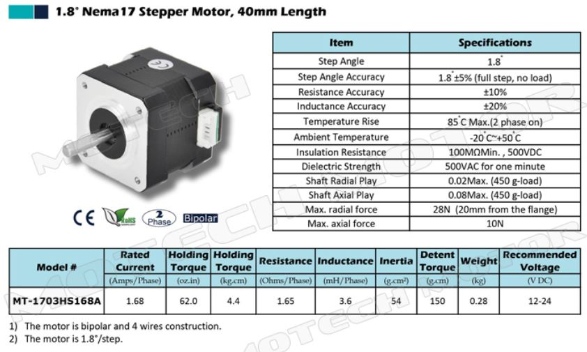

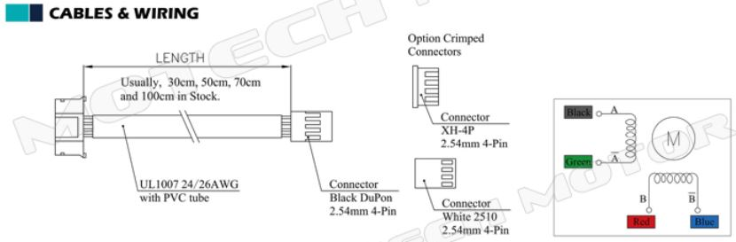

The Trium stepper motor has a maximum current rating of 1.7 A with a 1.67 Ohm coil resistance, which indicates a maximum motor supply of 2.8 V (using Ohm's law).  Using this motor with 12 V would allow higher step rates, but the current must actively be limited to 1.7 A to prevent damage to the motor.

## DRV 8825

The DRV8825 driver schematic diagram shows the trim potentiometer used to set the current limit. The current is limited to 2xVref. The Polulu diagram below shows a 10 kOhm trimpot, but the average resistance measured on the PCBs supplied with the Trium is around 7.67 kOhm. The Trium instruction is to set the resistance between Vref and GND to 2.2 kOhm.  Simple math shows that Imax = 2xVref=2x3.3x2.2/7.67=1.9A, with Vref=0.95V.  It seems then that the Trium stepper motors are driven somewhat (10%) beyond the design rated current.

The end-to-end resistance of the six trimpots for my printer measured 7.5, 7.4, 8.22, 7.61, 7.73, 7.59 kOhm.  This means that the current limits range from 1.77 A to 1.9 A. This 6% spread is probably fine, but if you require more accurate settings, it would be better to adjust the trimpots so that the reference voltage is around 1.7/2=0.85V.

See the notes below in the extruder section where it is described why and how the current limit setting should be adjusted to prevent filament grinding.

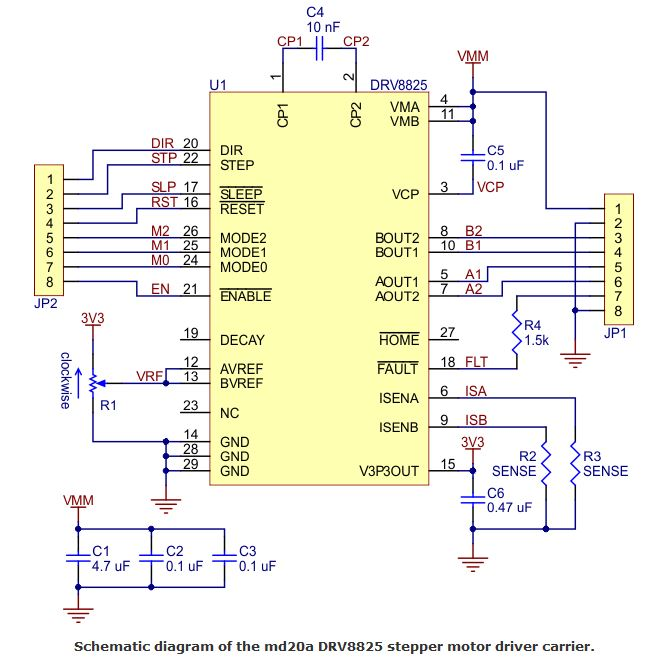

The boards supplied with Trium are not Polulu driver boards, but some useful information are given [here](http://reprap.org/wiki/Pololu_stepper_driver_board), [here](https://www.pololu.com/product/2132), and [here](https://www.pololu.com/product/2133), read with the necessary care.

## RAMPS board circuit diagram

The RAMPS circuit diagram is available [here](http://reprap.org/mediawiki/images/3/3f/Arduinomegapololushieldschematic.png) and [here](https://download.lulzbot.com/AO-100/hardware/electronics/RAMPS_1.4/RAMPS_1-4manual.pdf). and [here](http://www.reprap.org/mediawiki/images/0/06/RAMPS_dossier.pdf).

Also see the very useful [RAMPS information wiki](http://reprap.org/wiki/RAMPS_1.4), such as component identification, jumper settings and connecting to the RAMPS.  The wiring shown on this page is not fully Trium compatible, so read with care.

## Thermistors

The thermistor used by E3D-Lite6 is not the same as the one uses with E-Mergin hot end and the Diamond hot end.  Both have 100kOhm resistance at 25 deg C, but they have different [B or beta temperature coefficients](https://en.wikipedia.org/wiki/Thermistor). So, just measuring the resistance at room temperature will not help you discriminate between the two sensors: measure with the sensor at a known elevated temperature (see value below at the boiling point of water - don't put the open thermistor in the water, it is not waterproof). To measure the resistance values around room temperature is not sufficient, because the resistance differences are within sensor tolerance.

-  The E3D hot end ([firmware here](https://emergin.net/download/marlin-rc7-trium3d-e3d-26-11-2016/)) uses  the [104GT-2 Semitec](http://www.atcsemitec.co.uk/pdfdocs/GT-2-glass-thermistors.pdf) 100kOhm NTC Thermistor, with beta=4267K, nominal resistance values of

|Temperature | Resistance kOhm |
|----|----|
|20|126.8|
|25|100|
|50|33.49|
|100| 5.56|
|150|1.36|
|200| 0.439 |
|250|0.1475|

-  The standard E-Mergin and Diamond hot ends ([firmware here](https://emergin.net/download/marlin-rc7-trium-22-nov-2016/)) uses (according to the BOM) a [cheap 3950 thermistor](https://cdn.shopify.com/s/files/1/0658/7659/files/NTC-Thermistor_3950_Datenblatt.pdf) with beta=3950K, which has a nominal resistance

|Temperature | Resistance kOhm |
|----|----|
|20|125.25|
|25|100|
|50|35.9|
|100|6.7|
|150|1.77|
|200|0.582 |
|250|0.23|

Investigate the [temperature measurement](http://reprap.org/wiki/Thermistor) resolution. The 3950 thermistor temperature resolution values are investigated here.  From the RAMPS circuit diagram I conclude that there is no resistor in parallel with the thermistor and hence the sensor resolution in the range 230C to 250C is about 1 ACD unit per deg C.

	ADC_count = 1024*Vout/Vref = 1024* Rth /(R2+Rth)  # for 100K thermistors without parallel resistor

|Temperature | 3950 Resistance kOhm | ADC|
|----|------|----|
|230|0.328|66.8|
|250|0.23|47.7|

The two TRIUM firmware versions ([standard/DH]((https://emergin.net/download/marlin-rc7-trium-22-nov-2016/) and [E3D](https://emergin.net/download/marlin-rc7-trium3d-e3d-26-11-2016/)) differ in the file `Configuration.h` file: different temperature sensor `TEMP_SENSOR_0`.
- The E3D uses sensor 5: "100K / 4.7k - ATC Semitec 104GT-2 (Used in ParCan & J-Head)"
- The standard hot end uses sensor 11: "100k / 4.7k beta 3950 1%".

The thermistor resistance values given above are open circuit values, but in the RAMPS board these thermistors are in a [circuit ](http://reprap.org/wiki/Thermistor) voltage divider configuration with a 4.7 kOhm resistor, with a noise filtering capacitor to ground.

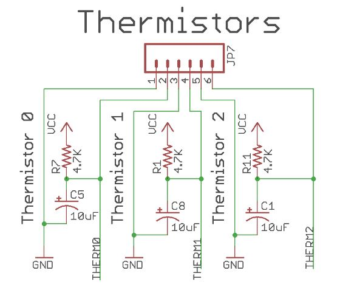

It would not normally be necessary to calibrate your thermistors, but if you need to, see [here](http://reprap.org/wiki/Thermistor), [here](http://www.thingiverse.com/thing:103668), [here](https://github.com/reprap/firmware/blob/master/createTemperatureLookup.py), and [here](http://hydraraptor.blogspot.co.za/2007/10/measuring-temperature-easy-way.html).

## Rod replacement

Steffen Bleich had a mishap where some rods broke.  He ordered this rods [here](https://www.ultibots.com/magball-arms-288mm-delrin/) in the hope that it will work also fine or maybe even better.  The rods obtainable [here](https://www.ultibots.com/magball-ends-set-of-12/) already include the required 12 balls and nuts. The balls have a M3-thread and should fit fine into the Trium hardware. The maker of the rods is [this company](https://groups.google.com/forum/#!msg/deltabot/mPw1SJ2f9Vw/55vmV3sPDQAJ)

## Bed levelling sensor

The inductive sensor reacts to metal only (not to glass). The 4 mm detection range apply when used with iron, [for aluminium the distance](https://3dprint.wiki/reprap/anet/a8/improvement/autobedleveling) is around 1.2-1.5 mm (so don't use a glass bed on top of the aluminium).

The sensor needs a power supply from 6 to 36 V (12 V for the Trium). The output signal can then potentially swing between near zero to the sensor supply voltage - and this could exceed the allowable voltage on the Arduino input pin. In this case some voltage conditioning is required. Sometimes the sensors are working at 5V (the voltage delivered by the RAMPS board), however, most of the sensors need a higher voltage to work.

The Trium BOM states that a LJ12A3-4-Z/AY sensor is used (2017-01-15).   The wiring modification E-Mergin supplied on the [KickStarter page]((https://www.kickstarter.com/projects/873464596/trium-delta-3d-printer/posts/1754830) shows a LJ12A3-4-Z/BY.

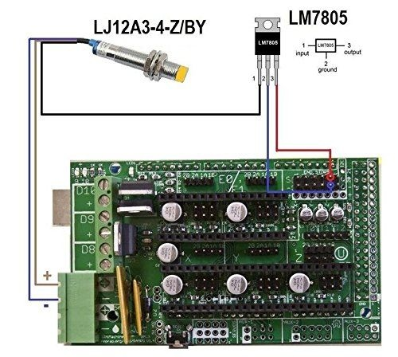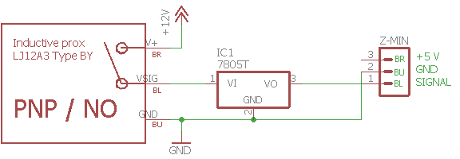

You can see which sensor was delivered with your kit by looking at the small label on the device.  My kit, as delivered contains one LJ12A3-4-Z/AY sensor and one LJ12A3-4-Z/BX. The LJ12A3-4-Z/BY wiring supplied on the Trium KickStarter page therefore *does not apply to my sensors*.  The Chinese suppliers appear not very diligent on delivery of the exact model you ordered. The electronics circuits and firmware settings for each of these three types are different, so what works for the one will not necessarily work for the other.  I put together information from a number of sources in the tables below to show the differences between the different sensors. In the figure below I show a switch but in the hardware a transistor or FET is used: so it is not just an isolated switch, it has voltage levels referenced to the rest of the electronics.

|[Model](https://opencircuit.nl/ProductInfo/1000064/LJ12A3.pdf) | Config | Switch |Where identified|In my kit|
|----|----|----|----|----|
|LJ12A3-4-Z/AY|PNP|NC|BOM|Yes|
|LJ12A3-4-Z/BY|PNP|NO|Wiring picture|-|
|LJ12A3-4-Z/BX|NPN|NO|-|Yes|

<a href="https://opencircuit.nl/ProductInfo/1000064/LJ12A3.pdf">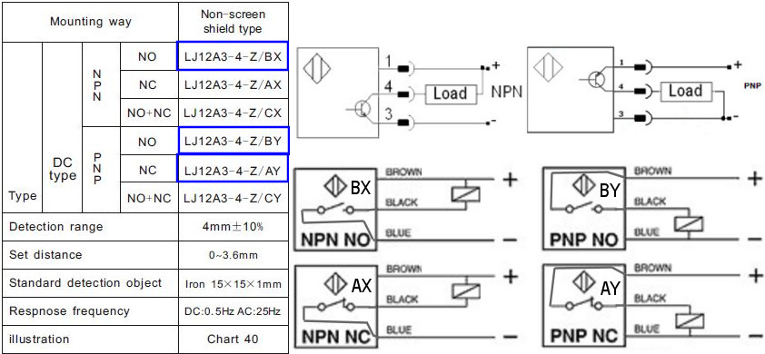</a>

Designing an interface between the sensor and the Arduino is [further complicated](https://3dprint.wiki/reprap/anet/a8/improvement/autobedleveling) by the fact that the open collector status of the sensor is not known (Chinese versions apparently mostly/often have pull-up resistors internally to the sensor: there could be a voltage on the black wire).  Depending on your sensor:
- NPN with no internal pull-up resistor to +V (open collector): safe to use with 5V Arduino.  Just connect to the board, but switch on the Arduino internal  pull-up resistor or add one externally.
- NPN with an (unknown value) sensor-internal pull-up resistor to +V: the voltage on the sensor  output may exceed 5V when not triggered. Some form of voltage conditioning is required; internet posts propose opto-couplers, voltage dividers or diodes in various configurations.
- PNP output voltage will always swing between near zero and the sensor supply voltage. Some form of voltage conditioning is always required; internet posts often propose voltage dividers.

To determine if the sensor is open collector, wire it up and measure the output voltage (black) with respect to ground (blue). When triggered, if the output voltage does not change significantly it is open collector.  If there is an internal pull-up resistor the measured signal voltage will change.

The [MEGA 2560](https://www.arduino.cc/en/Main/arduinoBoardMega2560) digital pins have internal pull-up resistors of 20-50 kOhm that are by default *disconnected* from the pin. A pin can be connected to the internal pull-up resistor by a firmware command (not sure what Marlin does).  Any external resistor network connected to the pin will be affected by the internal pull-up resistor, if connected by firmware. So be careful when devising voltage divider circuits.

Most logic conventions assume a high value to mean a triggered value and a low value to mean the absence of the trigger (this is known as positive logic).  Depending on the normally open (NO) or normally closed (NC) option and the NPN/PNP configuration, the sensor logic can be positive or negative.  Hence,  you must set up the firmware to match the logic of the sensor. The Trium the sensor is connected to the ZMIN endstop pin (ZMAX is connected to the switch).   In Marlin the ZMIN logic convention is defined in the line `#define Z_MIN_PROBE_ENDSTOP_INVERTING xxxx  // set to true to invert the logic of the endstop` in the file `configuration.h`.

|xxxx |NO|NC|
|----|----|----|
|PNP|false |true |
|NPN|true |false |

So in my case with both NO and NC sensors, it seems that I would have to reflash the firmware for changing logic  when changing printing heads.  A better solution would be some electronics on the printing head that will always give a consistent polarity output.

After some consideration I decided on the following solution. **This is not yet built and tested**. The idea is to employ an opto-coupler circuit to take care of the voltage incompatibilities and also to configure the output logic to be positive (1 for proximity and 0 for not proximity), irrespective of the sensor on my print head.  The wiring for each sensor configuration is slightly different but the output logic to the Arduino firmware is consistent between the variants.  The component values are selected for a 10 mA LED current and assuming a 1:1 ratio between LED current and transistor current.  Depending on the value of the Arduino internal pull-up resistor the NO `low` voltage will be between 0.3 and 0.7 V.  The sensor positive supply voltage will be 12 V, taken from the red heat sink cooling fan wire, and the ground will be taken from the black heat sink cooling fan wire. Cut the three sensor wires (BR=brown, BU=blue, BL=black) and insert the opto-coupler components as shown below.

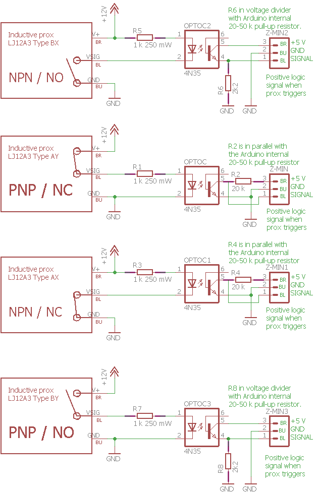

Test the probes operation [as follows](https://www.repetier.com/documentation/repetier-firmware/z-probing/): 
First check is always if signals are correct. So send M119 and see that z probe shows a “L” for low = not triggered. Now trigger it by hand while sending M119 again. Now probe value should show a “H” for high = triggered. If it is the other way around you need to change `Z_MIN_PROBE_ENDSTOP_INVERTING` (`Z_PROBE_ON_HIGH` for Repetier firmare). If nothing changes you have either the wrong pin used or configured, or pull-up must be different. Fix it and continue.

For more information see
[Repetier firmware z-probe details](https://www.repetier.com/documentation/repetier-firmware/z-probing/), 
[description of how the sensors work](http://www.ab.com/en/epub/catalogs/12772/6543185/12041221/12041227/print.html), [description and circuit diagram](http://www.electroschematics.com/12295/inductive-proximity-switch-w-sensor/), [opto-coupler connection](http://electronics.stackexchange.com/questions/101624/how-to-connect-a-inductive-proximity-sensor-switch-npn-dc6-36v-to-pic18f4550-5v), [here](http://forums.reprap.org/read.php?219,533688,539308), [here](http://electronics.stackexchange.com/questions/101624/how-to-connect-a-inductive-proximity-sensor-switch-npn-dc6-36v-to-pic18f4550-5v), [here](http://www.thingiverse.com/thing:539692), [here](http://forums.reprap.org/read.php?219,533688,539308), [here](http://www.printrbottalk.com/forum/viewtopic.php?f=21&t=7372), [here](https://3dprint.wiki/reprap/anet/a8/improvement/autobedleveling), [here](http://www.fabric8r.com/forums/archive/index.php/t-1745.html), [here](https://www.theautomationstore.com/npn-pnp-devices-and-connections/), [here](http://www.instructables.com/id/Enable-Auto-Leveling-for-your-3D-Printer-Marlin-Fi/?ALLSTEPS), and [here](https://sensortech.wordpress.com/2011/01/18/industrial-sensing-fundamentals-%E2%80%93-back-to-the-basics-npn-vs-pnp/).

# Inspecting parts prior to assembly

Carefully inspect the electronics boards for the following:

- Bent pins (all pins must be perfectly straight and perpendicular to the PCB). Use a long-nose plier to carefully bend them back.

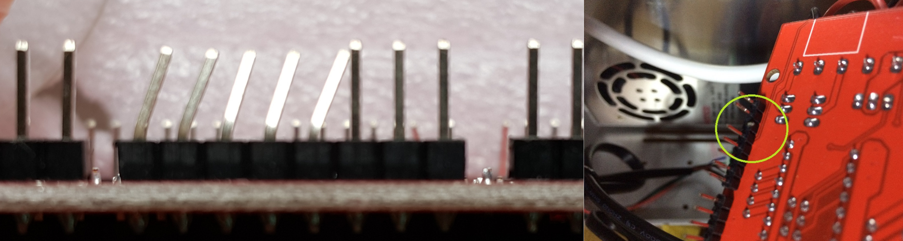
- Check for short circuits between pins. In the picture below solder bridges appear to short tracks and pins; note however that the solder bridge is on top of the conformal coating, so it will not result in a short.  If you do have shorts carefully remove and if necessary reflow the solder.

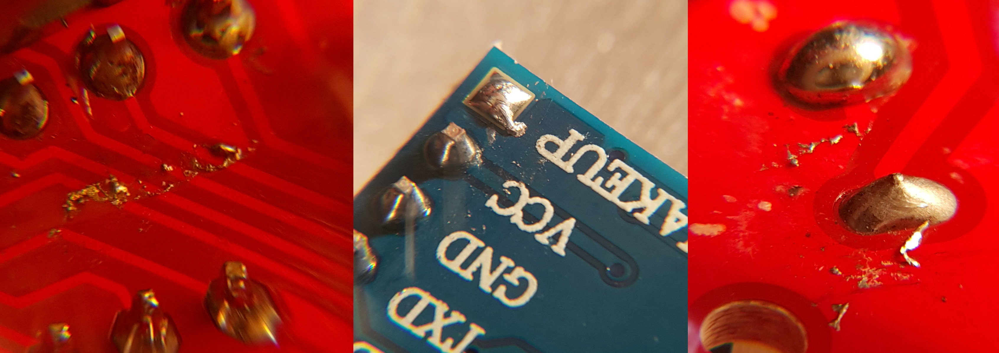
- Check for broken tracks. Hairline cracks are very hard to spot, obviously broken tracks such as caused by scratches are easier to spot

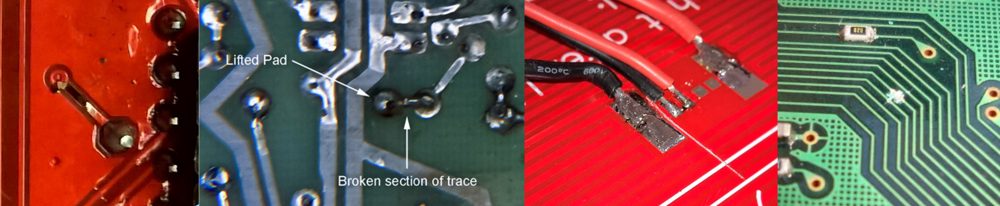
- Check for the RAMPS board MOSFETs not touching anything. The three big shiny components are the MOSFETs.  They may be bent or otherwise touching some other wire or electronic component. Carefully bend them upright and clear of anything else.

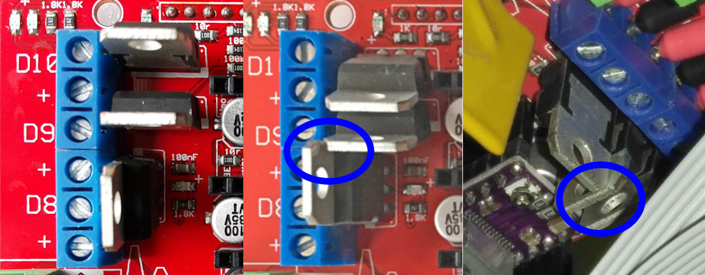
- Dry joints or damaged solder joints. These are hard to fix, get an expert to do this or buy a new board.

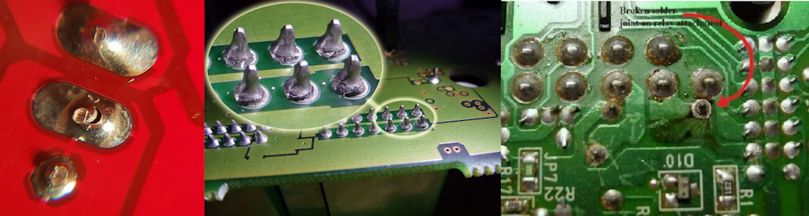
- Check seating for all connectors.  In my printer the Molex connector pins slid back out when pressed from the front.  This could result in no or intermittent contact.  Carefully inspect both sides of the connector to ensure that all pins are making good contact.
- Check the resistance of the thermistors, for the standard and Diamond head, as well as the heated bed the values should be between 90 kOhm and 100 kOhm (pins not connected to the electronics) at temperatures of 20-25 deg C. Once connected the thermistor is in parallel with a 4.7 KOhm resistor, and the 100 kOhm (at room temperature) will not be measurable.  The hot end thermistors are connected to the small white wires in the Model connector.  The heated bed thermistor is connected to the two thinner wires on the inside of the heated bed PCB.
- Check the resistance of the heated bed, it should be around 1.2-1.5 Ohm.
- Check the stepper motor phase resistance. Connect the stepper motor cable (6-pin white connector on the one side and 4 pin black connector on the other side).  The motor phase resistance is measured between the two left-most and the two right-most pins.  The phase resistance should be of the order of 1.3 to 1.7 Ohm.

Inspect the mechanics and other hardware:

- Presumably the aluminium parts are accurately cut to size - this is the main reason to buy the Trium: the excellent metal frame.
- Check the length of the GT2 belts, some users reported they barely fit.
- Check the length of the Bowden/ptfe tube, it could be [too short](http://trium3d.proboards.com/thread/13/anybody-successfull-print-new-trium?page=6): on one printer the ptfe tube  is too short and at x=-90 y0 z0 it pulls up the head.  The solution is to use longer (1 m) tubes.

# Arduino and RAMPS boards

## Arduino

The Arduino board can be powered in one of three ways: (1) 5 V via the USB, (2) 7-14 V via the Vin pin, or (3)  7-14 V via the round power connector on the board.  In this case the Arduino board gets 12 V power on its Vin pin  from RAMPS board (see the lower left corner of the RAMPS circuit diagram).  The power flows from the RAMPS 12 V input, through the MRF500 fuse and a diode to the Vin pin.  If the Arduino board only works on USB but not from the RAMPS board it may be a bent pin, blown fuze or some other disconnect.  You should be able to power up the Arduino using 12 V from the power supply into the round power connector.

## Firmware

Make sure to install the correct firmware for your hot end.  There are [two versions](https://emergin.net/support/): the E3D hot end version and the Trium hot end version.  The two different hot heads have different sensor parameters encoded in the firmware.  You may have to modify some variables in the firmware code.  Use the ino file downloaded from the E-Mergin web site, change variable and flash down to the printer using the Arduino IDE (latest available version).

Install the firmware as shown [here](https://www.youtube.com/watch?v=Rwoz79IAFwI&index=18&list=PLMmAHPJoXlL8cp_-7R_6Hdb887jVPCUp3) or [here](https://www.youtube.com/watch?v=sOojWpuci_o&feature=youtu.be).

When flashing the firmware you will get a [time-out message if](https://www.kickstarter.com/projects/873464596/trium-delta-3d-printer/posts/1772659) (1) if you have a bluetooth chip connected, (2) if the slicer is currently accessing the board, or (3) [the USB cable may not seat properly](https://www.facebook.com/groups/emergin/permalink/1865886796982413/).

If the Arduino IDE is installed, the necessary serial drivers should be installed as well.  On the forum and facebook page, the Trium users often refer to the `FTDI` driver to be installed.  The serial chip used in many (if not all) Chinese Arduino boards are in fact the CH340, see [here](http://www.microcontrols.org/arduino-uno-clone-ch340-ch341-chipset-usb-drivers/) and [here](https://www.youtube.com/watch?v=Ix4t-_RZ7NI).  It seems that the drivers are availabe [here](http://www.wch.cn/download/CH341SER_ZIP.html), but download at your own risk. On the [Trium forum](http://trium3d.proboards.com/thread/24/problems-recognizing-trium-usb-port) E-Mergin advises that the FTDI drivers be downloaded from [here](http://www.ftdichip.com/Drivers/D2XX.htm).

## Setting up the RAMPS board

(p38) The Trium uses the RAMPS 1.4. The following picture shows how the wires are connected.  The cable orientation are shown in the short colour bars for the inductive sensor, the end-stops and the stepper drivers. For example, the black wire on the stepper cables should be on 1B. The complete wiring diagram is also shown below, showing the cable colour next to each connector.

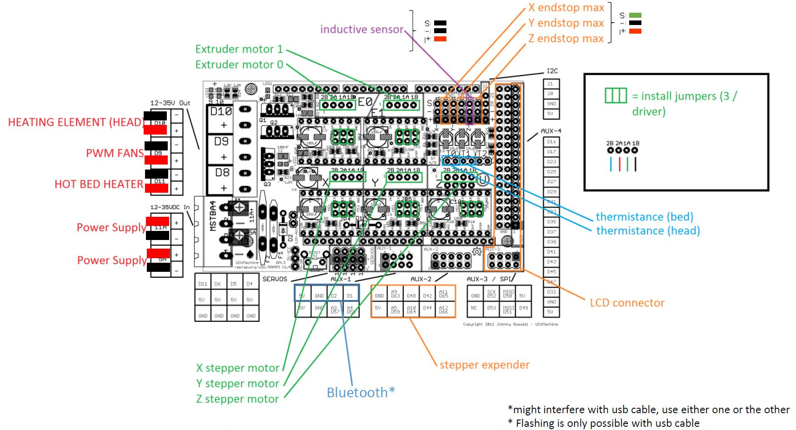
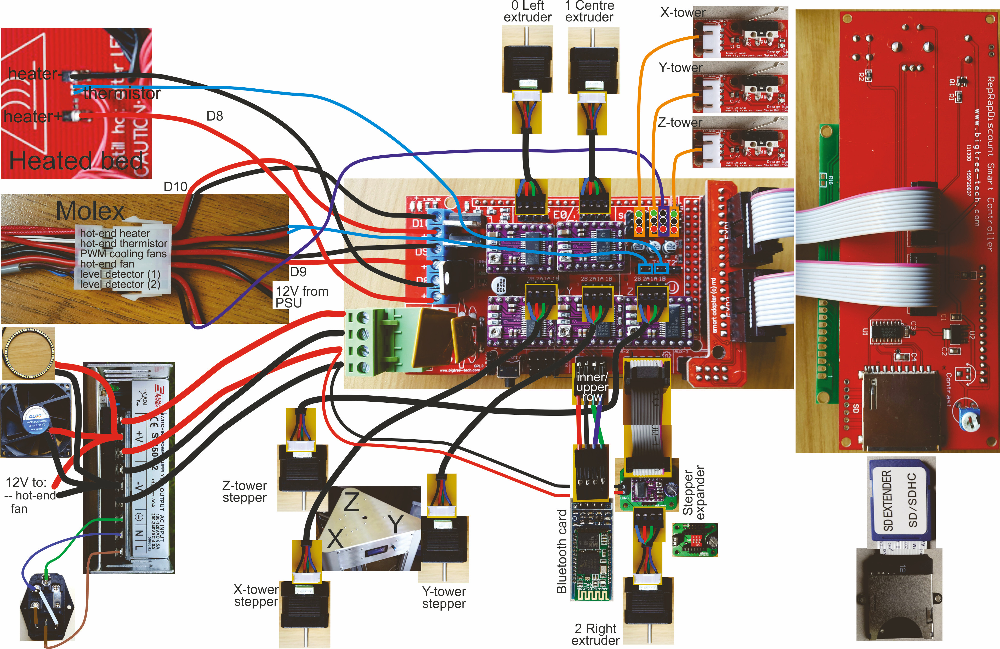

(p18, p38) The RAMPS board requires jumper settings on (blue in the diagram below).  These settings determine the [number of micro steps](http://reprap.org/wiki/RAMPS_1.4). If the jumpers set it to a higher number of micro steps than supported by the driver it will operate at the maximum number of micro steps for that driver. The default is maximum micro stepping (all jumpers installed under drivers), which results in 1/32 for DRV8825. So set all three jumpers for each driver.
- the three delta stepper motors X,Y, and Z.
- E0 if only the standard head is used.
- E0, E1 and the extra stepper extender if the Diamond head is used.

(p36) Before mounting the small driver PCBs, calibrate the stepper motor drivers by setting the potentiometers as detailed in the Manual (p36).  The 'Quick calibration' method is grossly inaccurate - only use this if you cannot use the more accurate method.

Optional:  It might be convenient to reset the Arduino from outside (with a switch or by a future wifi connection).  In order to facilitate resetting the Arduino later, I soldered two pins to the underside of the reset switch on the RAMPs board.  Any connection can be made to these two points later.  These two reset pins extend a little towards the stepper driver extended (for Diamond hot end users).

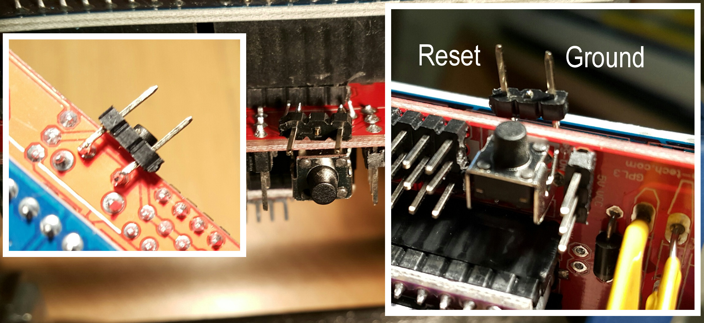

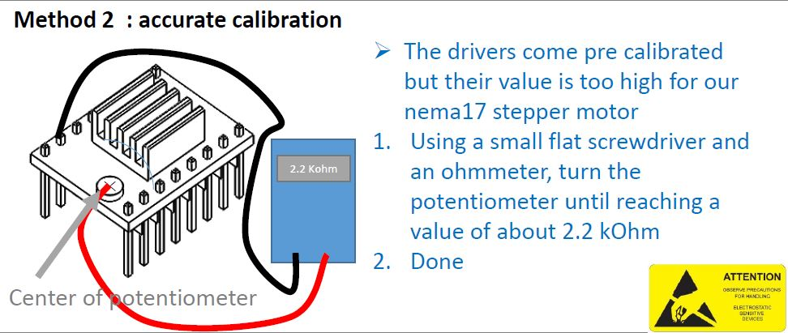

Some users pointed out that it is difficult to set the value accurately. The PCB is small and one seems to have too few hands to do the task. The E-Mergin assembly video shows a technique to connect the multimeter to the screw driver.  The following alternative setup makes it trivially easy to set the trimpot.  Use a protoboard to fix the PCB position (it does not slide all over the desk).  Wire the ground pin (second pin) to the first multimeter using the protoboard. Use one hand to turn the pot and the other to hold the second multimeter lead.

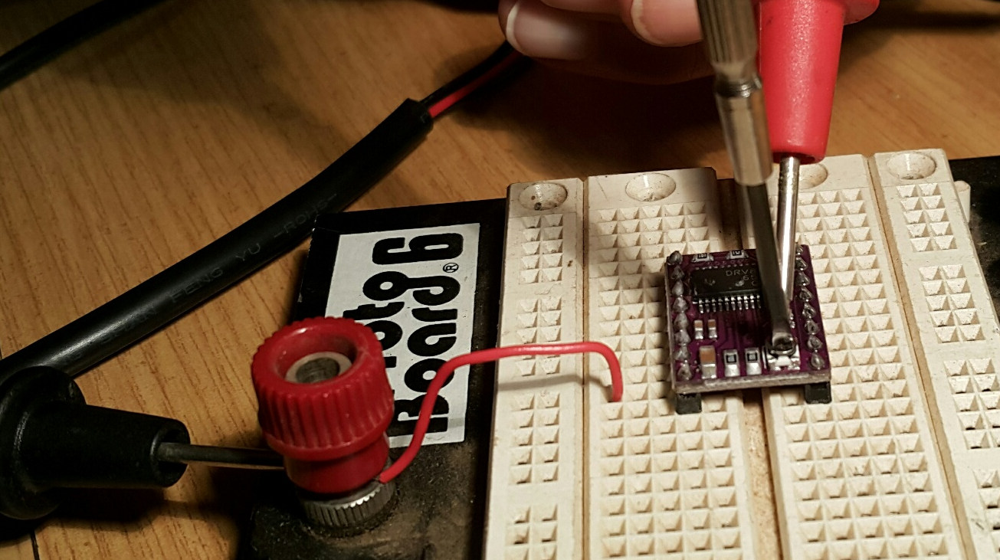

(p18) Insert the driver PCB in the orientation shown in the next picture (before and after heat sinks are stuck on).  Stick the small self-adhesive heat sinks on top of the IC on the driver PCBs.

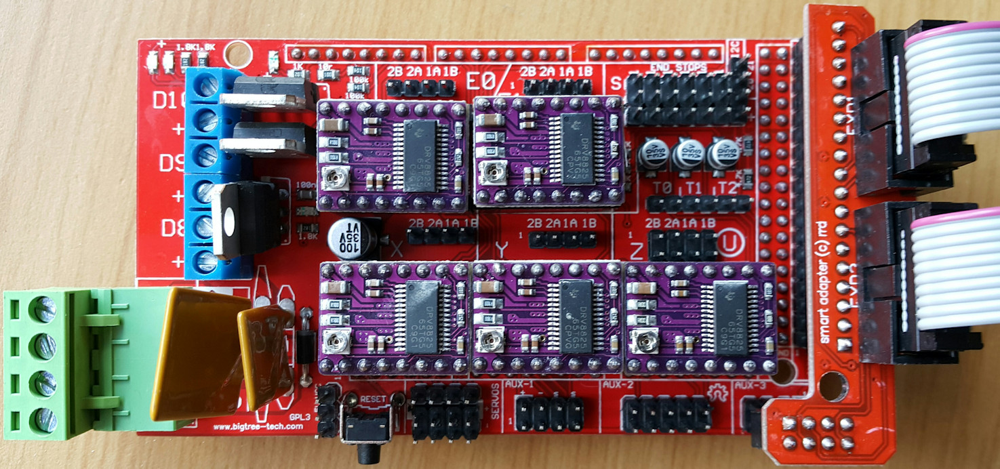

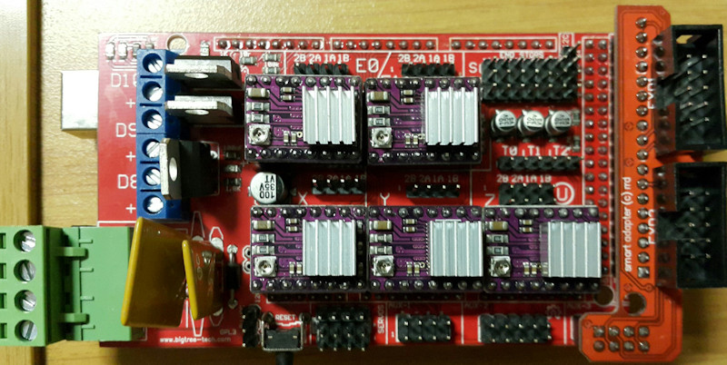

(p18) If you have a Diamond hot end, assemble the third extruder driver (used in addition to the five other stepper motor drivers on  the RAMPS board). Set all three switches to 'on' position (this is the same as inserting all three jumpers on the RAMPS board).  Insert the driver with heat sink as shown in the below (heat sink not yet mounted).  Mount the power supply cable into the terminal block with the black wire on ground (GND) and the red wire on (VMOT) (if necessary cut of the ferrules to expose just the copper wire).

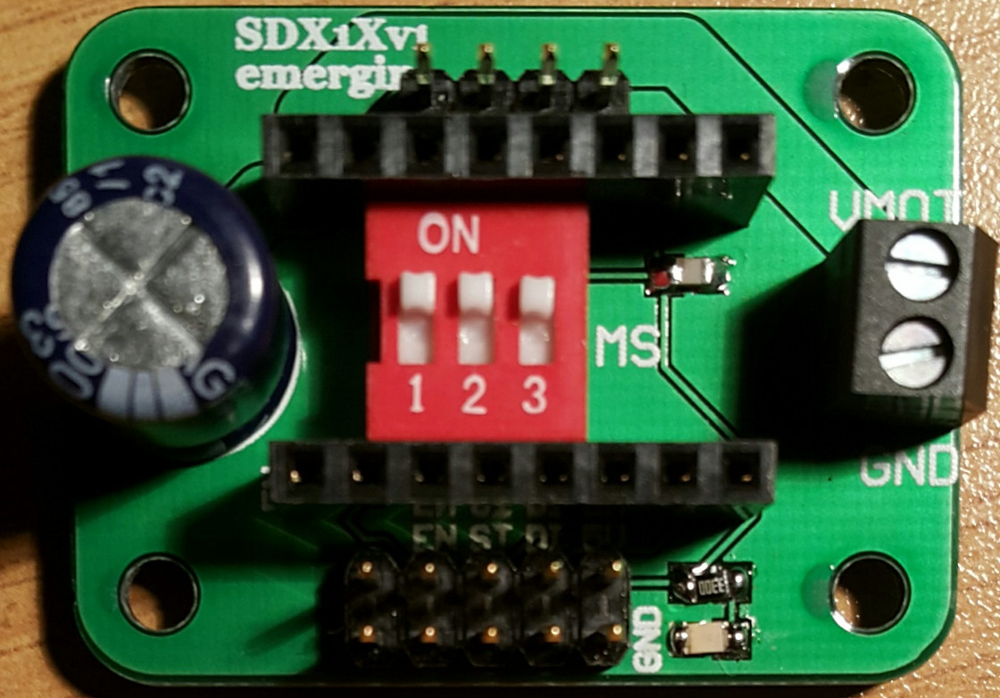 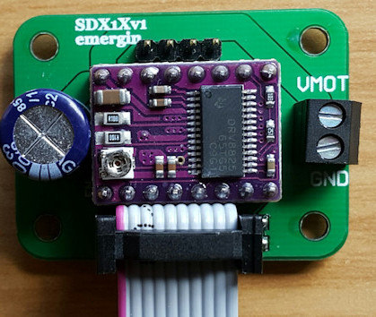

[This tutorial](http://3dtek.xyz/blogs/technical-docs/18982427-not-another-ramps-tutorial) describes wiring the RAMPS for another printer.  It does not fully apply to the Trium, so read with care.

[MiR advises](http://trium3d.proboards.com/thread/67/notes-building-trium-standard-diamond) to print out a fan holder and to mount the fan directly to the Ramps Board. He used  [this thing](www.thingiverse.com/thing:166045)  (You will need to use 3mm screws, 4mm screws will not fit).  Later found [this](www.thingiverse.com/thing:211672) one, has some small improvements.  See also the customiser [here](http://www.thingiverse.com/apps/customizer/run?thing_id=166045&code=b8a1480ff8c69a94a20b4d2d0528a997).

## Integrating the Arduino and RAMPS boards

(p18) [MiR has an excellent suggestion](http://trium3d.proboards.com/thread/67/notes-building-trium-standard-diamond) to first integrate the electronics and test it stand-alone, before building it into the Top Plate Assy. Do the following on a non-conductive surface (not on the aluminium Top Plate):

- Place the RAMPS board on top of the Arduino board, carefully check that all the RAMPS pins are properly aligned with the Arduino headers (adjust the headers and pins if necessary). If you are certain that all pins align, gently press the two boards together.  The RAMPS board pins should be carefully forced all the way into Arduino sockets, don't leave gaps where pins are visible.

- Connect the LCD small L-shaped adapter board to the RAMPS, connect the two ten-pin ribbon cables to the adapter and to the LCD board.  The ribbon cable connectors have keys, and and only plug in in one orientation.

- Connect the USB-Cable (Extender) to the Arduino Board.

- Connect your computer via the provided USB Cable to the plug of the USB-Cable (Extender).

- Install firmware on Arduino as described in the manual. See also  [here](https://www.youtube.com/watch?v=Rwoz79IAFwI&index=18&list=PLMmAHPJoXlL8cp_-7R_6Hdb887jVPCUp3) or [here](https://www.youtube.com/watch?v=sOojWpuci_o&feature=youtu.be), or see [LMGTFY](http://lmgtfy.com/?q=download+RAMPS+firmware).

After flashing (or when you press the reset button on the side of the RAMPS board) you should see an error message on the display, that's OK, we have not yet connected any sensors so the safety features of Marlin kick in (see picture below).

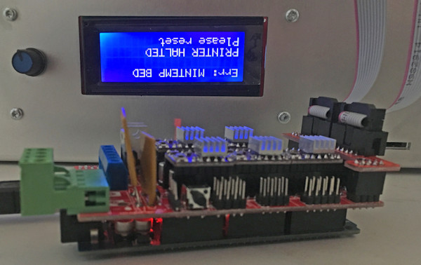

Disconnect the USB connector from the Arduino board and remove the LCD ribbon cables.

# Top Plate Assembly

If you plan to use the Diamond head punch out the two additional extruder holes on one of the triangle sides (the centre hole should already be open).  Also, if you are planning to use three Trium horizontal spool holders, punch out the three holes in the corners on the top plate.  Some people prefer to use [vertical spool holders](https://www.thingiverse.com/thing:2001034), so consider your options.  My printer came supplied with only one spool holder (even though I ordered the Diamond nozzle).

(p16) Mount the extraction fan such that the air is forced *into the cavity* (arrow pointing inwards, or fan label is visible when mounted).  The logic of blowing into the cavity, instead of extruding air from the cavity as for PCs, is probably to prevent hot air from the printing volume (between the towers) being sucked into the Top Plate cavity.

[MiR](http://trium3d.proboards.com/thread/67/notes-building-trium-standard-diamond) and [Jean Marc Cierniewski](https://www.facebook.com/groups/emergin/permalink/1871767846394308/) found that the fan is very loud, so some form of damping (rubber, silicon, cork) between the fan and the frame may help reduce noise.

(p16) Mount the power switch. My printer is connected as shown below; where green is earth, blue is neutral and brown in live. This is different from Trium instruction, be careful.

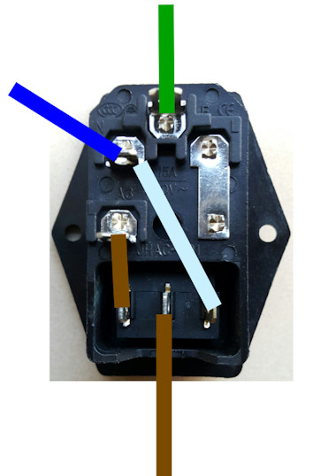

(p16) Mount the USB cable.

(p37) On the SD-card extender, remove the small plastic guides between the copper connections.

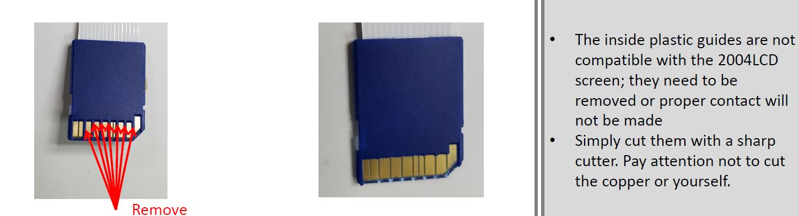

(p17) Mount the SD card extender.  Before you mount the SD card extender, pass the USB extension cable below the SD extender, behind the two pillars. In my case I mounted the SD extender pillars with Loctite and was unable to unscrew the pillars - now it must lie on top.

Before moving on, test the height of the SD card extender to confirm easy card access through the hole in the Top Plate.  In my case the pillar was too high and hence the extender sits too high relative to the hole.

If you can also confirm that the SD card extender orientation is the right way up (I think mine requires the card to slide in upside-down).   Keep in mind that at this stage the Top Plate is upside down.

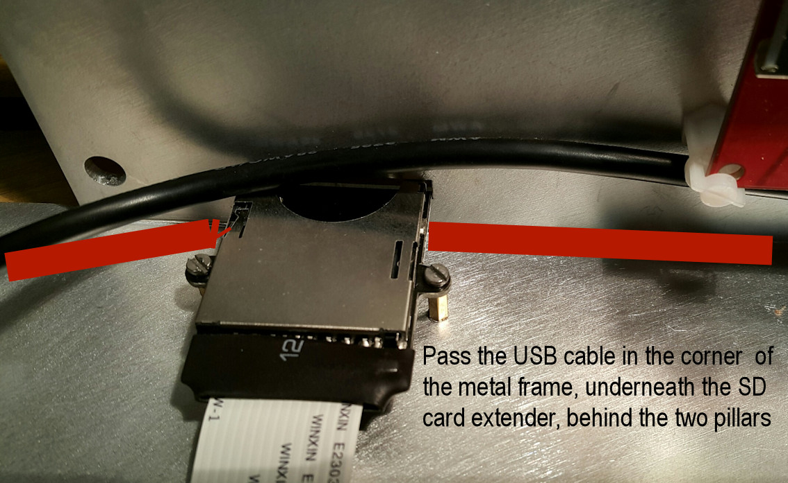

(p17) When mounting the LCD board, initially screw in only one spacer: the one bottom on the side of the SD-Card.  When you now assemble the display it stays in place, it is fixed on one side by the spacer and the other side by the switch spindle that goes through the hole. You can now easily add the other spacers, starting by the 2nd one on the bottom.  In the picture below note that the PCB corner fits into the gap at the top of the mounting pillar. The pillar must be rotated to be at 45 degrees with the two PCB edges.

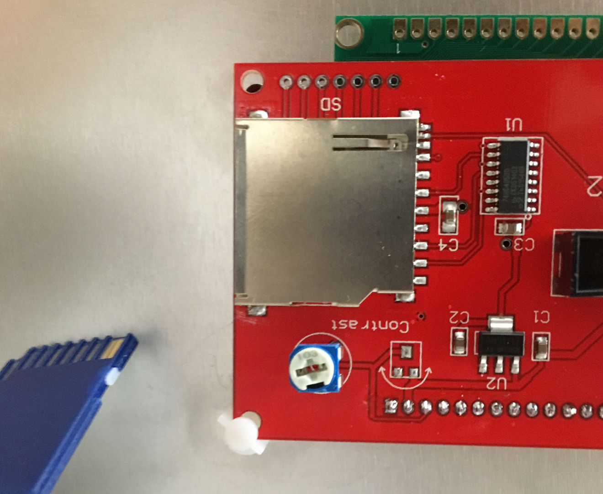

(p19) Mount the power supply. Mains power can be lethal, disconnect all power leads before working on these wires and make very sure that the wires are connected correctly.

 *When wiring your power supply, make very sure that the brown and blue wires never touch anywhere else than on the switch and on the L and N terminals on the power supply.*  If for some reason you suspect that the cable is faulty, have it fixed by a knowledgeable person.  E-Mergin has done the right thing by properly covering the electricity leads with insulation material, but the flat shiny bar on the right-hand side of the switch is also at live potential and *it is not covered*.  Please be very careful.

On the side of the power supply there is a switch where you must select the voltage (115 or 230V) for your country (mine was preset at 230V). Mount the power supply in the Top Plate as shown in the Manual (p19).

Connect the 220V mains cable between the on/off switch and the power supply, being careful to follow the brown/blue/green colour convention.  If you wish, you can zip-tie the internal power cable down to the side of the power supply, just do not block the air vents at the bottom of the supply.

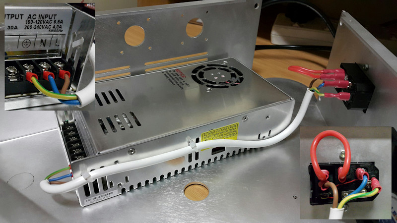

Optional - your choice: The next picture shows how the neutral and ground (negative/black) wires are connected to the case (note the thick bare copper wire going underneath the terminal block, firmly screwed to the case).  I also added a terminal block for the large number of wires connected to the power supply.  Note, however that the terminal block will interfere with the horizontal spool holder bolt extending below the top.

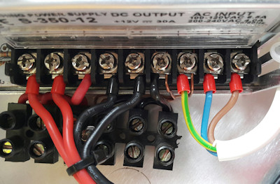

**Test the power supply output voltage before connecting anything to it!**
At this point you should have a working power supply.  To verify the supply operation and voltage, connect the printer to the mains supply and switch on.  Measure the voltage on the power supply output between the - and + terminals.  It should be around 12V; if not, adjust the voltage by turning the potentiometer on the left side of the power supply.

Switch off the power supply and **disconnect the power cable** from the printer.

## SD Card not working

If the SD card is [not detected](https://www.facebook.com/groups/emergin/permalink/1870864693151290/) try [these steps](https://www.facebook.com/groups/emergin/permalink/1869330273304732/):
-  Insert the SD card before power on so that the printer boots with the SD card in place.
-  Experiment with different SD cards - different users have different experiences with small, large, new and old cards. Find one that works.
- Check your SD card is using the FAT file format.
- Verify that the SD card extender loom is well connected into the LCD board.
- Verify that the SD card extender mount screws are not too tight
- If the printer still doesn't see it, try opening SDFatConfig.h go to the 74th line:	`#define SPI_SD_INIT_RATE 5`. Change it to read: `#define SPI_SD_INIT_RATE 6`. Then re-flash the firmware.

##  Mounting the Arduino/RAMPS boards

(p18, p19) When mounting the Arduino/RAMPS and extender boards, [MiR suggests](http://trium3d.proboards.com/thread/67/notes-building-trium-standard-diamond) the following:

- Take two mounting pillars and screw in the two spacers that are on the wide side of the Arduino PCB, on the side facing the edge containing the extruder holes.

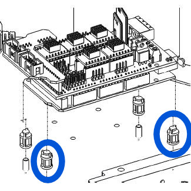

- If you have Diamond head prepare the two mounting pillars for the extension board.
- Turn the case so that it stands on the side with the hole(s) for the extruders. The two Arduino and two extender mounting pillars should now the at the lower edges of the boards.
- Align the mounting pillars so that they are roughly angled 45 degrees. Now you can slide in the boards, they stay in place thanks to gravity.
- Finally assemble the missing mounting pillars.

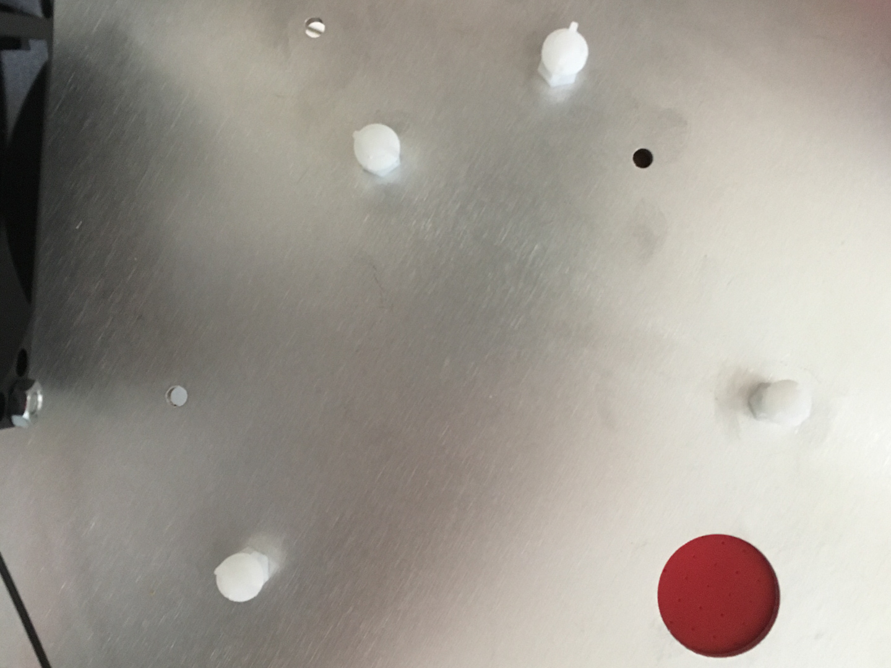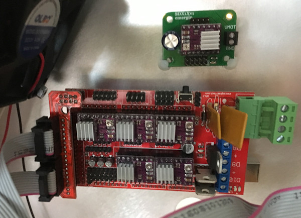

## Wiring and EMC and interference prevention

[mikeeitel proposed](http://trium3d.proboards.com/thread/51/emv-protection) some measures to lower interference. I added a few additional recommendations. These are:

- Route the LCD cables below the Arduino (between the Arduino and the aluminium case), to prevent interference from the stepper drivers into the LCD cables (the ribbon cable does not have screening).  Do the same for the stepper driver extender card.  The stepper driver chips feed high frequency noise into the heat sinks, which then radiates EMI signals (perhaps one can ground the heat sinks?). Keeping the LCD and other wires away from the stepper drivers helps lower EMI pickup. This picture shows the ribbon cables passing underneath the Arduino and stepper driver extender board.  It keeps the ribbon cables out the way and reduces the risk of EMI.  The added benefit is that the layout is cleaner with less cable clutter. Some users complained that the LCD screen shows gibberish - this is caused by EMI: the LCD should reset every 10 seconds, alternatively press the rotating button.

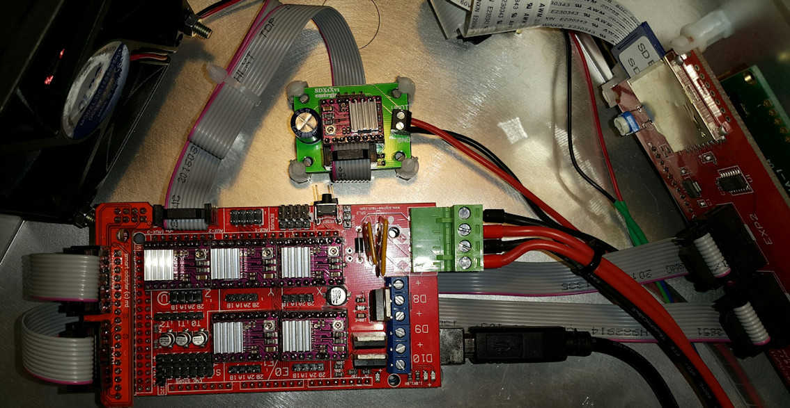

- Pull the bed heater cables and thermistor cables through different towers, to prevent noise interference with the temperature measurement.

- Route the stepper cables over the power supply and from there as straight as possible, and away from other cables, in right angles to the drivers.

- Try to keep the tower end-stop switch wiring away from the stepper motor wiring.

- Mount a large (>10 microF, >20V) electrolytic capacitor and a 100-470 nF capacitor in parallel directly to the output switched power supply. Be careful with the electrolytic capacitor polarity, connect the + side to the + PSU terminal. Note that all three + output screws on the PSU are connected to each other, and all three - output screws are connected to each other, so one set of capacitors will serve for all three connections,

- Optional, but recommended: The enclosed aluminium case has reasonable potential for preventing the printer to radiate electrical noise and to protect the printer from outside interference.  However, just screwing them together does not always provide good electrical connection. Drill holes in the two Top Plate aluminium parts, and tightly screw the parts with a nice thick wire to the mains earth connection.  There some holes in the Top Plate assembly, so the assembly does not provide a perfect Faraday cage, but every little bit of screening helps.

- Optional, but recommended: Add an [EMI filter](http://www.ebay.co.uk/itm/3900W-EMI-18A-High-Frequency-Power-Filter-Board-DIY-Kits-For-Speaker-Amplifier/262372720254?_trksid=p5713.c100284.m3505&_trkparms=aid%3D111001%26algo%3DREC.SEED%26ao%3D11%26asc%3D20140905073823%26meid%3D8e1126b342874e4db679d35183853806%26pid%3D100284%26rk%3D2%26rkt%3D10%26sd%3D262372720254) to the mains power leads. This filter should be able to provide the current required by the printer. This EMI filter is not the same as a surge protector - the surge protector protects your printer against lightning. The EMI filter suppresses high frequency noise spikes (household appliances and lights switching on or off) on the power lines.

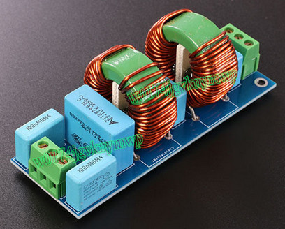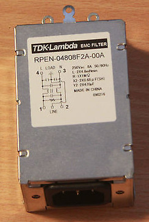

- Optional, but recommended: There are three Pulse Width Modulation (PWM) outputs on the RAMPS board.  These PWM signals (8 A for the bed heater and 3 A for the hot-end heater) are switched fully on and fully off in variable on/off time ratios (hence 'pulse width') such that the low frequency average provides the required power level. These currents are  switched on and off in very short time periods, leading to considerable high frequency content (30-40 MHz).  These signals on the PWM wires can/should be filtered to remove some of the very high frequency content that might cause interference in radio or other electronics. [Ferrite components](http://eemc.nl/nl/pdf/EMI%20Suppression%20with%20Ferrites.pdf) absorb high frequency magnetic fields and thereby suppresses the EMI.  At large DC currents the magnetic circuit saturates and the filter becomes less effective. The [correct use of ferrites for DC carrying conductors](http://educypedia.karadimov.info/library/Use%20of%20Ferrites%20in%20EMI.pdf) is as shown below, where the two conductors must follow closely the same path through the ferrite component. Additional turns through a core will provide multiples of peak impedance, furthermore, the impedance peak shifts to a slightly lower frequency. In my printer I used a ferrite ring and was able to push two windings through the ring (this shortened the lead, so I would have to lengthen the leads). Keep the red and black wire as closely together as possible so as to create a net-zero magnetic field at DC.  Solder a 10-100 nF capacitor on the one side of the ferrite wires.  Make two such filters: connect the capacitor-side of the filter to the connector for D8 (bed heater) and D10 (hot-end-heater). For more information see [here](http://www.a-m-c.com/download/support/an-023.pdf), [here](http://www.allaboutcircuits.com/technical-articles/choosing-and-using-ferrite-beads/), [here](http://www.skyworksinc.com/uploads/documents/202378A.pdf), and [here](http://www.pcsilencioso.com/cpemma/pwm.html).

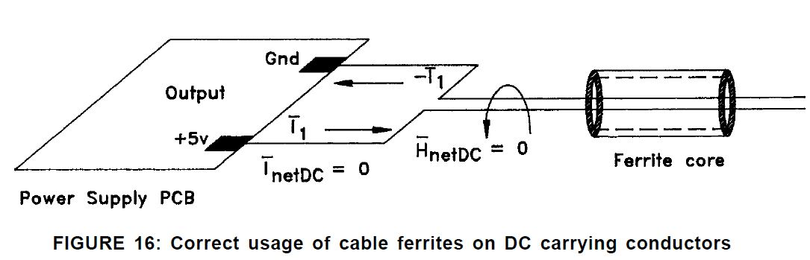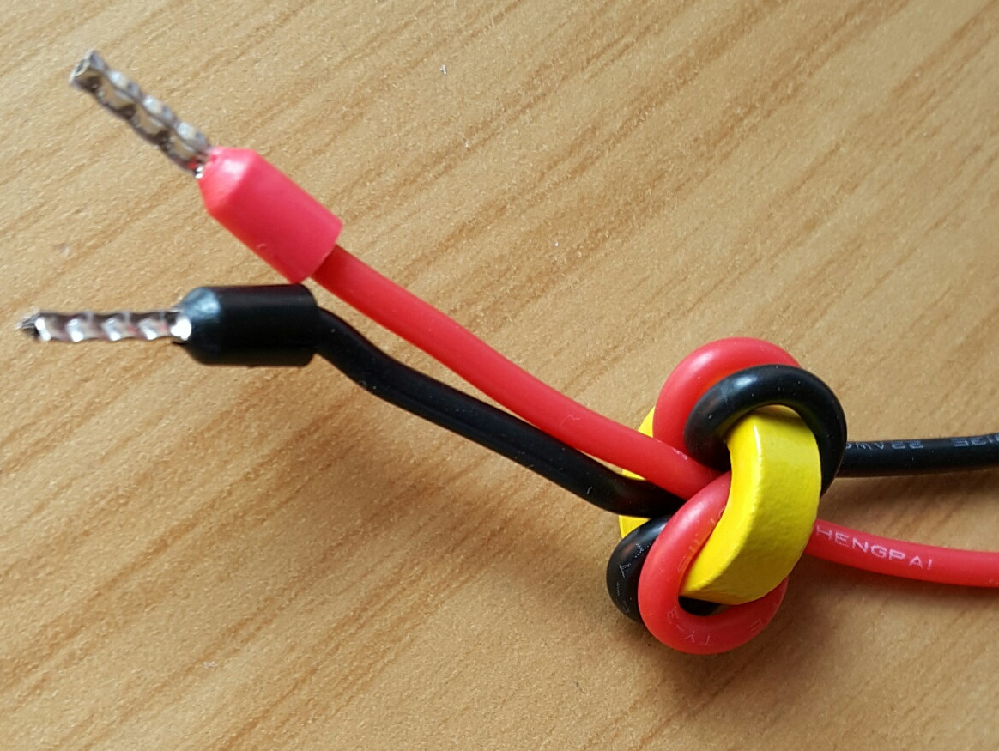

- Optional: If you can solder two wires to the RAMPS reset switch, mount a switch somewhere on the frame.

- Optional information: The RAMPS board has two + (positive supply) input screws and two - (negative supply) input screws.  The negative screws are connected together internally and form the ground for the electronics.  However, **the two positive screws are not connected together)** each positive input serves another part of the electronics. Analysing the RAMPS circuit diagram, it is evident that the left-most/top positive supply +12V2 feeds directly into the bed heater MOSFET and appears not connected to any other component on the RAMPS.  The +12V2 has no decoupling capacitor on the input or MOSFET output.  The third connection from the left/top is labelled +12V and feeds the rest of the electronics, the PWM cooling fans and the PWM hot end heater element.  This input is decoupled with a 100 nF and 100 microF capacitor near the input connector. Furthermore, each driver carrier +12V is also decoupled with 100 microF. So there is probably no need to further decouple the +12V supply on the RAMPS board.

[Mir suggests](http://trium3d.proboards.com/thread/67/notes-building-trium-standard-diamond) that it would make sense to perhaps build up the print head now and do some testing of the electronics together with the print head.  But both MiR and me instead went on constructing the extruders.

**Checking the driver calibration**  Now would be a good time to measure the true reference voltages on the stepper motor drivers, as part of validating your driver calibration.  The voltages (relative to negative/back) on the centre of the potentiometer should be in the range 0.85 to 0.95 V.  When I measured these values in circuit, all the voltage levels were below 0.8 V, even as low as 0.75 V.  All six drivers calibration was re-adjusted to 0.85 V, perhaps on the low side - we'll see later if this was too low.

## Main case fan

Diamond head users: The main case fan can be connected to the stepper extension board because it is nearest the fan. Connect the red fan wire to the `VMOT` terminal and the black fan wire to the `GND`.

Standard head users: The main case fan can be connected to the green terminal block on the RAMPS board because it is nearest the fan. Connect the red fan wire to the + terminal and the black fan wire to the - terminal.

The main case fan must force air into the cavity. I think is is because if the fan extracts air out of the cavity, the cavity inflow will be the hot air from below.  After connecting check the airflow to confirm that the fan forces cool outside air into the cavity.

In my build, I extended the fan wires to connect directly to the power supply. It is neater and just feels better.

## Bluetooth

I have not yet installed the Bluetooth module, these are notes picked up from the forum.  I have my doubt over the effective operating range if the Bluetooth module is encased in the totally closed metal Top Assembly.

[Bluetooth connection](https://www.facebook.com/photo.php?fbid=1313506788710450&set=p.1313506788710450&type=3&theater) The red wire on the chip is [plugged on the "VCC"](https://www.facebook.com/groups/emergin/permalink/1864425840461842/).

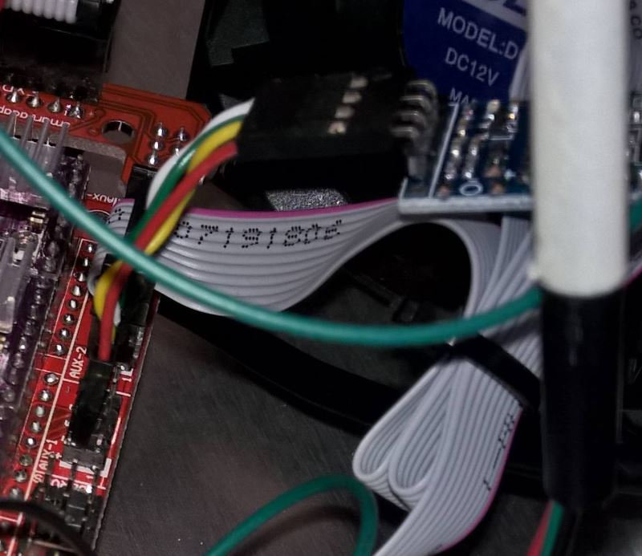

[In Reptier](https://www.facebook.com/groups/emergin/permalink/1864425840461842/) select the bluetooth, then 115200 baud data rate.  The Bluetooth password is 1234.

When flashing new software to the Arduino, [remove the Bluetooth module](http://trium3d.proboards.com/thread/40/wiring-notes#ixzz4WC2flXiu).  Both the Bluetooth connection and the USB connection used for flashing uses the Arduino's serial port functionality and it seems that the Bluetooth takes precedence in this conflict.  The end effect is that the flashing fails.  Only reconnect the Bluetooth module after flashing and calibrating.

# Extruders mounted in the Top Plate
## Extruder assembly

Remember that the while you are working on the Top Plate, it is upside down, so you must mount the extruders upside down!

Trium uses a Chinese variation of the GeeeTech MK 8 extruder (something like [this](https://www.aliexpress.com/store/product/42HD4027-01-Aluminum-3D-Printer-Extruder-kit-Set-w-NEMA-17-Stepper-Motor-For-1-75mm/333670_32663281335.html), [this](http://www.icstation.com/left-hand-extruder-aluminum-frame-block-printer-p-6326.html), or [this](https://www.aliexpress.com/item/2pcs-lot-Aluminum-block-DIY-kit-Left-hand-For-single-nozzle-MK8-extruder-extrusion-printer-head/32575822076.html?spm=2114.40010608.4.221.fmVgih), or [this](http://www.thingiverse.com/thing:1386402)).

Optional: Measure the stepper motor phase resistance before mounting. Connect the cable (6 pins white -- 4 pins black) to the motors and measure the motor phase resistance between the left-most two pins and right-most two pins on the black connector.  The phase resistance should be close to 1.65 Ohm.

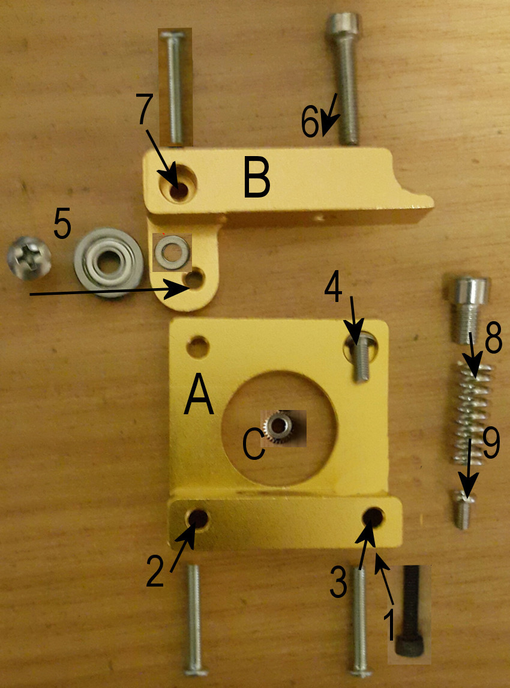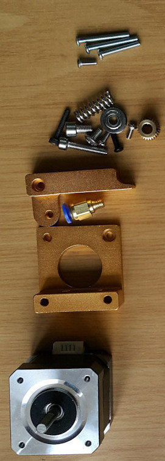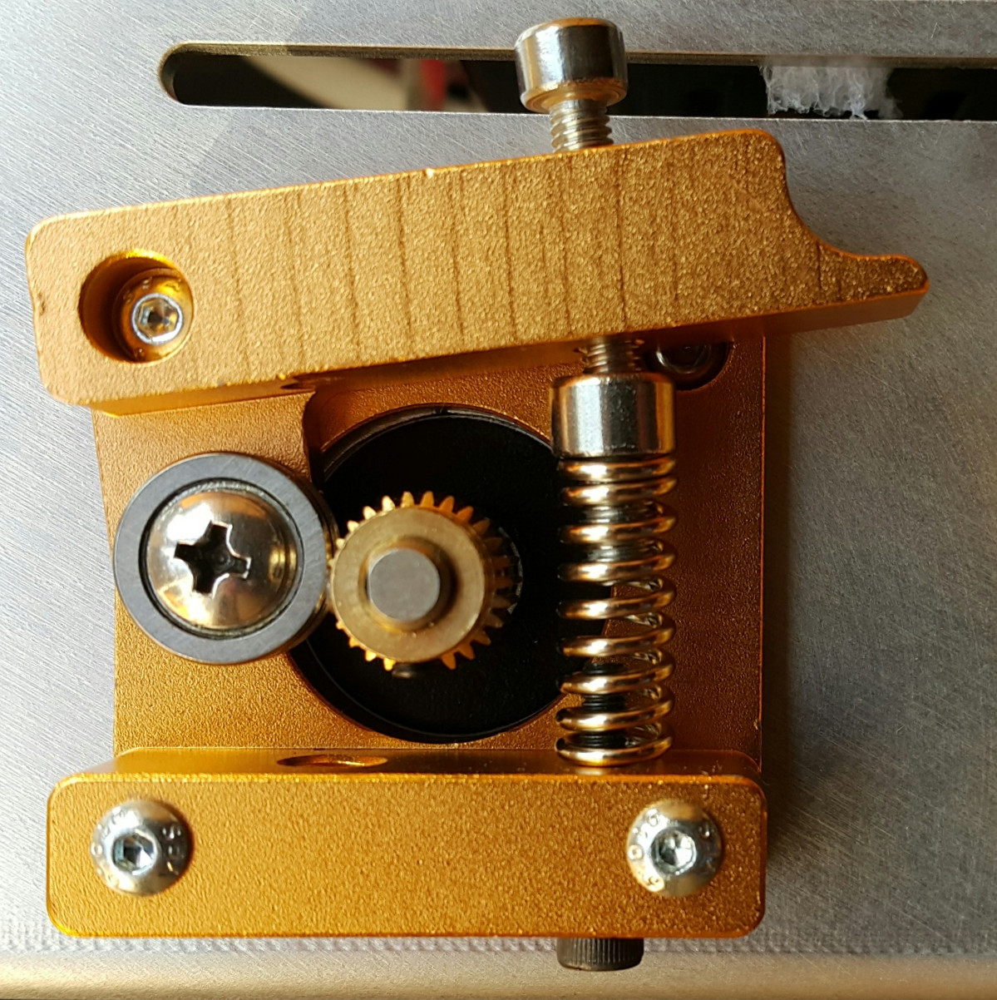

[MatterHacker's extruder tutorial](http://www.matterhackers.com/articles/extruders-101:-a-crash-course-on-an-essential-component-of-your-3d-printer) provides a good introduction to extruders.  [This page](http://reprap.org/wiki/Extruder_assembly) may be helpful in assembly - but the wiki describes hardware where the hot end is integrated with the extruder. The procedure described in the wiki differs slightly from the Trium procedure (stop at step 8 in the wiki procedure).

In the wiki Step 4, there is mention of a M4 gasket (washer?) (item 9 in the wiki figure).  **This gasket is missing from the extruder kit as delivered.** This gasket is quite important because without it, the pulley is fact touching/rubbing directly on the hinge part. The friction between the pulley and the hinge negates the presence of the bearing.  Please add your own M4 washer between the gold-coloured part and the pulley/bearing. Thanks to BillB for pointing out that the black screw belongs under the spring.

p20 Trium build:
- Step 1: Screw in the black screw (1) into the hole in Part A, *from below*. The screw tip of (1) will eventually hold the bottom end of the spring secure.
- Step 2: Trium mounts the stepper motor and extruder components on both sides of one of the Top Plate walls (p20).  Locate the stepper motor on the inside with the connector to one side (if the connector is facing down it is difficult to plug in the cable).  Place Part A on the outside and screw in the two bottom screws (2) and (3), into the bottom holes of the stepper motor.
- Step 3: screw (4) into the stepper motor in the top-tight hole.
- Step 4: mount the hobbed gear (Part C) on the motor spindle. Ensure that one of the two grub screws seat into the flat surface on the motor spindle.
- Step 5: screw the (missing) M4 washer, bearing and pulley into Part B.

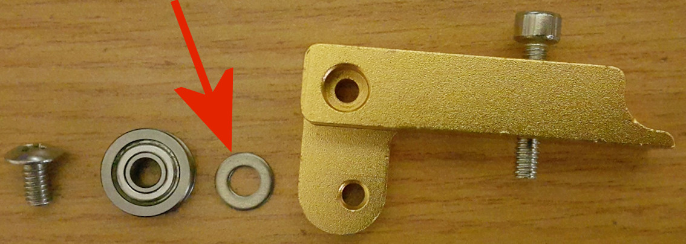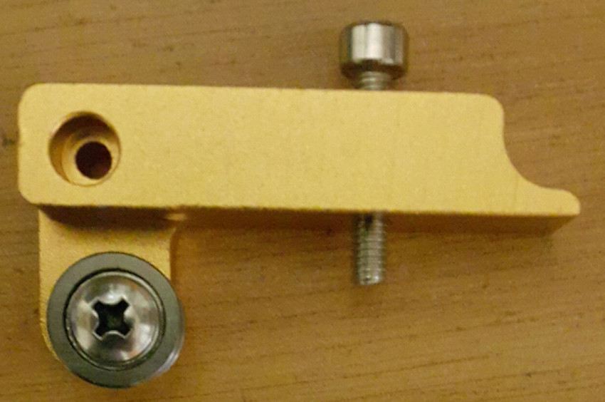

- Step 6: screw the large stainless steel screw (6) into Part B.
- Step 7: fix Part B onto Part A by screwing (7) into the top-left hole in the motor.  This screw should not be tightened, to allow a swivel movement of Part B around (7).
- Step 8: slide the small stainless steel screw  (8) into the spring.
- Step 9: place the bottom of the spring over (1) and set the bottom of screw (6) into the top of screw (8).  The spring should now press against Part B.  The tension in the extruder (pressure of the pulley onto the hobbed gear) is adjusted by turning (6).
- Step 10: When installing the Bowden tube see  [handling of the Bowden tube](reprap.org/wiki/Diamond_Hot end).

After assembly you will be left a a few unused components that came with the kit.

Connect the stepper motors with the appropriate connectors on the RAMPS PCB.  Make a note of which extruder number E0, E1 or extender is connected to which extruder motor. Perhaps it would be easiest to remember that the right -hand-side extruder is E0, and so on.  When stepper extender is plugged on the small PCB the blue wire must be on the terminal or  right-hand side when viewed for reading the text.

.

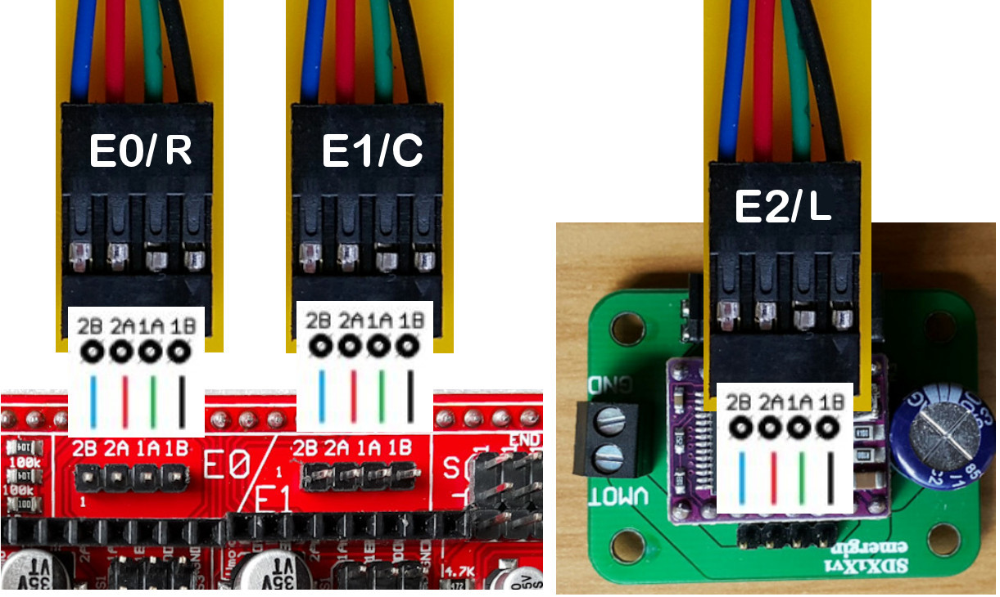

## Further notes on the extruder

### Extruder unable to push filament

Tighten the screw above the extruder until it grips. But don't tighten too much, it may force the PTFE tube to pull out at the extruder or hot end if the hot end somehow blocks the filament.

The Marlin firmware prevents the extruder motors to turn if the hot end temperature is below 175 C.  This is to prevent cold extrusion. You can temporarily override this with the gcode `M302 P1`.

### Printing with flexible filament
The standard MK8 extruder as delivered on Trium cannot print flexible filament: the output coupler does not bring the Bowden tube close to the filament hobbed/cob gear.  Some mechanism is required to prevent the filament from buckling under extrusion.  The alternative options were presented thus far:

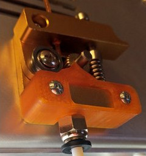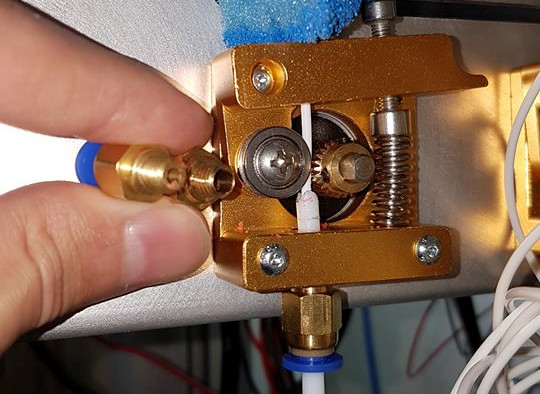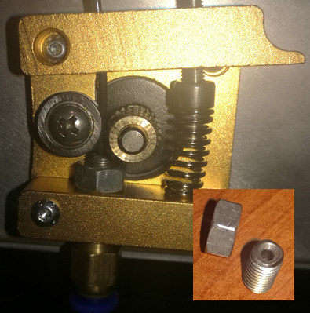

The solutions are from left to right:

1. [Andreas Pfeifer](https://www.facebook.com/groups/emergin/permalink/1867202580184168/) [here](http://www.thingiverse.com/thing:2035413) describes an adapter by KnoxD that fits to the extruder.
1. The adapter described [here](http://www.thingiverse.com/thing:1386402)  fits between the entry into the Bowden tube and the extruder cog wheel.  It is a very tight fit, the designer advises that the work piece be sanded to make it fit. **The width of this Thingiverse part  is too wide**, it should be 2 mm narrower for the extruder used in the Trium.
2. [Rajaa Kahel](https://www.facebook.com/photo.php?fbid=703445856496900&set=pcb.1857616977809395&type=3&theater)  recommends to replace the output coupler with a [coupler](https://www.aliexpress.com/item/2Pcs-Pneumatic-Fittings-PC4-M6-Bore-4-3mm-For-4mm-PTFE-Tube-connector-Coupler-Feed-inlet/32633859496.html?shortkey=IVruA7zm&addresstype=600) inside diameter 4 mm hole, which allows the PTFE tube to push through all the way close to the hobbed gear. Another Trium user tried this and found that the tube slid out. Use [this](http://www.thingiverse.com/thing:2035468) to prevent release.
3.  Janlu's solution is shown [here](http://trium3d.proboards.com/thread/23/flexible-filaments)

### Noise dampers on the extruder
Trium users discussed the use of noise dampers on the stepper motors for the tower motors.  There is room in the tower for these dampers on the XYZ motors.  The mounting shown below allows only two mounting screws or the front and two on the back sides.  However, for the extruders, the motor mounting screws also provide mounting integrity for the extruder. So unless the extruders are really noisy, it would be best to avoid dampers here.

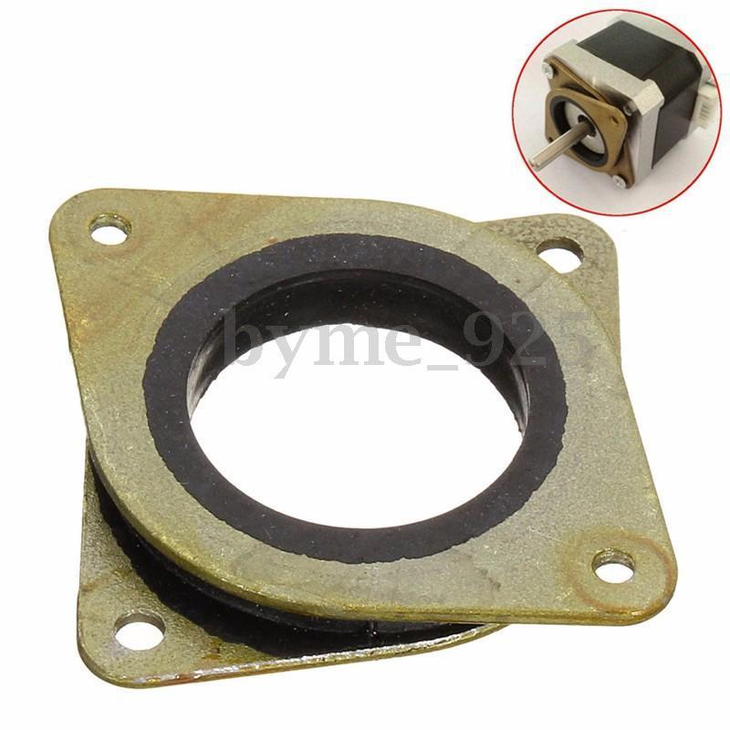

### Filament cleaner
A filament cleaner keeps dust and plastic particles out of the Bowden tube, nozzle and print.  You can use a [makeshift cleaner](https://www.facebook.com/photo.php?fbid=703445856496900&set=pcb.1857616977809395&type=3&theater) using a sponge to clean the filament. See also [here](https://www.facebook.com/groups/emergin/permalink/1868165253421234/). Locate the filament cleaner as close to the extruder as possible.  There are also [filament cleaners on Thingiverse](https://www.thingiverse.com/tag:filament_cleaner).

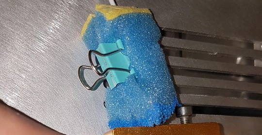

None of the above filament cleaners cleans the filament after passing through the extruder. Small fragments of filament waste could result from the extruder gear damage to the filament. Is this a problem?

### Filament lubrication
Filament lubrication on the filament is somewhat  controversial. Some insist that lubrication should never be used, because the teflon tube has sufficiently low friction.  Short radius bends and (filament) dust in the tube may increase friction (in both cases rather rectify the cause).  Some printer users advise that a small amount of lubrication solved their printer problems. Use oil with a [high smoke temperature](http://www.clovegarden.com/ingred/oilchart.html); commonly used oils are light mineral oil, refined canola oil, refined corn oil, or refined olive oil.  The key consideration is to use lubrication sparingly. For more information see the web sites [here](https://ultimaker.com/en/community/4483-lubricating-the-bowden-tube), [here](https://ultimaker.com/en/community/3110-trouble-making-soft-pla-prints#entry14759), [here](https://www.thingiverse.com/thing:48646), [here](http://forums.deltaprintr.com/index.php?threads/to-oil-or-not-to-oil.312/), [here](http://forums.deltaprintr.com/index.php?threads/to-oil-or-not-to-oil.312/), [here](https://www.3dhubs.com/talk/thread/oiling-pla-stop-jams), and [here](http://forums.reprap.org/read.php?1,286062)

There are several possible methods to lubricate the filament:
- Place a drop of oil on the dust filter sponge.
- Dip the filament tip into the oil and allow to drip excess. Print a skirt first to avoid excess oil in the work piece.
- Wet a sponge/cloth with oil and lightly wipe the first 10 cm of the filament.  Print a skirt first to avoid excess oil in the work piece.

### Filament grinding
Grinding is a considerable risk for softer filaments, but can also occur on PLA. Read [here for more information](http://support.3dverkstan.se/article/23-a-visual-ultimaker-troubleshooting-guide#grinding):   Grinding happens  when the motor tries to push the filament through the nozzle but for whatever reason it starts to slip on the filament and instead grinds the plastic down. The more it grinds the filament the less grip it is able to get and very soon it will not be able to move the filament neither in nor out. Grinding also creates filament dust that may enter the Bowden tube, leading to increased friction.  Grinding should be minimised by finding the correct balance between the hobbed gear pressure on the filament (adjust the extruder spring) and the stepper motor current limit.  By limiting the motor current the stepper motor will skip back *before starting to grind the filament down*. When this happens you will hear a *tock* sound and the feeder wheel will spin in reverse for about a quarter turn.  We can control the motor current by controlling the reference voltage on the DRV8825 driver. Optimise the combination of spring and current settings as follows: adjust the extruder spring to ensure good plastic flow under normal printing conditions. Once the optimal spring setting is found, while extruding against resistance (i.e., cold hot end) adjust the reference voltage (hence motor current) to force until the motor tocks/clicks before grinding occurs.

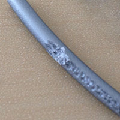

### Changing filament

In your favorite printing software (or the LCD) you go into manual mode and heat up your hot end to about 190°C. When this temperature is reached, you release pressure from your extruder by pushing its arm down. Then pull the filament out with your other hand. Then you can fiddle new filament into the extruder and push it down until it reaches the hot end. In manual mode of your printer software, now extrude until the colour is clearly this of your new filament without bits of your previous one. To be on the safe side, you should also print a bigger brim for your next model to see if there was any old filament left in the nozzle. See [here](https://www.facebook.com/groups/emergin/permalink/1866813056889787/) and [here](https://www.facebook.com/groups/emergin/permalink/1863754567195636/).

You can also use the LCD control. To preheat: `Prepare-> Preheat PLA (or Preheat ABS)`.  This method heats both the nozzle and the bed. You can also heat just the nozzle by `Control->Temperature->Nozzle`.

### Bowden tube maintenance
[Maintaining the Bowden tube](https://fbrc8.zendesk.com/hc/en-us/articles/205658894-Maintenance-How-Do-I-Maintain-My-Printer-): Over time, the Bowden tube can experience wear and tear, especially if you’re using more abrasive filaments. When you start to experience trouble feeding, it’s worth taking a look at your Bowden tube to check for any sign of damage. The feeder end of the Bowden tube should be slightly widened out to help facilitate feeding material. The printhead end should be flat, and should be fully seated in the white PTFE coupler in the printhead.

### Removing the Bowden tube

Push the coupler ring to maximum and pull the tube. But don't do that too many times, because [the tube material and coupler easily get damaged](https://www.facebook.com/groups/emergin/permalink/1863754567195636/).

# Bottom Plate Assembly

p22 The Bottom Plate assembly is relatively simple, simply follow the pictures on p22.  The Bottom Plate assembly might be simple, but the setting up and calibration of the heated bed is a cause for much frustration.  

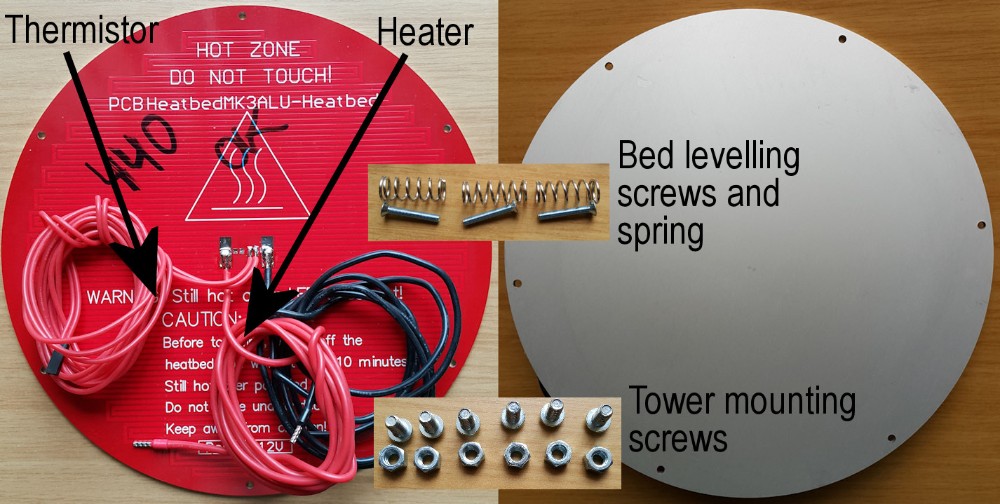

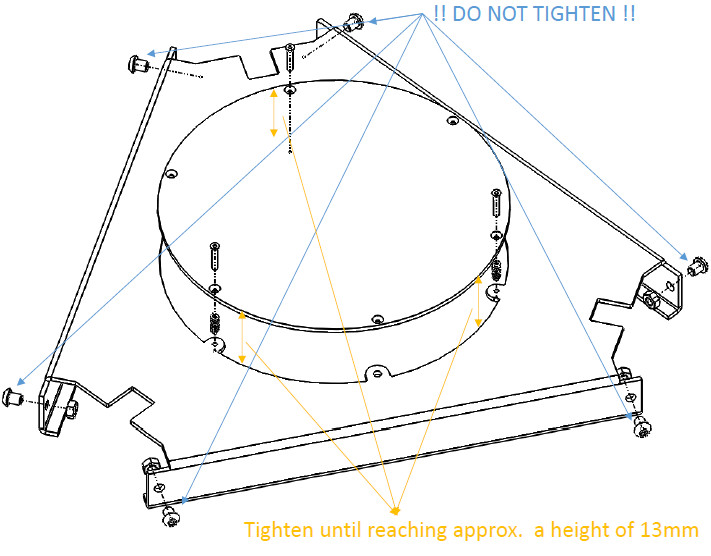

Assembly:

- Before mounting the heated bed inspect the PCB side for visible damage.
- The two outer (thick) wires carries the large current to heat the bed. Polarity on these wires is not important.
- The heater resistance should be 1.5 to 1.7 Ohm.
- The two inner (thin) wires is connected to a thermistor embedded in the heat bed (where?) used to measure the bed temperature.  Polarity on these wires is not important.
- When not connected to the electronics the thermistor resistance should be 100 kOhm at 20 deg C.
- When connected to the electronics the thermistor resistance should be around 4.5 kOhm at 20 deg C.
- Optional: Rajaa Kahel chamfered the mounting holes in the build plate with a 6 mm drill bit to make the bolt heads flush with the surface of the bed.  This gives you the full size of the bed to print on. Just be careful with a hand drill on the wobbling bed, my chamfering attempts did not produce a neat result - perhaps use a drill press for this task.
- Set the height of the bed to approximately 13 mm.  Use a small object of the required size (someone used a Lego block) to help set the height.  The video shows the use of a vernier caliper; probably because it is easier to measure the offset, rather than to be minutely accurate.  The height of the hot bed will be finally adjusted later when bed levelling calibration is done, adjustment now does not have to be overly precise.
- The three bed screws have to go in quite deep, there is about 3-4 mm thread sticking out on the other side. This is convenient to add locking screws later.
- Fix the six  M6 tower mounting screws and nuts to the bottom plate, but don't tighten.

To set the bed at a height of 13 mm, the screw had to travel quite far - the spring is well compressed. Note the uneven chamfering attributable to poor control of my hand drill and the work piece.

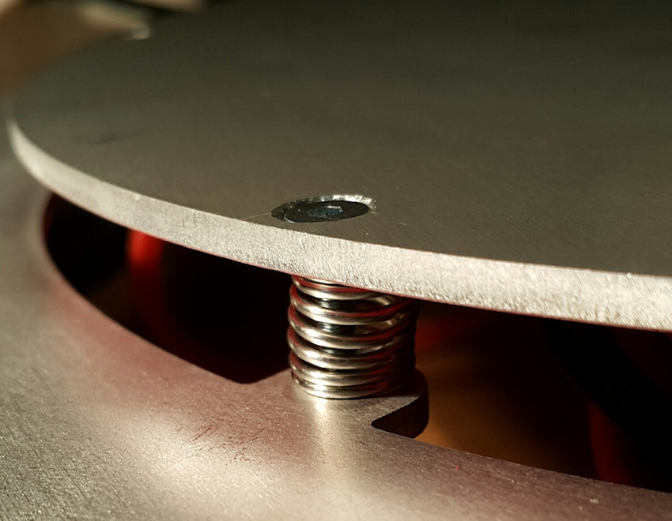

The bed will not reach high temperatures when the cooling fans is blowing (reaching only 60-70 deg C max). With no forced air movement the bed should reach around 100 deg C. Someone mentioned that he speeds up the bed warm up by using a hot air  heat gun from the top.

Variations:

- Optional:  Add some noise damping feet (rubber, cork or similar) to prevent noise coupling to the table. Then also put the printer on a heavy and stiff base, such as granite.
- Optional: The build plate is suspended with three spring-loaded bolts.  The idea is that the springs pushes the build plate against the bolts.  [Rajaa Kahel](https://www.facebook.com/groups/emergin/permalink/1855806441323782/) does not like the fact that the build plate position is held in place with springs, so he used spacers with shims to adjust the build plate hard mounted to the frame, with no freedom to move.  The downside of this method is that there is no movement possible if the head crashes onto the bed.
- Some users complain that the screws loosen and the bed level is lost.   A set of double-locked nuts might help to prevent the screw nuts movement. Don't use Loctite.

# Towers / Columns / Beams

All three towers are assembled the same. It does not seem that any one tower has preference over the other.

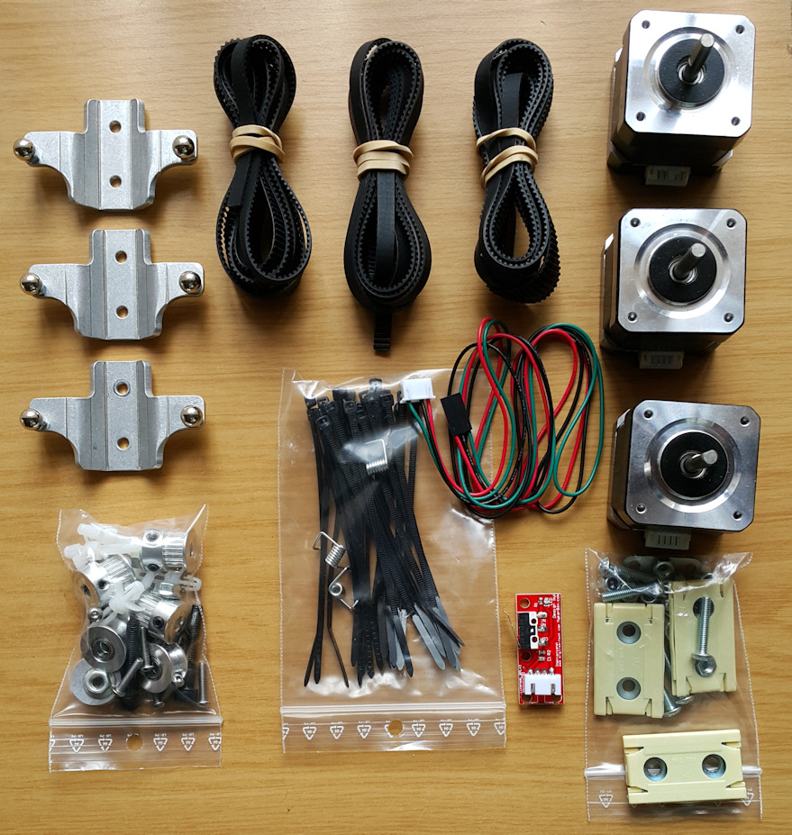

## Stuffing the tower empty space

I decided to put a piece of plastic conduit up each of the towers and then stuff  the tower with some plastic foam. I used some redundant laminate floor plastic under-mat foam sheeting, in a tightly rolled bundle about 15 cm long, jammed to about halfway down the tower (so the upper and lower portions were open).  I guess any firm material should suffice. if you can fill the full length of the tower it will be best.  Just stuff the material in there very very tight. Be careful not to cut your hands on the extrusion edges.

I am not sure what difference it will make to the noise levels, but at least I tried.  It does lower the ringing when the tower is struck with a metal object, so it should make some difference.

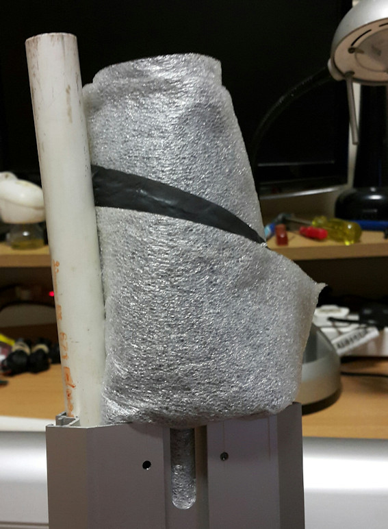

## Idler pulley p26

The idler pulley is meant to hold the one end of the belt in place.  The pully should run free on the screw bolted to the tower. Lock the nuts on both sides of the extrusion. [Rajaa Kahel recommends](https://www.facebook.com/photo.php?fbid=701887786652707&set=p.701887786652707&type=3&theater) adding an additional M5 nut on the bolt that holds the idler pulley with less play, as shown in the third picture. The choice is up to you.

Assemble the pulley, but don't mount it in the tower just yet. It will be screwed in place just before fitting the belt.

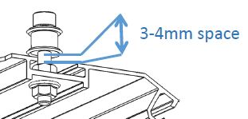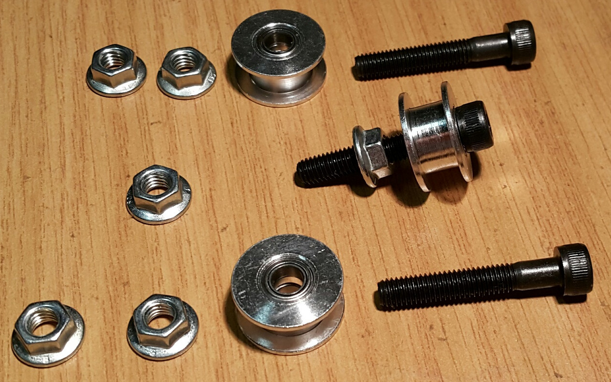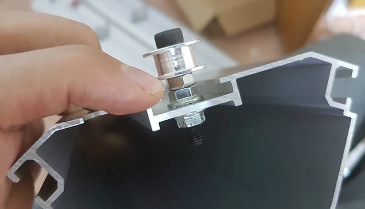

## Tower stepper motor p24, p25

Before mounting any other component on the tower, first mount the stepper motor.  

In the Trium design the [NEMA-17](http://reprap.org/wiki/NEMA_17_Stepper_motor) stepper motors are hard mounted to the extrusion, inducing some noise into the frame.  E-Mergin [recommends](https://www.kickstarter.com/projects/873464596/trium-delta-3d-printer/posts/1763458) placing a damper between the motor and the extrusion (not part of the kit, buy separately) These are simply installed in between the tower extrusions and the motors with a total of 4 M screws (2 original one we are originally providing and 2 M3x4 for the motor side (3X each) ). The damper can be bought on [Ebay](http://www.ebay.com/itm/142210528617) or Aliexpress. Try to avoid the cork dampers, they appear to be [too thick](https://www.facebook.com/groups/emergin/permalink/1866102783627481/).

Mount the stepper motor with the connector to the outside/top of the tower to facilitate plugging in the cable.

So there are two options in mounting the stepper motor:

1.  Mounting without a damper: simply screw the stepper motor down with the four M3x14 screws provided, one in each corner.  In this mounting the motor spindle extends quite far beyond the extrusion.

2.  Mounting with the damper. In this mounting the motor spindle does not extend so far beyond the extrusion, but there seems sufficient exposed spindle length to mount the gear.  Follow this procedure to mount the motor:
  -  You may have to drill out some of the holes on the damper to full 3 mm bore, some seem to have M3 thread cut into the flange.
  -  Stick two M3 nuts to the damper with glue or double sided tape. Cut out the hole in the tape with a craft knife to allow the screw the pass through.  This serves to hold the nut in place for construction when screwing the motor to the tower extrustion. Sticking the nut to the damper is *not for permament mounting*. It will become evident that it is almost impossible to mount the damper without this step: it holds the nut in place to screw into.
  -  Turn the damper upside down so that the two stuck screws are pointing towards the motor and place it on the motor.
  -  Using the other two holes (not those with the nuts), screw the damper firmly to the motor with two M3x4 screws (not in the kit, purchase this yourself).
  -  Position the motor (with damper) under the mounting holes in the extrusion, drop screws down into the nuts held by glue or double sided tape and tighten the screws. Do this carefully, otherwise you may loosen the nut.

3. Finally fit the GT2 gear on the motor spindle, but don't screw it down too tight yet.

This picture shows how the double-sided tape is used to hold the nuts in place on the damper.
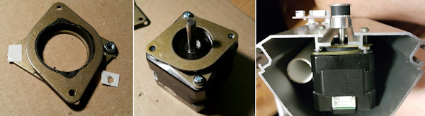

## Slider assembly p24

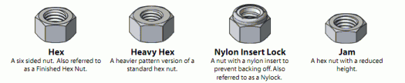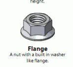

When working on the sliders work careful with (1) the ball joints and (2) the plastic slider pieces.

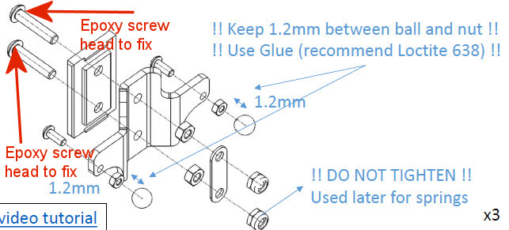

Do the following for each slider:

- Assemble the slider (one for each tower) as shown on p24.  There is no instruction on aligning the two parts, I did my best to eyeball the two parts well aligned. In other words the two parts are not obviously misaligned.
- Look carefully at the nuts; there are two types of nuts in the kits: regular hex nuts and nylon insert nuts. Use the hex nuts first to hold the two parts together.  Later use the nylon insert nuts to fix the spring holder.
- There is nothing holding the screw head in place. Once mounted in the tower you cannot get to this screw head.  It might be neccessary to unscrew the nuts later (see below) which means that you cannot properly tighten the nut because you cannot get to the screw head. I did not do this but perhaps you can consider bonding the screw head to the slider carrier at the locations shown in red blue in the pictures below.  *Just be very careful that the epoxy don't leak through to below the screw head.* Of course, once glued in place you cannot remove the screw, but that is a small price to pay for the convenience of working on the slider once in the tower. **[BillB](http://trium3d.proboards.com/thread/94/bed-positional-stability-good?page=1&scrollTo=800) had a slider nut loosening while printing**, so perhaps it is a good idea to glue in the screw heads to easily recover from such failures.
- Once two slider parts is mounted, carefully study the plastic slider: it consists of two parts.
- From the video: Unclip and remove the outer/upper part, it comes away and exposes the metal part and the screw tops.  For some reason, you must place a layer of tape (I used magic tape) on the metal part. The tape stuck to the slider is to take up some play between the slider and the tower. The type of tape [is apparently not important](https://www.facebook.com/groups/emergin/permalink/1868255326745560/).   Put back the slider plastic half to its original state.   You can now see the tape covering the screw tops through the holes in the plastic slider.

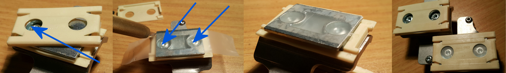

- I thought that the slider should move freely in the extrusion, but the sliding fit was rather stiff.  How stiff is stiff?  

Later during printing it appeared that my printer [might have lost steps](http://trium3d.proboards.com/thread/94/bed-positional-stability-good?page=1&scrollTo=799) on the X tower.  The discussion on the forum pointed out a number of possible reasons: 
- A stiff slider, with friction too high for the stepper motor during fast movement.
- A stuck slider, where the slider was to large for the guide and had to be sanded to fit.
- The motor driver current was set to low.
- Feeding at too fast a rate (keep it below F3000 in the gcodes).

This experiment might help to quantify the friction.  I used a cheap luggage scale to pull the slider up and observed the apparent weight - this can be translated to a force required to move the slider. The slider was moved for about 200 mm in one second.  Despite the crude and inaccurate nature, it was still an interesting experiment.  The slides were always pulled up (the printer was turned upside down for the downward direction).  After correcting for the 160g mass of the scale itself, the scale indications (in kg) were as follows:

|-| X | Y | Z |
|-----|-----|-----|-----|
|Down | 0.59  | 0.36 | 0.32 |
|Up | 0.49|0.62| 0.44|
|Average| 0.54 |0.49  |0.38  |

It is evident that the sliders are within reasonable range of each other, none had grossly different friction from the other.  So this experiment indicated that there was no large differences here. I have no idea what the ideal value should be.

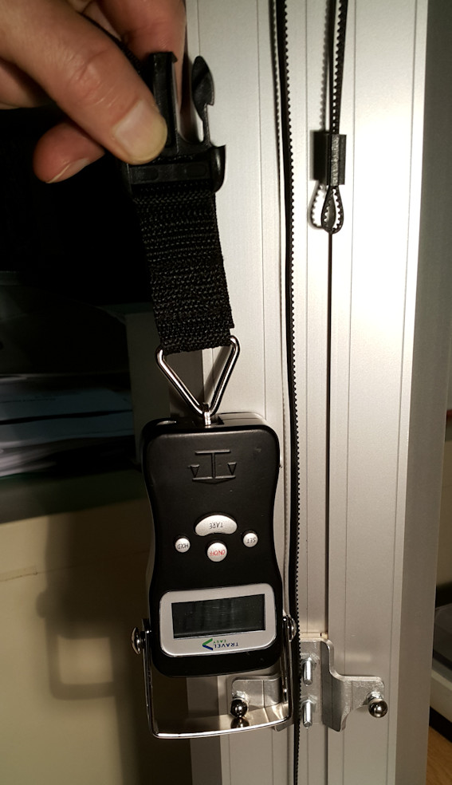

## End-stop PCB p25, p42

**The preciseness of the  printer calibration and long-term calibration stability depend on these three end-stop PCBs as much as it depends on the nice sturdy frame.**  Keep in mind that we want 0.01 mm stability and repeatability on these flimsy switches.  It does not help that the frame is stable if there is some free play on the end-stops. So at the risk of repeating, make sure that your end-stop PCBs are mechanically sound. [digid recommends](http://trium3d.proboards.com/thread/94/bed-positional-stability-good?page=1&scrollTo=800) that you  can interchange end-stop switches as a means to determine faulty devices (just be careful not to damage the plastic pins or the PCBs).  Given the nice frame, we should perhaps consider alternative end-stop mechanisms that better match the quality of the frame? 

- Carefully inspect the end-stop PCB to ensure that the switch is properly and firmly mounted on the PCB.
- Ensure that the plastic pillar mounts are properly fixed into the tower extrusion. The mechanical stability of the end-stop depends on these two pillars. If they can move, the calibration is lost.
- Once mounted, there must be no freedom of movement on the PCB in any direction or rotation. It must be hard-fixed super stably.
- The switch lever must be working properly with not too much freedom of movement (obviously it must move to switch).  Exactly how much freedom and play is allowed is not clear, because the switches on my printer are very loose.
- The slider arm must provide good mechanical contact with the switch level.  On my printer the slider arm and switch are laterally displaced, with the lever only touching only on one half of the slider.
- Carefully route the end-stop cable such that there is enough free play (cable not pulling the switch sideways).  I found that the X tower cable runs near the main case fan - vibration on the fan might transmit via a tight cable to the end-stop switch. The cable is mounted on the long side of the PCB, so any sideways pull will lever the PCB to rotate with maximum effect.

Only mount the end-stop after the stepper motor is installed to prevent accidental damage to the end-stop.  Follow the procedure outlined on p25 and p42 to insert the plastic clips into the tower and then mount the end-stop PCBs on the clips.  

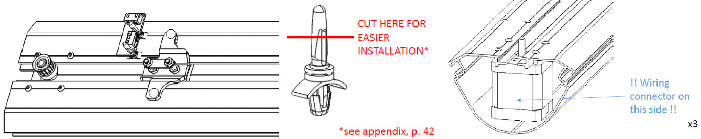

The end-stop must be mounted such that the micro-switch is pointing towards the bottom plate. 

Insert the slider into the tower with the long straight edge to the top / motor side. Verify that the slider can activate the end-stop switch.  Press down the end-stop PCB until you can hear the microswitch click when activated by the slider (perhaps turn down the music for this).

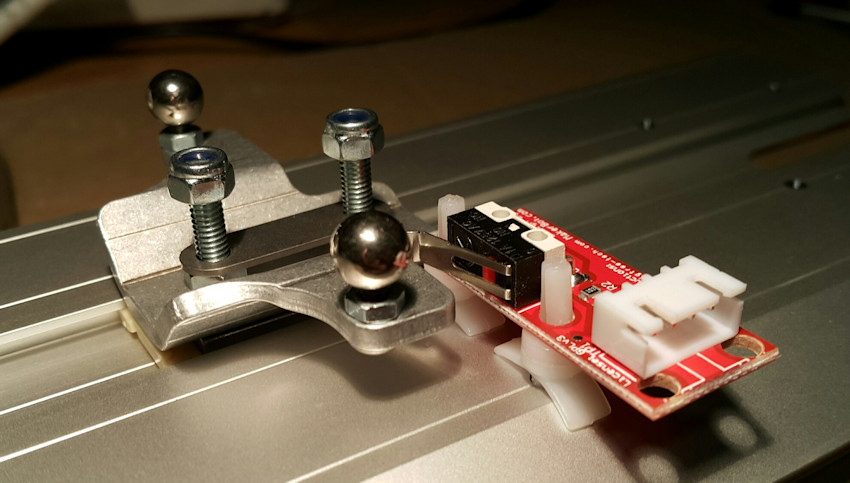

Later when testing, you can check the status of the end-stop: when powered up, activating it should light up the LED.

After inserting the slider, you can now screw in the idler pulley.

## Belt drive

Once the stepper motor, end-stop, slide and idler pulley are all in place, prepare the relative height positioning of these parts to be on the same level. The teeth section of the gear must be at the same height as the belt mounting on the slider.  I measured the height of the belt mounting on the slider, relative to the inside sliding surface, to be 12 mm. Now screw down the GT2 gear on the motor and the idler pulley at the same height.

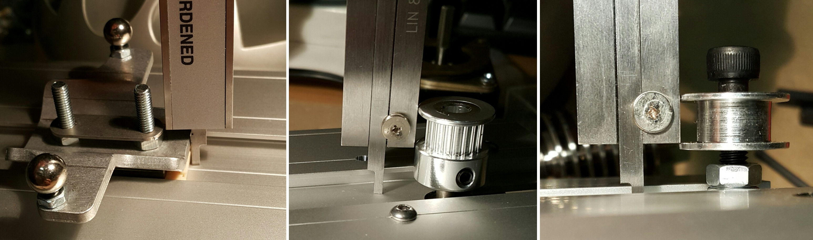

Now fit the GT2 belt.  [Make sure that the towers' belts are assembled correctly](http://trium3d.proboards.com/thread/67/notes-building-trium-standard-diamond#ixzz4WNNRddlE), when moving the slider up the stepper motor needs to turn to the left. When you do this wrong things may go up when it should go down, and then homing will not work correctly. MiR made this very nice picture to show how the belts must be mounted on the slider.  

When fixing the gear to the motor axis, ensure that one of the grub screws touches on the flat surface on the spindle.

When fixing the idler pulley, use a nut to limit the freedom of sliting movement on the pulley so that it does not hit the tower extrusion. Leave sufficient axial movement on the pulley to self-align with the belt.  Secure the idler pulley screw with the two flange nuts, one from above and one from below the  extrusion wall.

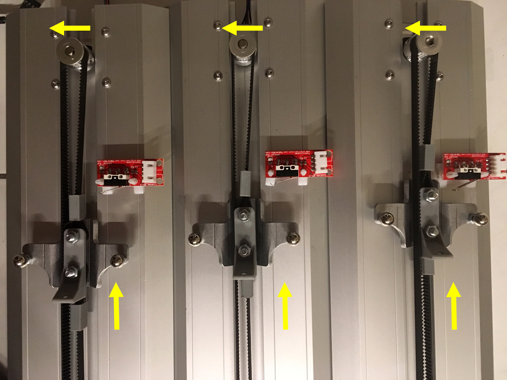

There are a number of different proposals for fixing and tensioning the belts. Some users complained that the belts are very short so any technique that requires less belt length would be fine.

### Trium build instruction

To be completed ????

### Adjustable tensioner
[Rajaa Kahel](https://www.facebook.com/photo.php?fbid=701930819981737&set=p.701930819981737&type=3&theater) replaced the GT2 belt tensioner with an [adjustable tensioner](https://www.facebook.com/photo.php?fbid=702124596629026&set=p.702124596629026&type=3&theater). Print [this](https://www.thingiverse.com/thing:1976893) with 100% infill for strength.   The following picture shows the tensioner down at the bottom.  It also shows Rajaa's rubber spring.

### Zip tie tensioner

This example is taken from another type of printer but should, in principle, also work here. [Zip tie belt tensioner](http://www.tridimake.com/2012/10/the-best-belt-tensioner-so-far.html) Use zip ties to tension the belts.  You can tighten the belts further very easily with the help of a small set of pliers.

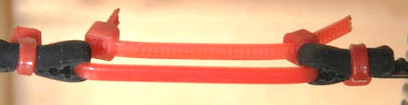

### Pre-measured, fixed belt length

[MiR proposed](http://trium3d.proboards.com/thread/67/notes-building-trium-standard-diamond#ixzz4WNT9dCyO) a procedure where the belts are made to the required length and then slid over the motor pulley. He designed [two parts](http://trium3d.proboards.com/attachment/download/168), a simple 6mm thick spacer and small fixer block that allows to tightening the belt by slipping the fixer block over the belt. The fixed block needs precise printing, it is designed to have a very tight fit so that it does not need any glue to stay in place.
Insert the two spacers, fold the GT2 as seen in the picture and tighten up by sliding the fixer over the belt. Then install the metallic plate and use the two nuts to screw everything together.

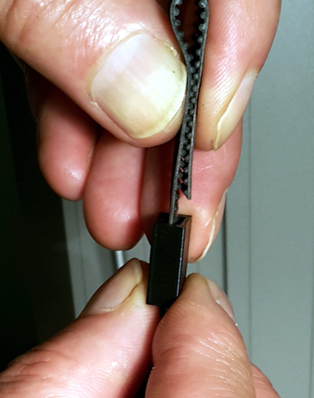

To tighten the belts use the following procedure: Connect the stepper motor with only one screw on the top, do not tighten the screw, you must be able to move and tilt the motor. Adjust the belt tension so that you can barely put the belt on the pulley. Then gently move the stepper motor in correct place, screw in the 2nd screw on top, tighten up the two screws and check the tension of the belt. If tension feels good then loosen the two screws a little and screw in the bottom two screws + tighten everything. If belt feels too loose then go back to start, tighten up the belt by 1 tooth and retry unless tension feels right.

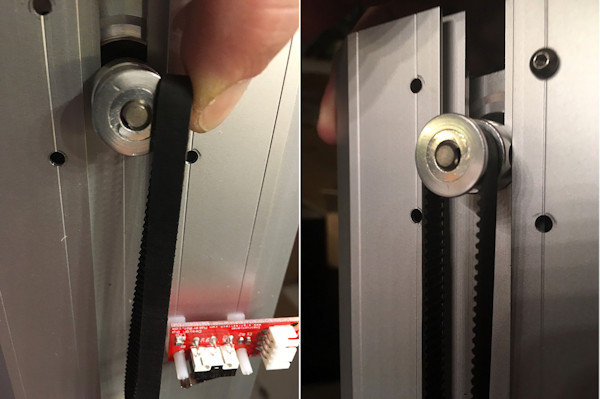

### Variation on MiR's pre-measured technique

I did not see my way open to struggle with the stepper motor plus damper in MiR's proposal above - that nut deep inside makes it hard enough to mount when not loaded with the belt tension. Fortunately, there is a very simple alternative that works just as well. Mount the stepper motor and idler pulley as described above. Use MiR's spacer and fixer block as follows:

- Place both belt spacers on the screws in the slider, make the two loops on both ends of the belt with the fixer block (watch out the two openings of the fixed block differ - this is a smart design!).
- Mount one belt loop over the one slider screw.
- Run the cable around the idler and gear and slide  the other loop onto the remaining open screw (instead of tilting the motor as in MiR's original description).  Keep in mind the sliding/rotation convention shown with the arrows in the picture above.
- Test the belt tension and adjust tighter or slacker by sliding back the fixer block and adjusting the length.
- Repeat until the correct tension is found.

After setting up the GT2 belt the motor (mounted on the damper) spindle was tilted by quite an angle under the belt tension. I don't know if this is a problem? Perhaps the belt tension was too high?  A hard-mounted motor  without the damper should not tilt this far.

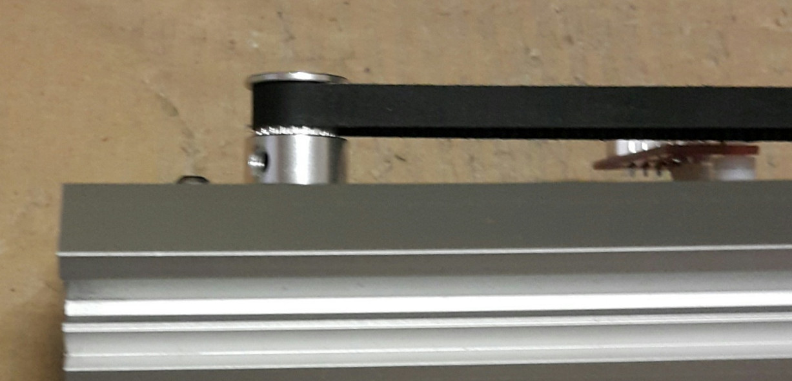

## Add the spring tensioner

Finally, add a mechanism to mount the spring to the slider.  The spring tensioner is required to prevent the magnetic bearings from disengaging under high force conditions. Without the springs the print head inertia and required manoeuvre may result in forces exceeding the limits of the magnetic bearings.

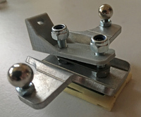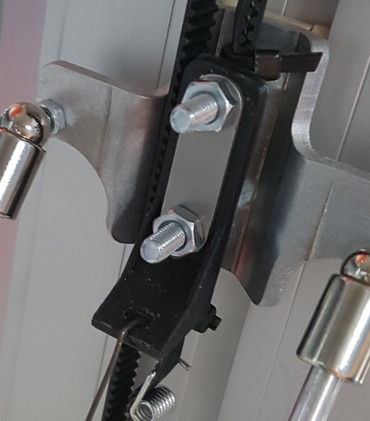

The springs provide a [force of 15 N](https://www.facebook.com/groups/emergin/permalink/1865172640387162/) when mounted. The springs are custom made, and cannot be ordered from China. It is not hard to find the equivalent spring though.    On the surface of the Earth an object with a mass of 1.5 kg has a weight of about 15 N. Using [Hooke's law](https://en.wikipedia.org/wiki/Hooke's_law) and [Newton's second law](https://en.wikipedia.org/wiki/Newton%27s_laws_of_motion) hang the mass from the spring and see how much the spring extended.  In math terms F=15=kX=mg, where F is the force in N, k is the spring constant in N/m or kg/s2, X is the displacement in m, g=9.8 m/s2 and m is the mass in kg.  So we can find a replacement spring (or rubber band) with the same spring constant if the replacement spring elongates by the same distance as the Trium spring when mounted, when carrying 1.5 kg.  One Newton is 1 (kg.m)/s^2.

Detour 1: Suppose we want to replace the Trium spring with a rubber band. Consider the spring to be a solid, rod-like material (like the newly proposed rubber band).  The spring constant can be written as k = c x A/L where c is a material constant (something like Young's modulus), A is the cross sectional area and L is the length of the elastic part (i.e., ignoring the straight wire sections).  It is evident that a larger cross section A increases the spring constant, so we can put two similar springs in parallel to get double the spring constant of each on its own.  Likewise if we make the spring twice as long, the spring constant halves.  The Trium spring elongates by 0.27-0.233=0.037 m under 1.5 kg, hence the spring constant is  k = mg/X=1.5 x 9.8 /0.037 = 400 N/m.  To replace the Trium spring with a rubber band with higher Young's modulus (less elastic rubber band), we must make the new rubber band longer to obtain the same spring constant. To replace the Trium spring with a rubber band with lower Young's modulus (more elastic rubber band), we must make the rubber band shorter or use two springs in parallel to obtain the same spring constant.

Detour 2: The Trium spring is 0.8mm diameter, has 110 turns, a free length of 88 mm, and an outer diameter of 5.8 mm.  Using the [Axcess Spring Calculator](http://www.acxesspring.com/spring-constant-calculator.html), assuming music wire, the spring constant is calculated as 295 N/m, which is somewhat less than calculated above.

If the spring is hard mounted [(as per the original build instruction)](https://www.kickstarter.com/projects/873464596/trium-delta-3d-printer/posts/1747753) to the slider it is subject to metal fatigue and [failure](http://trium3d.proboards.com/thread/43/broken-retaining-spring-after-roughly
). There are several other proposed alternatives, providing a free-moving joint:
- A 3D printed mounting bracket, as proposed by E-Mergin. See [here](https://emergin.net/download/spring-update/) or [here](https://www.kickstarter.com/projects/873464596/trium-delta-3d-printer/posts/1763458) or its equivalent [in metal](http://trium3d.proboards.com/post/477).
- A paper clip hook hard mounted to the slider and then the spring hooks into the paper clip.
- Kahel suggests using a rubber band instead of a spring.
- A [small key ring](http://trium3d.proboards.com/post/460) as intermediate connection between the spring and the mounting link.  The idea with the ring is "with a 'double' connection, the spring hooks are preserved from torsion and deformation when the orientation change".
- Eric Lien recommends [light duty craft store stretch cord](https://plus.google.com/102723111845691625140/posts/RC1KuXqvZWD) (on another printer) which is simply tied.
- Zip ties as links between the spring and the mechanics.
- [digid](http://trium3d.proboards.com/thread/92/draft-version-building-guide#ixzz4XybuJ2SE) dug around in his  fishing tackle box. 3 line swivels for the top slides and 3 snap swivels for the extruder base. He cut the snaps and threaded them through the holes. Had to reduce the spring length by 40mm to keep tension the same.

 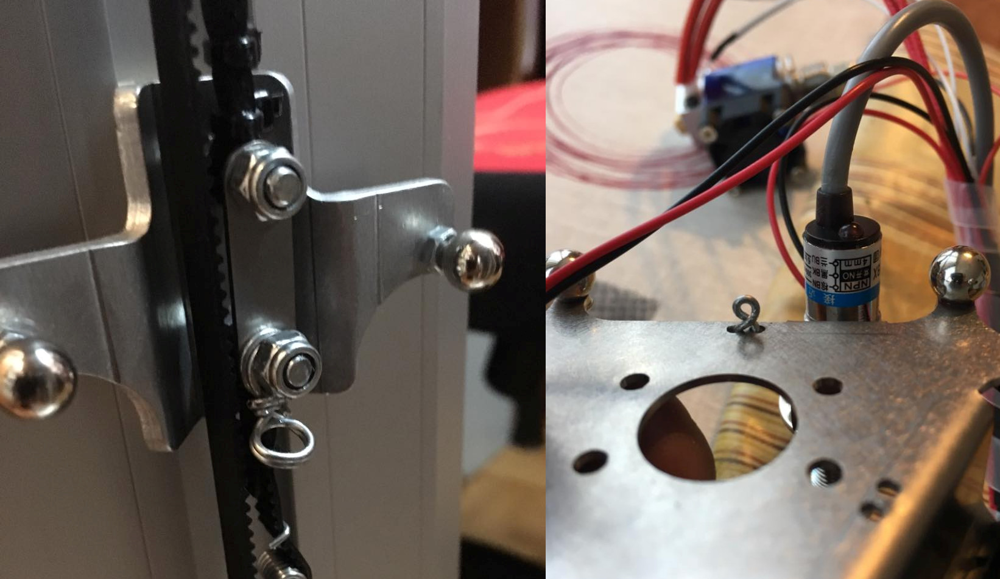
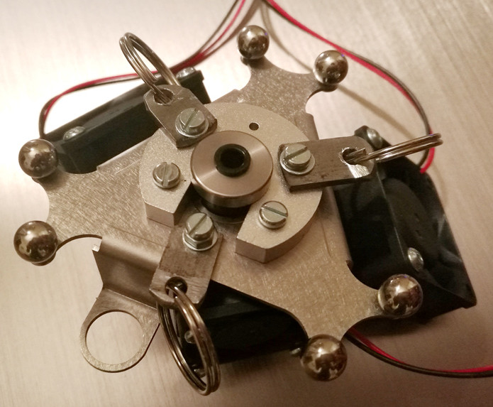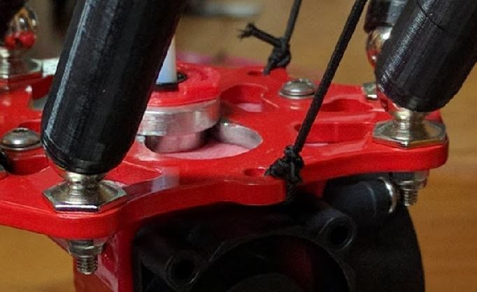

For my own implementation I used a paper clip link and short section of two parallel chains to provide the required freedom of movement plus some security against failure.

# Integrating the Top Plate, Towers and Bottom Plate

## Assembling the frame p31, p32

When you have properly assembled all three towers and all three stepper motors rotate anticlockwise when you push up the slider then you can start final frame integration.

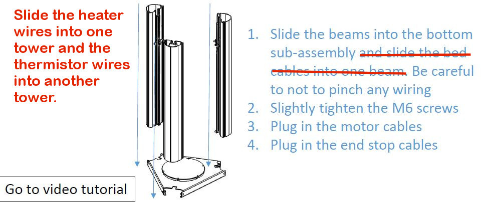

Assemble the Bottom Plate and three towers:

- Loosen the six M6 screws and nuts, leaving some space between the frame and the nut.  The channels on the side of the tower must slide in between the Bottom Plate frame and the nut.  The nut must end up in the channel.
- Place the Bottom Plate top-side up and slide each tower into an edge.  Move the tower until the M6 nut aligns with the channel on the side of the tower and slide into the channel.  The nut should be fully 'captured' in  the channel, preventing it to rotate.  
- Once the nut is captured in the channel force the tower as far down as it will go.  Tighten the screw sufficiently well that the tower will not fall out when handling.  Final tighening will only be done later.
- Repeat with the remaining towers, fixing to the Bottom Plate.

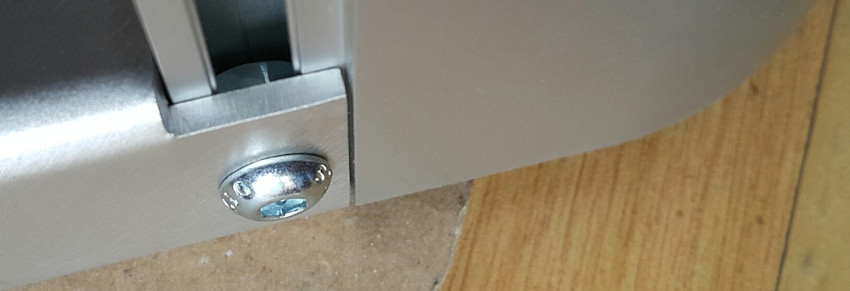

- Pass the thermistor wires up a different tower than the bed heater wires, in order to reduce the EMI on the temperature measurement signal.

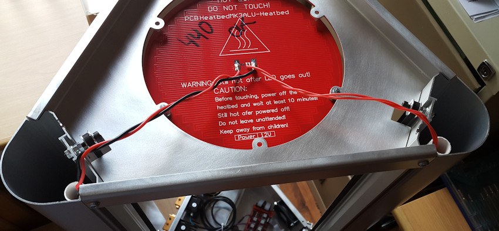

- Twist both sets of wires, all the way from the bed to the final connection. The tigher twisted, the better the EMI rejection will be - but be reasonable in the process.
- Secure the two pairs of bed wires at the top end of the towers. The wires leave the top of the tower in the cutout made for the stepper motor spindle.

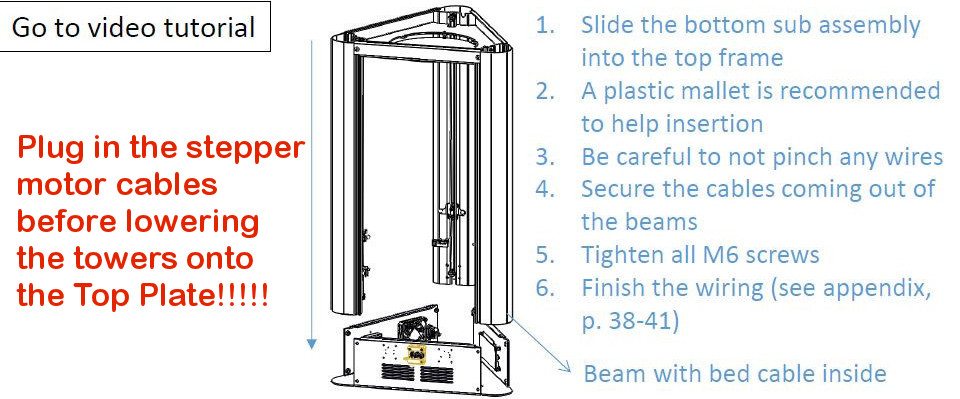

- Plug in the tower stepper motor cables. Plug them in NOW. You don't want to later  find out that the cables are not plugged in.
- Confirm that the stepper motor cables on all three towers are plugged in. Confirm NOW!
- Prepare the screws and nuts in the Top Plate, as for the Bottom Plate.
- Turn the Bottom & towers assembly upside down and carefully lower onto the Top Plate, aligning the nuts with the channels in the towers.  
- Watch out that the end-stop boards are not damaged when inserting the towers into the Top Plate.  There is a cutout in the Top Plate that should clear the end-stops, just take care when inserting.
- Be careful that the stepper motor cables are not damaged.

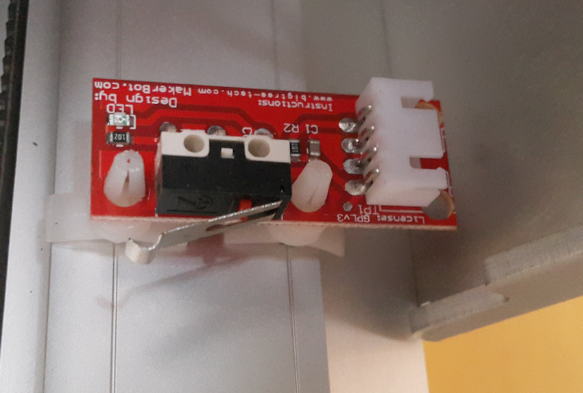

- The tower should fit nicely between the sides of the Top Plate.  Force the towers all the way to the bottom - at least as far as it will go.
- Loosen the Bottom Plate screws slightly to allow movement.
- If necessary, use a mallet (plastic or rubber hammer) or a wooden block and a regular hammer, and carefully hit the towers all the way into the Top Plate and Bottom Plate.  These pictures show how far I could seat the towers in my printer.

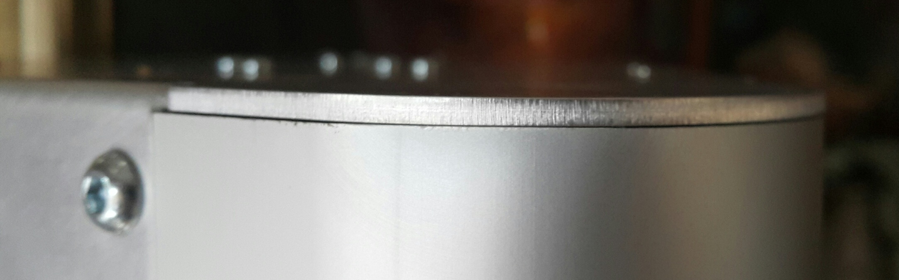

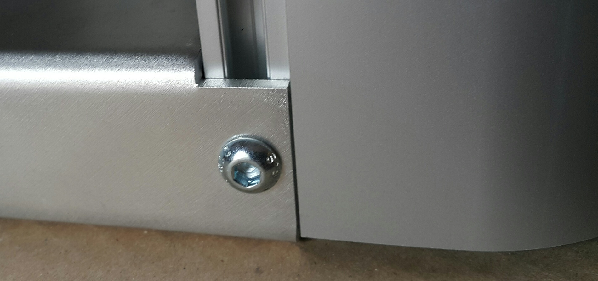

The use of a piece of wood and hammer may not be clear to some. Never hit a metal part with a hard metal hammer, it will damage the part. Especially, don't hit the Trium parts with a steel hammer.  Instead, place a piece of wood on the metal Trium part and hit the wood with a metal hammer. This approach is not as nice and safe as using a mallet, but much better than using a steel hammer!

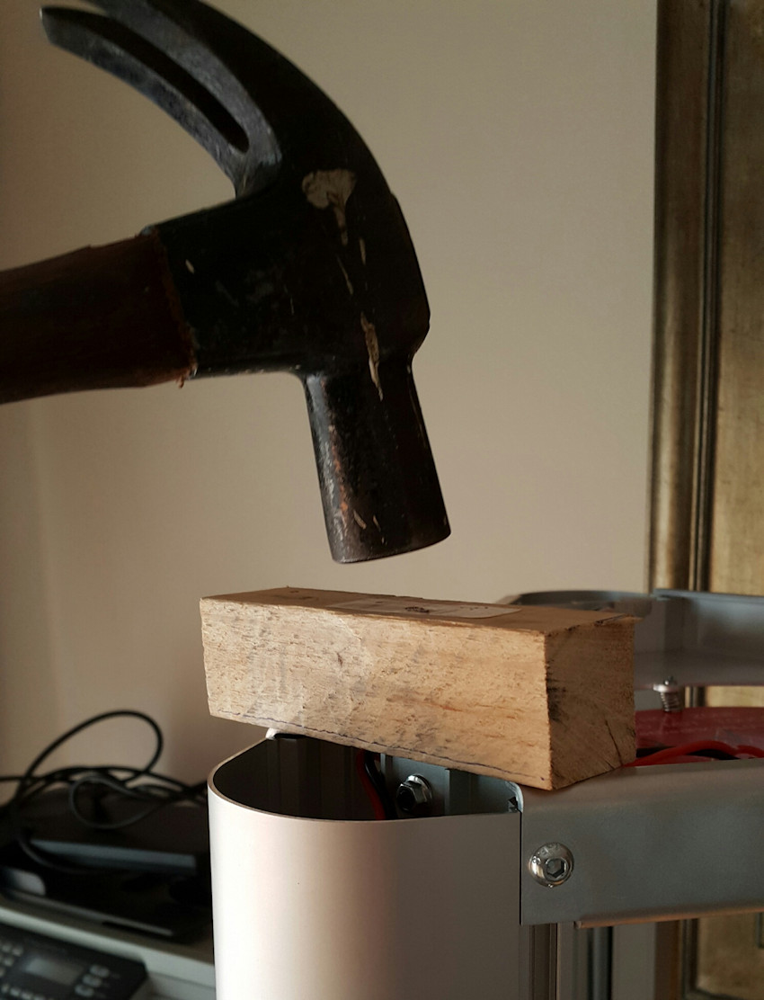

- Ensure that all three towers seat perfectly in the Top and Bottom Plates. The geometrical accuracy of the printer frame critically depends on this step.  Any gap will result in a distortion in the designed geometry. This distortion will later lead to errors in the print geometry.  The geometrical integrity of a delta printer is key to a good print - take special care in this regard.
- Now finally tighten all the M6 screws in the Top and Bottom Plates securely.  Hereafter the frame should be stiff and strong.

If you forgot to plug in the tower stepper motor cables before assembly, you have to open the Top Plate at each tower slightly to plug in the cable.  This is easier that I thought at first, considering how I had to hammer the Top Plate into position.  Loosen all six screws in the Top Plate.  Turn the printer top-side-up and use the mallet (or wood and hamer) to  carefully lift the Top Plate.  Bt very careful that you do not damage the end-stop boards!! You only have to lift to find clearance to fit the cable's white connector. Afterwards carefully push the Top Plate into position again.  The second time it is a lot easier to find proper seating.  Tighten all the screws again.

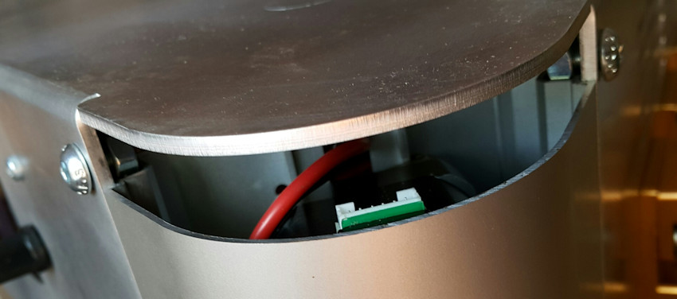

### Bed heater wires

The bed wires are the thick red and black wires coming up one of the towers. 
-  Measure the resistance (should be 1.5 Ohm) between the two wires to verify that the connections are still intact.
- Mount a 100 nF decoupling capacitor between D8+ and D8- on the RAMPS board.
- Use a ferrite ring and try to make as many turns of the paired red and black wires through the ring. Do this as close as you can to the end of the wire.  
- Connect the thick bed heater wires to D8+ and D8- on the RAMPS board.  Polarity is not important, but take the trouble and connect the red to D8+ and the black to D8-.  
- Try to keep the wires twisted all the way to the connector.

For the bed heater I wanted more turns on the ferrite ring. I had some cheap Chinese ferrites from a previous project (you will do better to buy a good quality product).  These rings had many turns, but with a single thin enamel-covered wire.  To prevent core saturation effects, we need to cancel the field created by the high DC current in the bed heater.  This required both wires to be passed next to each other through the core.  Furthermore the wire present in the ring was  24 SWG and I needed 16-18 SWG for the large current. The existing 24 SWG wire was cut into four pieces and paralleled to give about 18 SWG.  The wire is coated with a clear enamel, so in the picture below the copper  deceptively appears to be bare. As implemented the ring has four windings of both the bed heater wires.  A decoupling capacitor of a parallel combination of 15 nF and 680 nF was used.

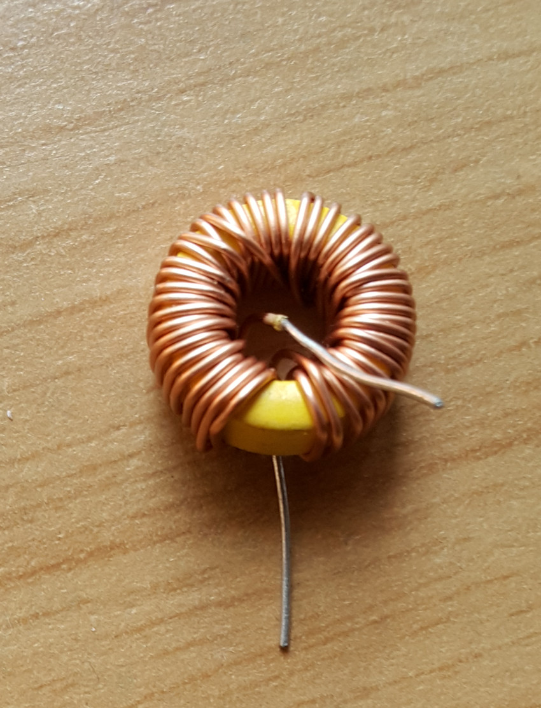 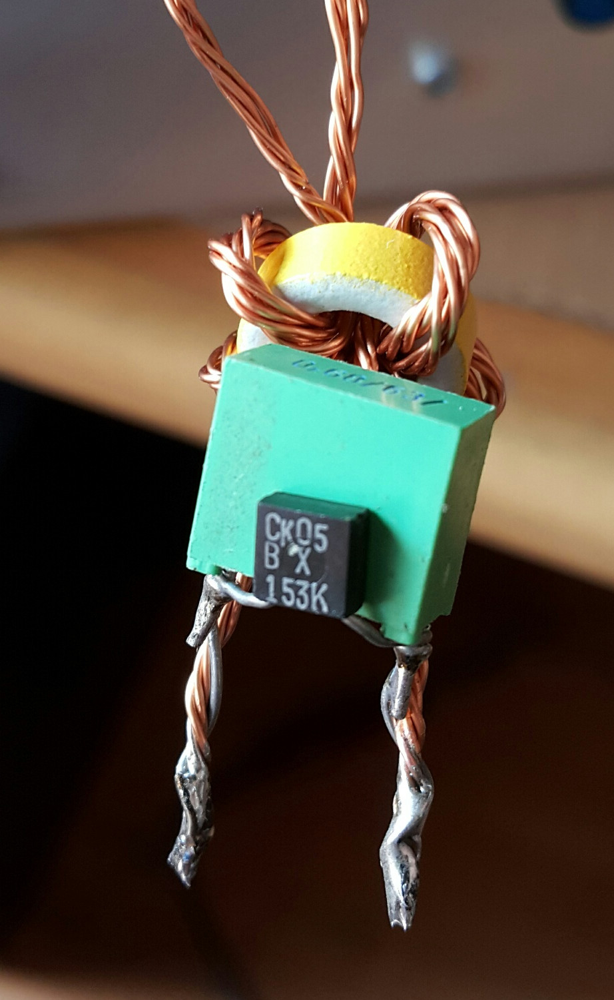 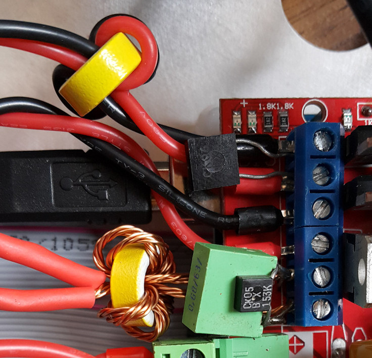
 

### Bed thermistor wires

The thermistor wires are the thin red en black wires coming up one of the towers. 
- Measure the resistance (should be 100 kOhm before plugging in) between the two wires to verify that the connections are still intact.
- Try to keep the wires twisted all the way to the connector.
- Pass the thermister wires under the Arduino and stepper extender boards to keep the wires away from the stepper driver wires.
- Plug the wire into the T1 connection on the RAMPS board (the middle pair of the six pins). Polarity is not important.
- Keep the wires clear from the stepper motor gear.

ToDo: I  don't like the way that the wires come out next to the stepper gear.  Print a block to be glued to the Top Plate to prevent the wires from touching the  stepper motor gear.

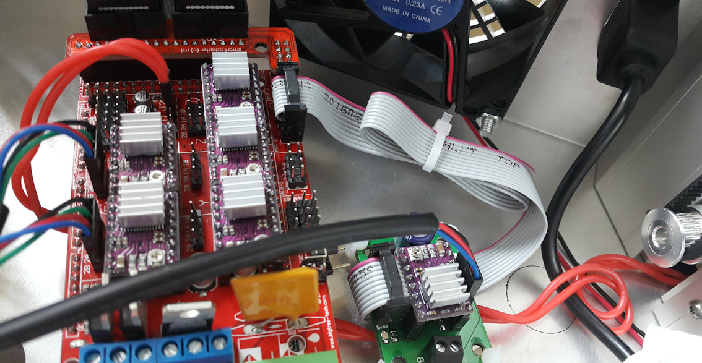
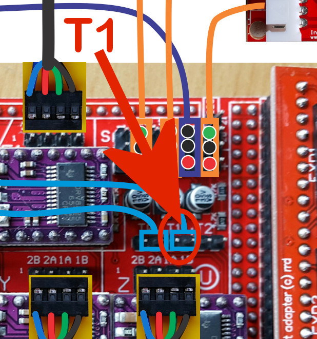 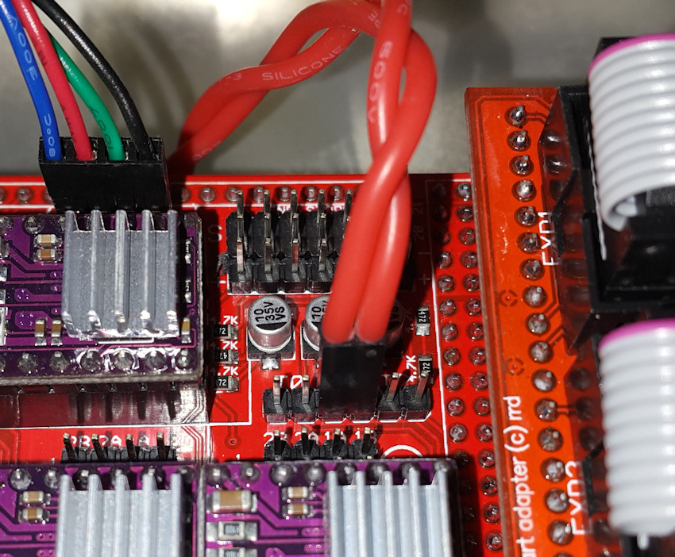

### End-stop cables

Wiring up the end-stop cables is simple, just be careful where you plug into the RAMPS board, and also be careful of the connector orientation. When powered up, you can confirm the end-stop working bt pressing the switch and noting that the LED on the board lights up.

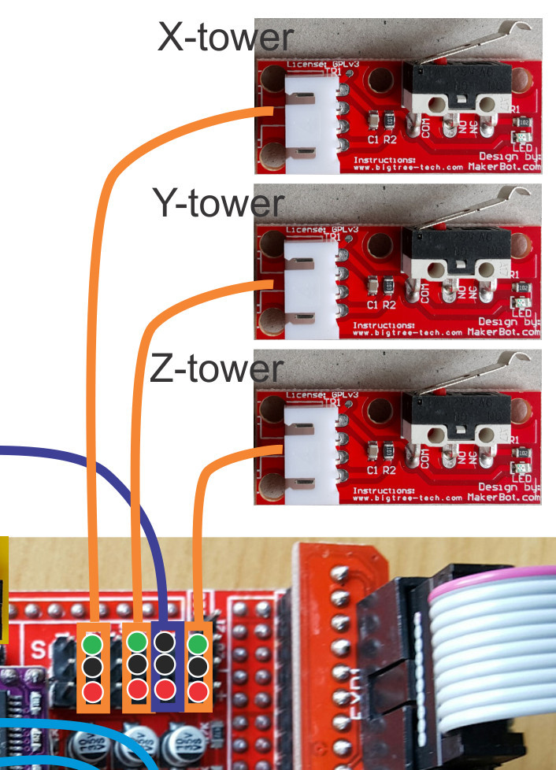

### Stepper motor cables

When plugging in the stepper motor cables match the colour in the cable with the pin number as shown below.  First match the tower ID (X, Y, or Z) to the correct connector and then match the colours 2B->blue, and 1B->black.  You can use either one of the two Z rows, they are connected.

If you did not correctly assemble the tower belt up/down movement then [you can switch motor rotation this](http://trium3d.proboards.com/thread/67/notes-building-trium-standard-diamond#ixzz4WNQFpLaK) by turning the motor connector on the RAMPS board, for that tower, by 180 degrees. It is however better to stick with the convention and change the belt direction mechanics.

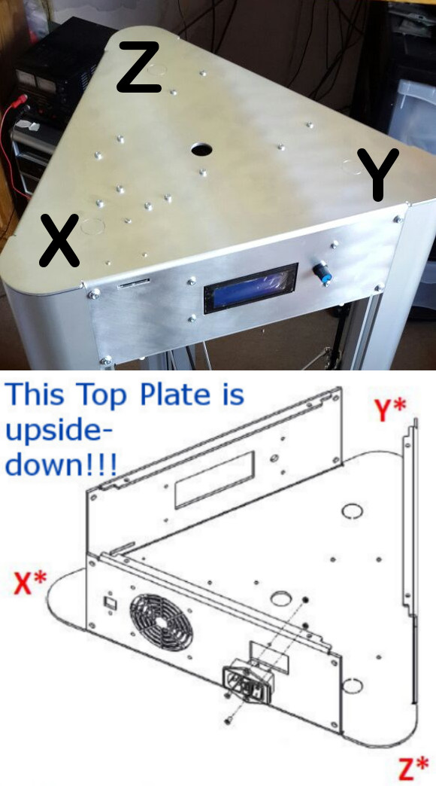

Optional information:  Stepper motor and jerky platform movement.  If you have a board with a [DRV8825](http://www.ti.com/lit/ds/symlink/drv8825.pdf), a motor with lower voltage rating then your supply, and when you move the 3D printer slowly (100 mm/min feed rate) it does not move smoothly. This is described in detail [here](http://cabristor.blogspot.co.za/2015/02/drv8825-missing-steps.html).  The jerky movement caused by DRV8825 drivers:  if we had a way to modify the motor so that with a voltage of 1.4V there would be no current flowing, then the driver would be able to generate all the currents because it would always be spitting out more than the minimum voltage. And it turns out that 1.4V is about the voltage drop of two diodes.  In each diode we have about 0.9V and with 1A current that would make 0.9W losses, such diode has a Rthja of 15K/W, so it will heat 15C above ambient temperature, pretty safe.  The solution is to add diodes as shown in the left-hand figure. There are plug-in boards available on [Aliexpress](https://www.aliexpress.com/item//32787567456.html) and [EBay](http://www.ebay.com/itm/3pcs-Pulse-Slicer-TL-Smoother-Addon-Module-for-3D-pinter-Stepper-motor-drivers-/252698187533?hash=item3ad5fc570d:g:XzsAAOSw241YYgpa). There is [an issue](https://groups.google.com/forum/#!topic/deltabot/2HJEQG_wR9Q) with these offerings.  [These are the diodes](http://www.vishay.com/docs/88713/s3a.pdf) used in the Chinese boards - only a single diode is used, not the required two in series (picture on the right).

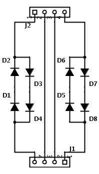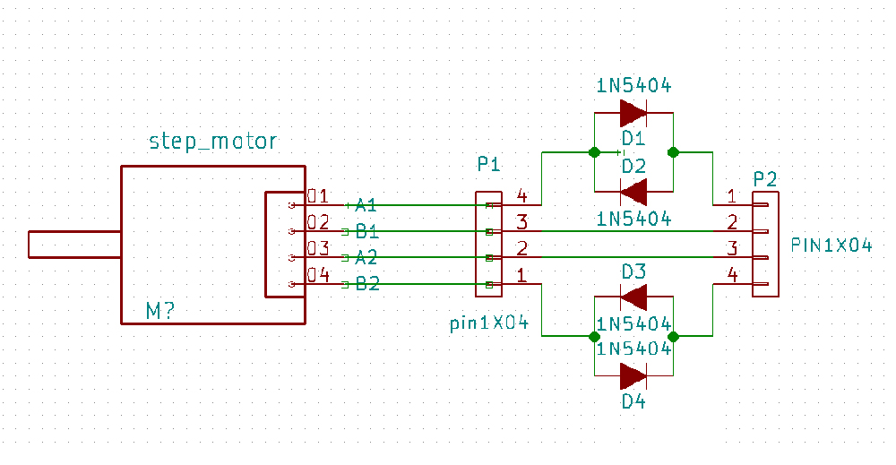

## Molex Connector

Wire the Molex connector as follows:

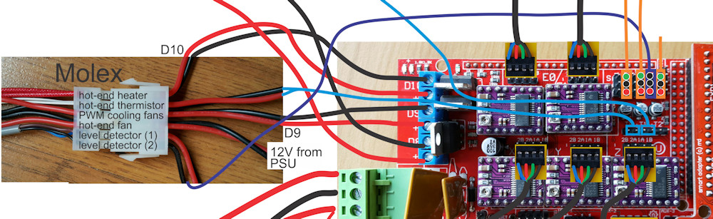

E-Mergin crimped a ferrule on the end of the hot-end heater and PWM cooling fan wires. This ferrule on my printer was larger than the height of the opening where it was supposed to go into (D9 and D10 connectors on the RAMPS board).  So I had to squeeze the ferrule a little to form a flat, wide profile to enter into the connector holes.

Starting from the 'bottom', wire the Molex loom as follows:
- Identify the three-pin connector with three wires. These wires take up the bottom two rows. Plug this connector into the top right of the RAMPS board, where the (black/black/red) pins are shown, the fifth slot from the left.
- The next two wires are for the hot end fan and connects directory to the 12 Vpower supply.
- Then follows the PWM cooling fan wires, which go into D9+ and D9- on the RAMPS board.
- Second from the top is the hot-end thermistor which plugs into the T0 position (left-most two pins on the T-series) on the RAMPS board.
- The top row connects to the hot-end heater element and must go into D10+ and D10-.

### Top Plate wiring conclusion

These pictures shows the wiring of the Top Plate completed. Note that I tried to keep the stepper motor cables tied together and away from the flat ribbon cables and the USB extender cable.  The end-stop cables are also kept together (near the top of the picture).  I believe it is important to keep all connectors open for inspection and verification before switching on.  The area around the output of the power supply is too crowded for my liking.

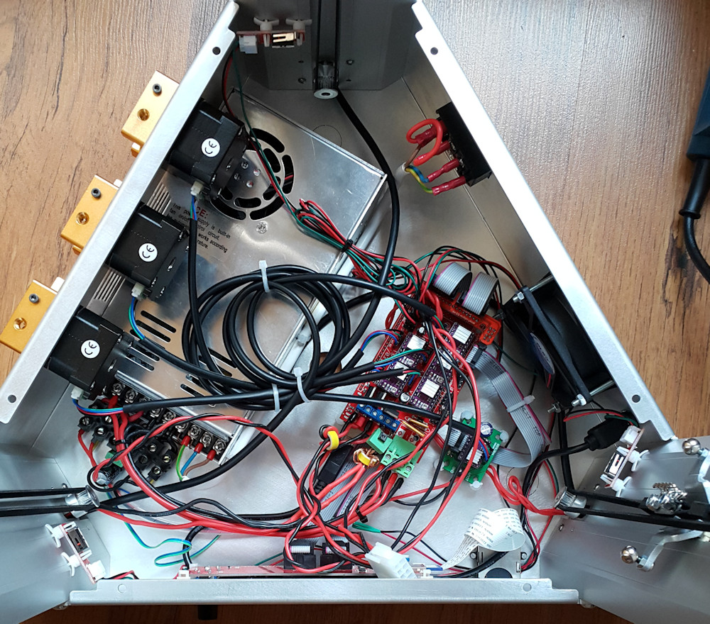

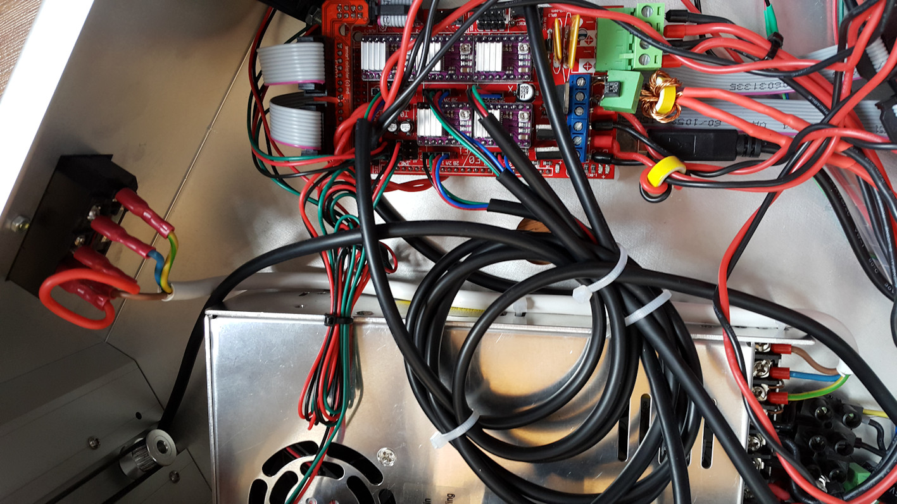

One aspect I don't like is the wires at the top of the towers coming through the motor spindle opening (this is the only place I could see for the wires to enter from the tower into the Top Plate volume.  It is only a matter of time before these wires are sagging down and resting on the rotating gear. Not good. I will be glueing a short cross beam between the wire-zone and the gear zone to prevent the wires from sliding down.

## Top Plate cover

I decided to mount the cover right at the very last step of the process.

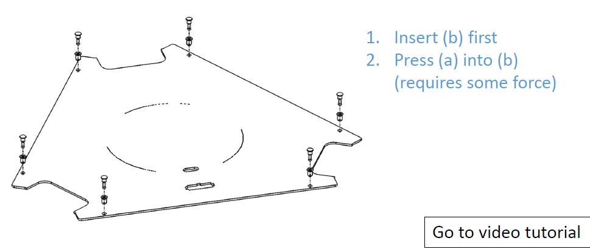

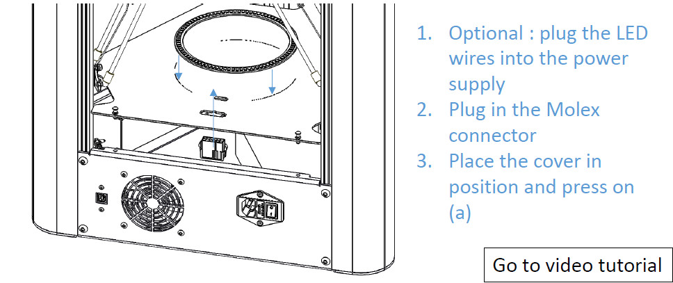

## Ring LED

The ring LED must be bonded to the underside of the Top Plate using the supplied adhesive.  I hope the adhesive sticks for the full lifetime of the printer.

Optional: 
- Add an on/off switch for the LED light or (later) add a PWM controller with new electronics.
- Another option is to see if there are any remaining pins left on the RAMPS board to [control the LED from the RAMPS card](http://neverstopbuilding.com/bed-lighting).
- The LED lamp is quite intense and there are two suggestions to reduce direct view of the LED elements.
  -  A convenient hot fix is to simply [cover](https://www.facebook.com/groups/emergin/permalink/1865630590341367/)  the top section of the printer with a piece of paper.
  -  A [shield](https://www.facebook.com/groups/emergin/permalink/1865630590341367/)  (picture on the right) was designed by [Zetaz](http://www.thingiverse.com/thing:2017085).

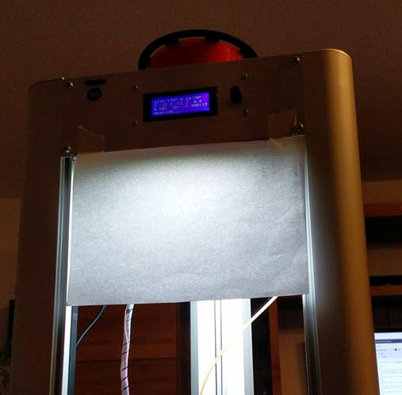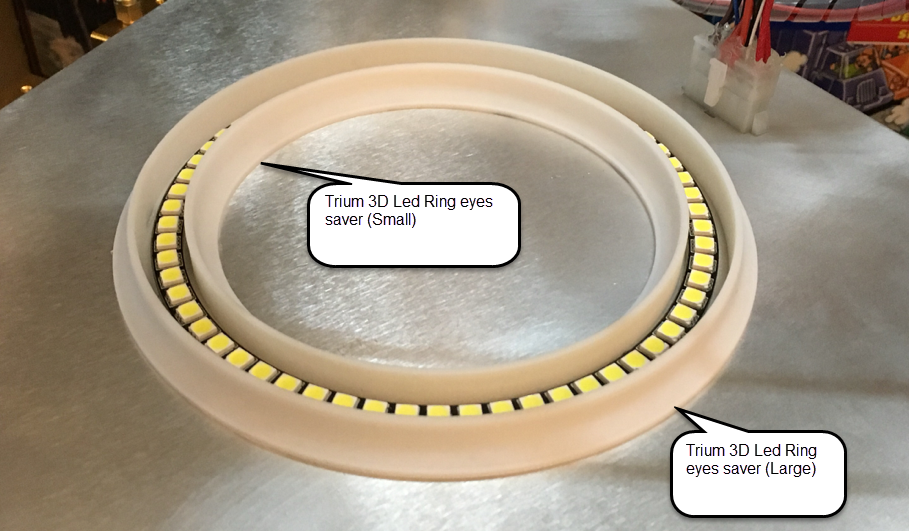

# Spool holders

To assemble the Trium spool holder you use the bearing and bolt and nut in the packets that came with the plate. Place a nut on the bolt and screw it all the way in.  Then place the plate and fix with the second nut. Place the bearing into the hole in the Top Plate assembly.  The spool holder protrudes somewhat into the Top Plate assembly so keep the volume clear.

The spools sometimes [turn too easily](http://trium3d.proboards.com/thread/60/experience-spool-flat-on-printer) resulting in dropped and loose filament. Several solutions were proposed:

- Gerrit printed a ring that is 1 mm higher than the distance between the spool holder and the printer and fits close on the bearing. The spool holder lays on the ring and turn on the bearing. The friction of this ring is enough to stop the spool by easy turning.

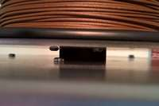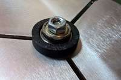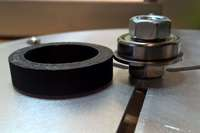

- Rajaa designed a [three-spool holder](http://www.thingiverse.com/thing:2005956).

- daveinuk cut a circle of cardboard about an inch and half bigger than the spool with a hole in the centre and placed it under the spool. Not too pretty but simple, cheap and it works. Might make one out of some plastic

- MiR printed a vertical spool holder, found on Thingiverse, [here](https://www.thingiverse.com/thing:2001034), [here](https://www.thingiverse.com/thing:1983543), or [here](https://www.thingiverse.com/thing:2020411).

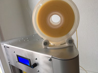

-Jean Marc Cierniewski [glued a piece of foam](https://www.facebook.com/groups/emergin/permalink/1870615306509562/) to the rotating table.

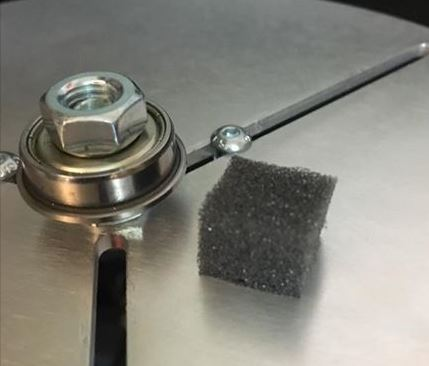

# Print Head

The assembly of the print head is one of the most important tasks in the printer assembly.

## Preparatory reading
Please read this prior to working on the print heads.

### Safety 
The [the E3D-lite wiki page](http://wiki.e3d-online.com/wiki/E3D-Lite6_Assembly) offers a few warnings:

- The thermistor is small and fragile. Be gentle with the legs. The bead is made of glass - don't crush! It is also very small, so don't breathe it in.
- You are dealing with high temperatures - the HotEnd gets hot, and may be off your printer when you do the initial tightening. If you touch it, you will get burned!
- You are dealing with high currents, make sure you double check all your wiring and your power supply rating. It is not recommended to work on anything whilst it is plugged in. Bad wiring with improper current ratings can cause fire.
- Any 3D printer can be a fire hazard. You are using experimental technology to heat and melt plastic, in a machine that you may have built or modified yourself, that likely does not have safety certification or significant failsafes. Fire/Smoke alarms, supervision of your printer while printing, and expertise should not be considered optional.

### General notes

- Look at [the E3D-lite wiki page](http://wiki.e3d-online.com/wiki/E3D-Lite6_Assembly),  there are useful hints for assembling the head. Just keep in mind that the standard E-Mergin head is a little different from E3D-lite.
- The M3x4 screws are too long to keep the balls in a stable position. When screwed in all the way into the ball, there still remains some freedom of movement.  To counter this, I had to add an M3 washer between the scew and the head platform. With the washer in place the ball can be firmly mounted to the platform.
- Use Teflon to seal the nozzle thread, using the hot-tighten technique (see the section below in this document or  [here](https://ultimaker.com/en/community/10885-teflon-tape-against-leaking-hot-end)).  Hot-tighten heat sink into the block and the nozzle into the block (see below). If you don't hot-tighten, [this can happen](trium3d.proboards.com/thread/66/idiot).
- Take care not to buy/use fibre-reinforced teflon tape.  The fibre is probably fine for plumbing purposes, but I prefer the 'clean' teflon tape with no foreign material.  Teflon can be used at temperatures up to around 270-280 deg C, but we have no information on the properties of the foreign fibre reinforcement. 
- When installing the Bowden tube see  [handling of the Bowden tube](reprap.org/wiki/Diamond_Hot end).

### Hot tightening and nozzle removal (Standard and Diamond heads)

'Hot Tightening' is mentioned and described [here](http://wiki.e3d-online.com/wiki/E3D-Lite6_Assembly#Hot-Tightening), [here](https://tamarintech.com/article/hexagon_std_assembly), [here](http://community.robo3d.com/index.php?threads/hex-extruder-hot-end-leaking.3313/), and [here](http://manual.prusa3d.com/Guide/5.+Extruder/56). Using your host software or panel interface etc, set the hot end temperature to 245C. Allow the hot end to reach 245C and wait one minute to allow all components to equalise in temperature. Gently tighten the nozzle whilst holding the heater block still with a spanner and using a smaller 7mm spanner to tighten the nozzle. This will tighten the nozzle against the heat sink and ensure that your hot end does not leak. You want to aim for 3 Nm of torque on the hot nozzle - this is about as much pressure as you can apply with one finger on a small spanner. The nozzle does not need to be torqued down very tightly at all to form a good seal, when at lower temperatures the aluminium will contract and lock the Nozzle and heat sink together extremely securely.

Follow the same pre-heat procedure when you want to remove the nozzle from the block. If the nozzle is removed while cold, the plastic in the thread sticks like Loctite and you may damage the nozzle or the aluminum block. Always heat up the hot end to around 180 C when removing the nozzle to soften plastic that may have entered the thread. See [here](https://ultimaker.com/en/community/10885-teflon-tape-against-leaking-hot-end) and [here](https://www.lulzbot.com/content/budaschnozzle-20-pla-fix-ptfe-nozzle-threads).

### Fitting of the Bowden tubes (Standard and Diamond heads)

[Be careful with the tube outside diameter](http://trium3d.proboards.com/thread/66/idiot-fixed) Bill B advises that the tube diameter can be slightly too large and get stuck before extending all the way into the heat sink/break.  Sand down the outside diameter of the tube end portion to ensure that the tube extends all the way (blue in the following picture) to the end.  Perhaps you can confirm the tube sliding down all the way before screwing in the nozzle.  PTFE tubes are 4mm OD and 2mm ID.

### Cooling fans and hot-end temperature control

It is very  important to cool the print, as described [here](http://www.desiquintans.com/coolingtests) and [here](http://www.desiquintans.com/coolingtests2).  For this reason, print and mount the cooling fan ducts as soon as you can. The same duct design fit on both the Diamond and the regular EMergin head.  There are several cooling duct designs available:[E-Mergin design](https://emergin.net/download/fan-duct-stl-file/), [lucapaschi design 1](http://www.thingiverse.com/thing:2035471), [lucapaschi design 2](http://www.thingiverse.com/thing:2037173), and [Anton Meyer-Erlach](https://www.facebook.com/groups/emergin/1864732583764501/).

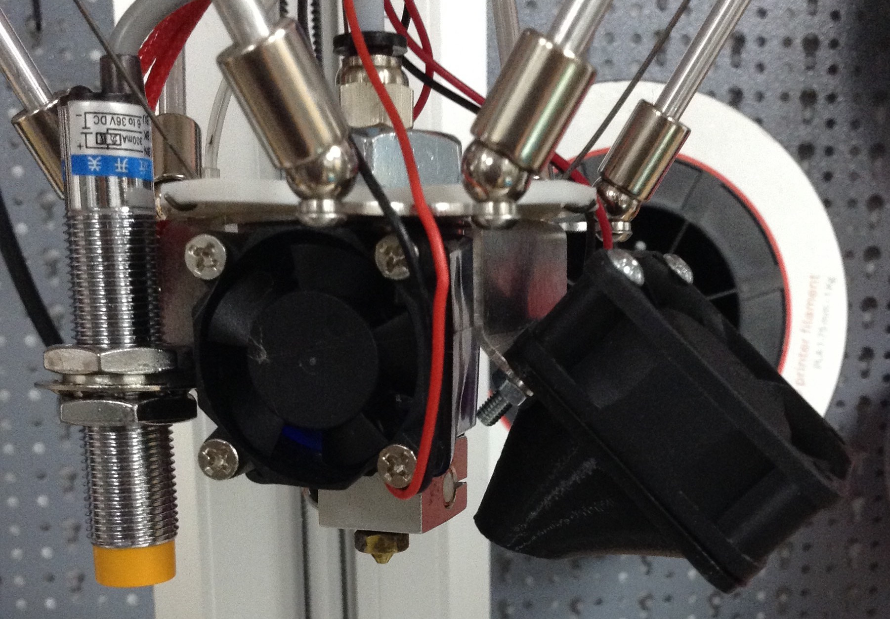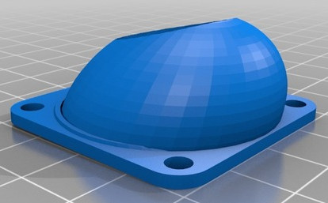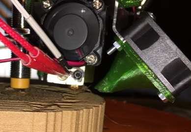

General notes:
1.  The head heat sink cooling fan (little one) is always turned on being directly connected to the power supply - whenever the printer is on, this fan will work.
2.  The two/three other cooling fans are connected to the RAMPS board for PWM operation.  These two fans are only supposed to be on during printing (but not on the first few layers).
3. Before printing the large cooling fans must be off otherwise the bed will not heat up properly.  During the first few layers the fan should also be off (better adhesion to the printer bed), only starting to blow at layer 2 or 3. Even then the fans should not always be blowing at full force. Experiment to find the sweet spot for your printer and material.
4. On the LCD screen push the button go to `Control -> Temperature -> Fan speed` and reduce to 0. The fan speed to 4 is to low. They start turning at 50/255 (20%).
5. The M107 command at the beginning of the print disables the fan.
6. The slicer software preferences has a function to control when the fan comes on or off and at what temperature.
7.  Don Saavedra [added a switch](https://m.facebook.com/groups/1798144480423312?view=permalink&id=1863805900523836) to all his 3D printers fans.
8.  The cooling fan ducts should not be too close to the hot metal, lest it be damaged by the heat.

Once the fans are installed and the hot end temperature is still not stable around the set point it could be that the temperature control system requires [PID tuning](http://trium3d.proboards.com/thread/73/eratic-hot end-temperature#ixzz4VxE384wR).  Running [PID Autotuning](reprap.org/wiki/PID_Tuning) will yield new PID values which can be hardcoded in Configuration.h or it can be entered using the `M301` gcode. You can even calibrate the thermistor in your printer, see [here](http://www.thingiverse.com/thing:103668),  [here](http://hydraraptor.blogspot.co.za/2007/10/measuring-temperature-easy-way.html), [here](https://github.com/Ultimaker/Ultimaker2Marlin/blob/master/Marlin/createTemperatureLookupMarlin.py), and [here](https://nutz95.wordpress.com/2014/04/13/marlin-firmware-thermistor-3950-table/).

### Hot-end thermal screening and socks

Quite a few users reported low/eratic hot end temperatures apparently caused by the cooling fans.  The idea is to keep the nozzle temperature stable, while cooling the plastic work area with forced airflow. The reason behind the thermal sock is presented [here](http://www.soliforum.com/topic/12161/insulated-hot end-is-a-good-idea/), [here] http://3dprinting.stackexchange.com/questions/1247/efficient-and-easy-way-to-thermally-insulate-the-heat-block-of-the-hot end), and [here](http://numbersixreprap.blogspot.co.za/2013/10/does-insulating-heater-block-make.html).  Rajaa Kahel recommends placing a piece of silicon between the the nozzle and heatsinks - this won't be as effective as a fully enclosing sock.  Note also the teflon tape he used when screwing the heat sinks into the hot end.

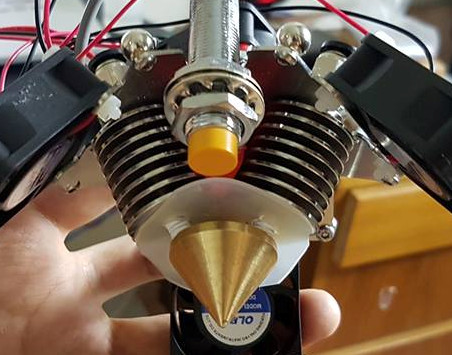

Use teflon to make a sock for the hot end, see [here](https://www.reddit.com/r/3Dprinting/comments/1wc1a3/does_anyone_else_prefer_ptfe_tape_instead_of/) and [here](http://imgur.com/a/fxXbt). Alternatively [make your own sock](http://imgur.com/gallery/vHDmL) with something [like this](http://www.bostik.co.za/products/sealants/super-gasket-maker).

## Hot end temperature error signals

Err: `MINTEMP`: This error means your thermistor has disconnected or become an open circuit. (Or the machine is just very cold.)

Err: `MAXTEMP`: This error usually means that the temperature sensor wires are shorted together. It may also indicate an issue with the heater MOSFET or relay that is causing it to stay on.

If the LCD and contact temperature differs with a large margin, it could be (1) broken thermistor or (2) wrong firmware flashing (two hot end thermistors are different).

Measure thermistor unplugged with an ohmeter, you should get around 100Kohm at 20 deg C

Sometimes manually preheating the nozzle and bed [works better](https://www.facebook.com/groups/emergin/permalink/1870753229829103/).

## Hot-end loom wiring notes

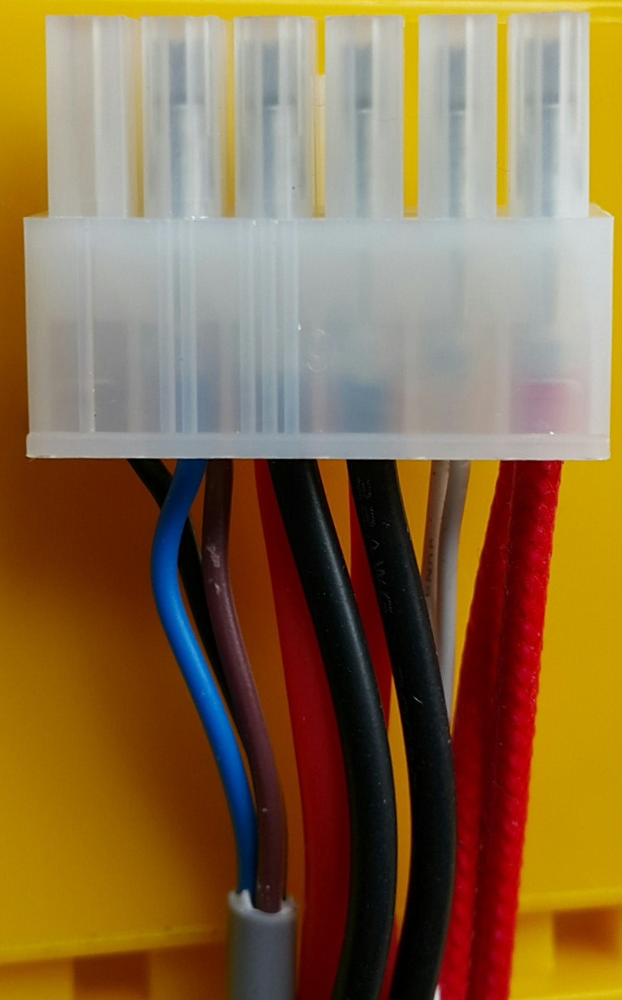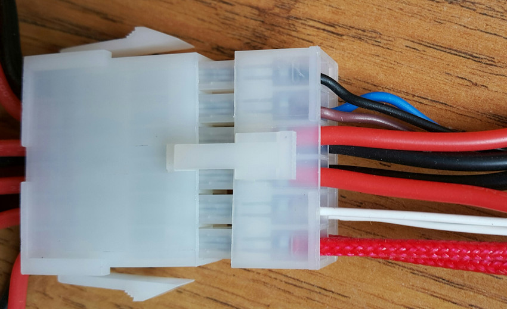

Working from left to right:
- the first four pins (of which three are used) is for the proximity detector (see elsewhere in this document).
- the next row (two pins): hot-end cooling fan (constantly on).
- the next row (two pins): print cooling PWM-controlled fan.
- the row second from the right (two pins), with the thin wires (any colour) connects to the thermistor.
- the right-most two pins, in the cloth-like sleeve, connects to the heater element.

## Standard/Regular Head p28

When building the platform I found myself frequently assembling and disassembling parts to try and figure out how to put it together. An initally logical assembly sequence often leads to problems later.   What does seem to make sense is to put sub-assemblies together and then in the final build put the sub-assemblies together.

### Hot-end sub-assembly

- Carefully consider which nozzle you want to start working with. You can always later change the nozzle, but  to set up the printer and for the first few prints you don't want to change the nozzle too often. I did not think about this and installed the 0.5 mm nozzle (perhaps the 0.4 would be more appropriate?).

- Apply a thin layer of teflon tape around the nozzle screw thread.  Carefully cut and remove any teflon extending beyond the thread, we don't want teflon in the hot plastic flow zone.
- Roll a thin layer of teflon tape around the small thread on the heat sink. Carefully cut and remove any teflon extending beyond the thread. Ignore the blue plastic in this picture.

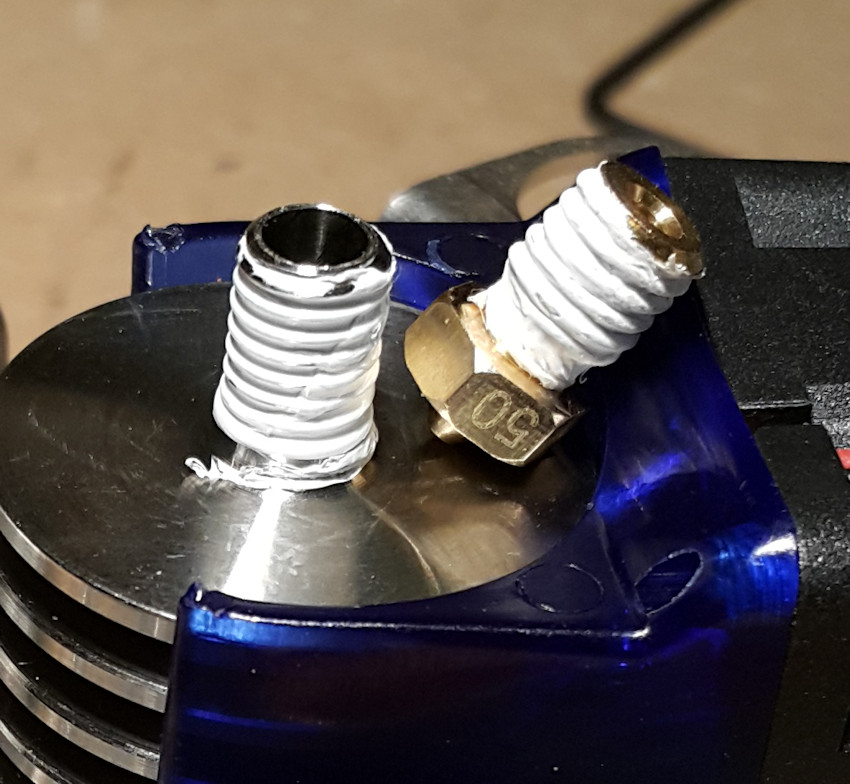

- Screw the nozzle into the aluminium block.  Screw the nozzle in on the side [closest to the hole that fits the thermistor](http://wiki.e3d-online.com/wiki/E3D-Lite6_Assembly).  Screw it all the way in, then unscrew the nozzle a 1/4 to a 1/2 turn. You should see a very small gap between the hexagonal portion of the nozzle and the bottom face of the heater-block. 
- Screw the heat sink into the aluminium block. Screw it in as far as it reaches, butting against the nozzle. Don't screw it in deeper, it will only push out the nozzle on the other side.  The heat sink will be hot-tightened later.

 
- The thermistor fits into a shallow hole and easily slips out. The black screw  next to the thermistor hole is meant to tie down the thermistor wires. [This page](http://wiki.e3d-online.com/wiki/E3D-v6_Assembly_(Old_Wiring) explains how to fit the thermistor.  The procedure described there calls for a washer, which is not supplied in the Trium kit. Find an M3 washer for this procedure.
- Measure the depth to which the thermistor fits and then make a sharp 90 degree bend in the wires. 
- Insert the thermistor into the hole and hold in place with the washer and screw. The screw by itself is too narrow, the washer is required to hold the wires firmly. Take care to orientate the washer with the machining burrs to the screw head side and not towards the wires (we want the smooth side towards the wires). 
- When tightening the screw push the wires underneath the washer. Don't screw down too tight, the wire is very fragile and the insulation easily deforms.

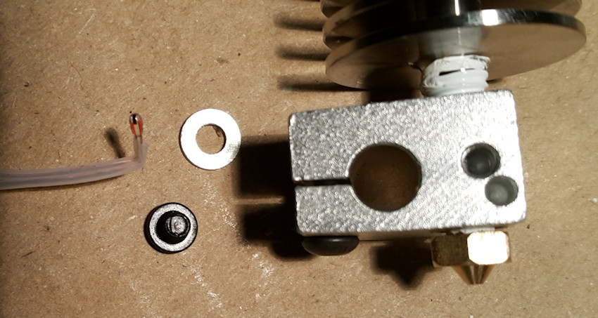 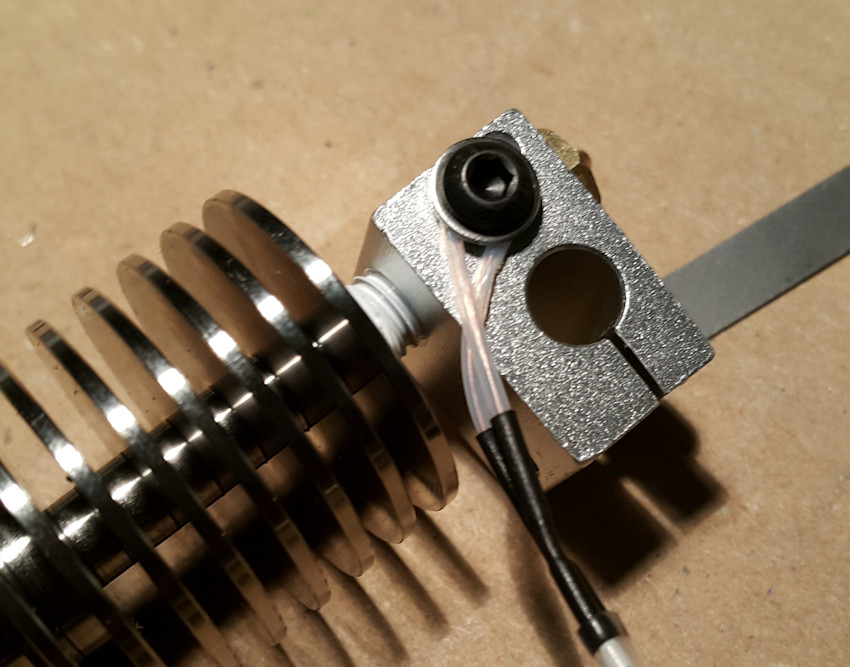

- The heater must fit snugly into the aluminium block. If it fits too loose, remove the screw and clamp the block in a pair of pliers to make the hole smaller before inserting the heater element. However be very careful that you don't make the hole too small, because it is very difficult to widen the gap again.  Be very careful you tighten the screw that holds the heater: the [screw thread can strip easily](https://www.facebook.com/groups/emergin/permalink/1868809946690098/).
- Apply a small amount of heat conducting paste to the inside of the  heater hole and insert the heater into the block.  I have mixed feelings about using this paste. Most of the paste products I reviewed are useable up to 250 deg C, which is near/below the upper operating limit for this printer.  If the heater fits snugly, the heat conductance should be good enough.
- Measure the resistance of the heater before connecting to the rest of the electronics. For the Trium it must be around 3.4-3.6 Ohm.
- Zip tie the thermistor cable to the heater cable to prevent damage to the fragile thermistor wires and to prevent it from being pulled out.
- Check that there is no conduction between the termistor and the block, there should be an open circuit between either lead and the block.  Also check the resistance of the thermistor (depending ambient temperature it must be somewhere between 60-100 kOhm.

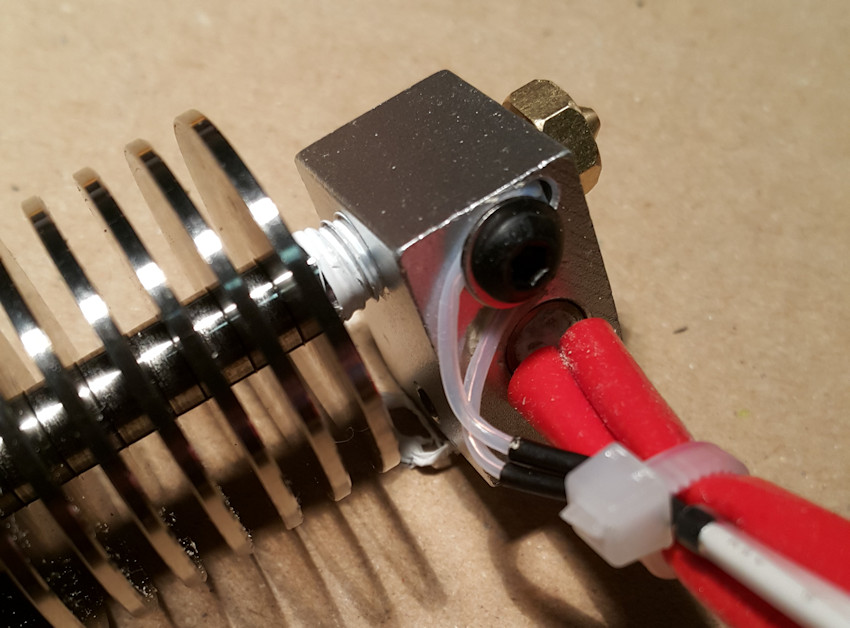 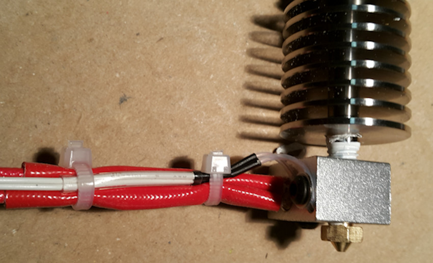

- Mount the permanent heat sink fan. Slip the plastic shroud over the side of the heat sink.  The fan is not syymetrical from the top and bottom, it has a cutout on the top. Watch out for the orientation: the plastic shroud should not extend much beyond the heat sink.  In the following picture, just ignore the mounting in the platform, only observe the hot-end sub-assembly.

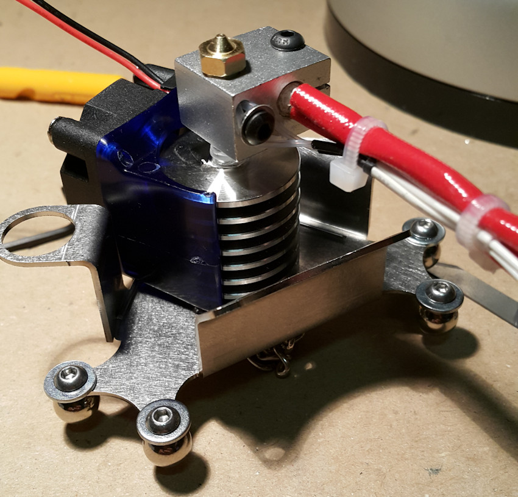

- [digid](http://trium3d.proboards.com/thread/92/draft-version-building-guide#ixzz4XybuJ2SE) points out that the small heat-sink fan for the regular hot-end may not work because it can jam if the four screws are tight and the plastic snap clamp is not flat.  His fan was so tight it had a curve in it. The only way it works now is to to remove two of the screws with just two screws on one side loose holding it in place

### Platform sub-assembly

- Mount the six balls with M3x4 screws to the platform. I found that the screws would not hold the balls firmly, the thread in the balls was too shallow.  Use some M3 washers between the screw top and the platform. 

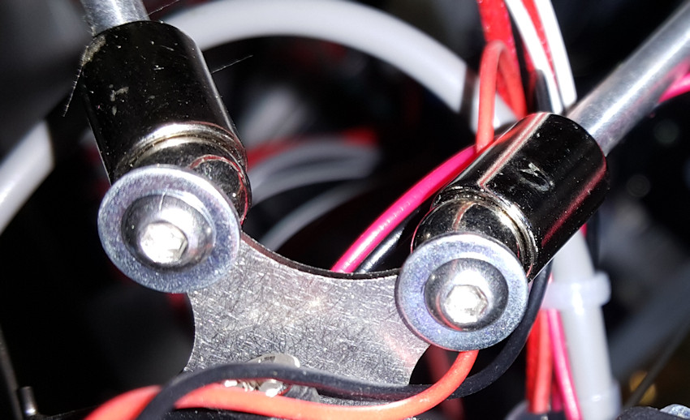

- Mount the spring mounting mechanism of your choice to the three sets of two holes in the platform (p28 has no such detail). I decided to experiment with a small chain mount.  The chain was tied to the platform with thick paper clip wire.  The chains are a bit long, the spring is not extending far enough (15 N force requires elongation of 50 mm).  I might be looking into another spring mount later.

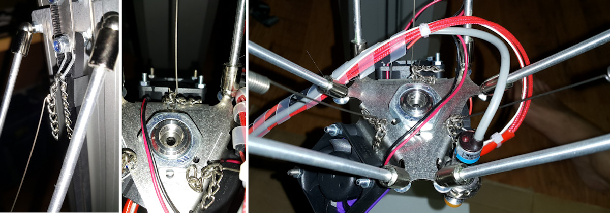

- Mount the proximity detector used for bed levelling.  I found that the top spring washer interferes with the platform. Use the bottom spring washer when mounting the sensor.
- Mount the cooling fans and fan ducts. I asked a colleague to print [this](http://www.thingiverse.com/thing:2035471) in ABS.  

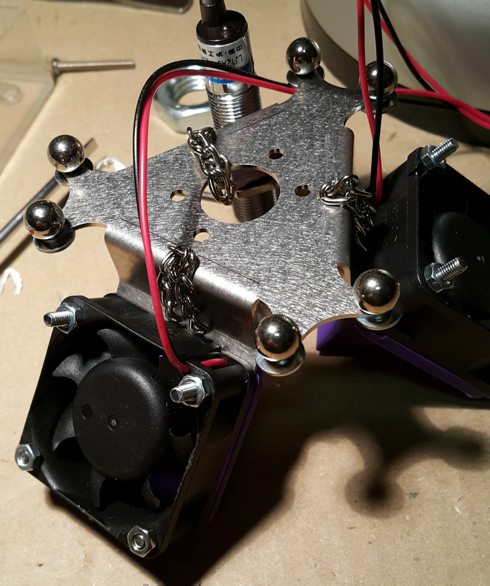 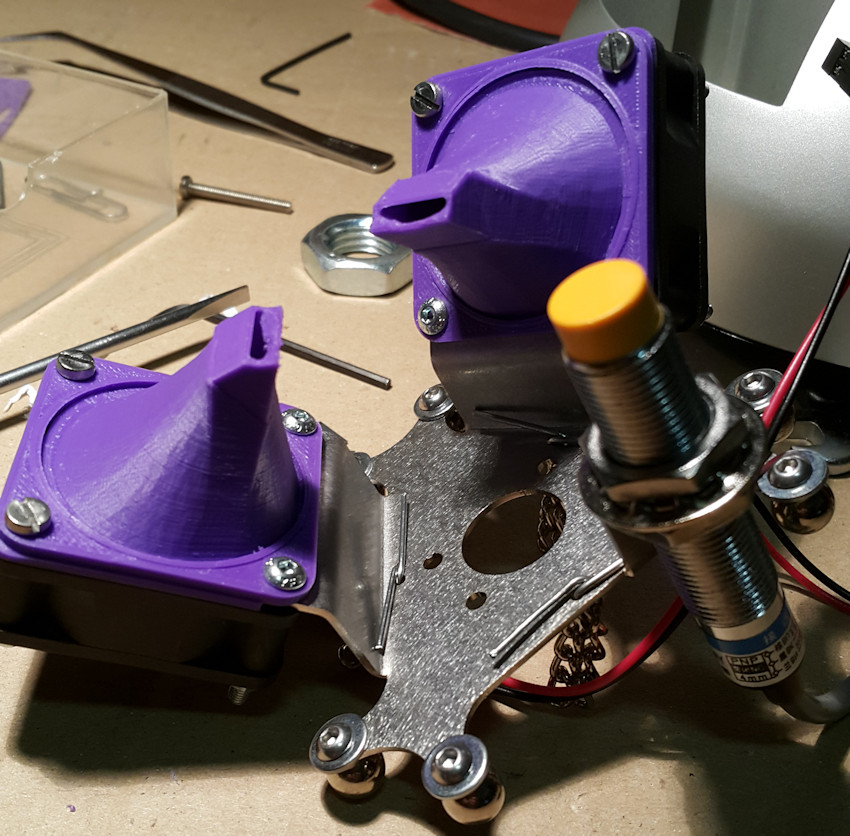

- The mounting screws and corners a the bottom end seems to be below the printing level.  The bottom of the original fan is just barely above the print heigth,  but the new addition is below and should be removed. The screw could be removed and the duct glued on. Note that the picture may not be perfectly horizontal to start with, but the lower end should definately be evaluated.

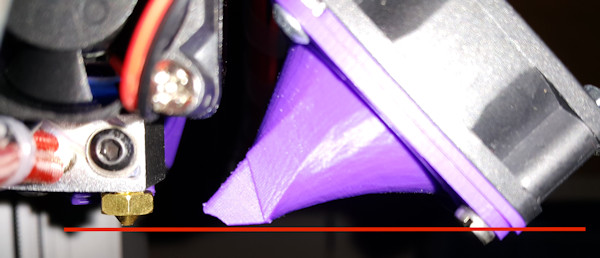

### Final assembly

- Fit the hot-end sub-assembly into the platform. It is difficult, but possible to seat the hot-end in its place in the platform.  Watch out that the heat sink might unscrew in the process.
- Screw the heat sink to the platform with the M16 nut.
- Connect the PWM fans to the loom.
- Connect the heat sink fan to the loom. In my kit the wires for the heat sink fan was much shorter than the other wires.
- Bind the individual wires together in the plastic spiral loom wrap.

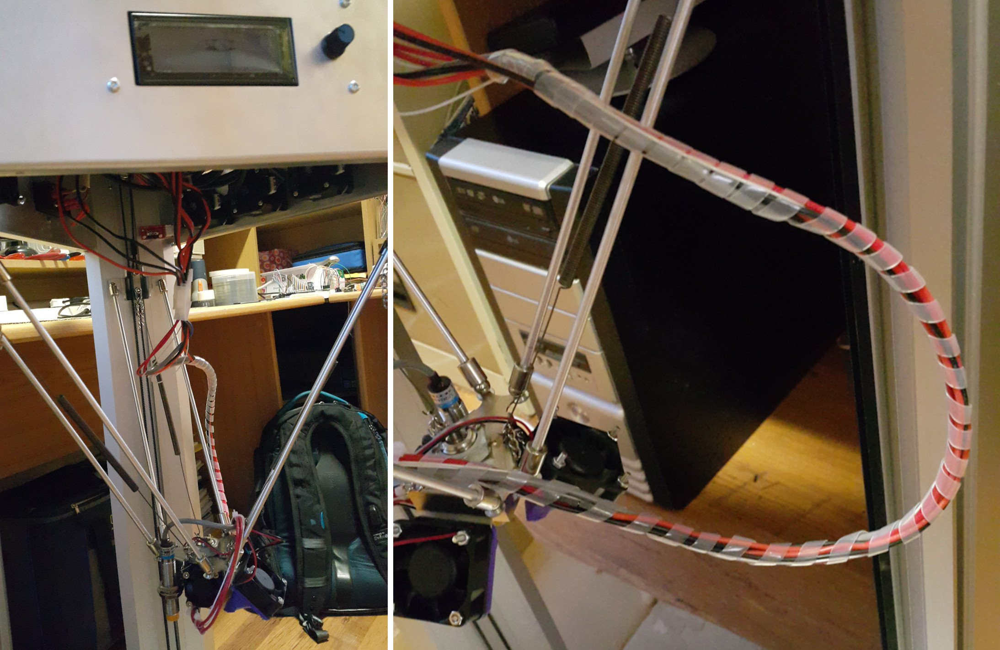

### Mounting on the rods p33, p34

- [digid](http://trium3d.proboards.com/thread/92/draft-version-building-guide#ixzz4XybuJ2SE) advised the following:  **Recommend checking the glue joints for the magnetic couplers.** I had one glue joint break when it was running in the printer, all of a sudden parts were slightly wonky. I removed all rods and used two as jigs with the broken one in between but staggered back and re-glued using the two good ones as a guide to set the correct distance. After that experience digid **added epoxy fillets to the back of every magnet and rod connection.** No more risk of moving.

- [digid](http://trium3d.proboards.com/thread/92/draft-version-building-guide#ixzz4XybuJ2SE) tells how to set the sliders to the correct orientation: To check correct (inclination) level of guides I attached the rods to the sliders and let them dangle straight down, with power off, lowered slider till arms touched Bottom Plate.  Move the rod bottom ends sideways and compare the drag of arms against the Bottom Plate. If one does not touch at all, the slider's inclination/rotation angle is not correct. Try to rotate the slider as shown below.  To do this, you have to loosen at least one of the two slider nuts slightly, rotate the slider and then re-tighten the nut. It is for this reason that **you need to expoxy the slider screw heads into the metal carrier** - you cannot get to the screw heads to tighten the nut properly.

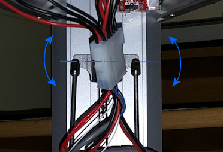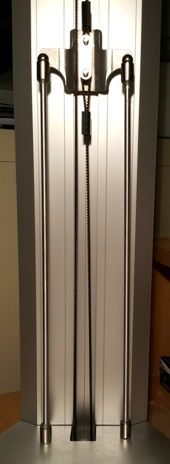

- Label each of the rods and note where they are used in the printer. This way you can always replace the rods in the same location, with minimal disruption of the printing geometry (i.e., convex/concave nozzel trajectory).  It might be a good idea to label the rods with X-left, X-right, etc.
-  The platform must be mounted such that when you view the printer from the front (1) the small fan on the head must be in front or (2) the proximity levelling sensor must be on the left. If not, the bed auto-levelling  will fail,  and you have to make an emergency stop by turning of the power manually
-  
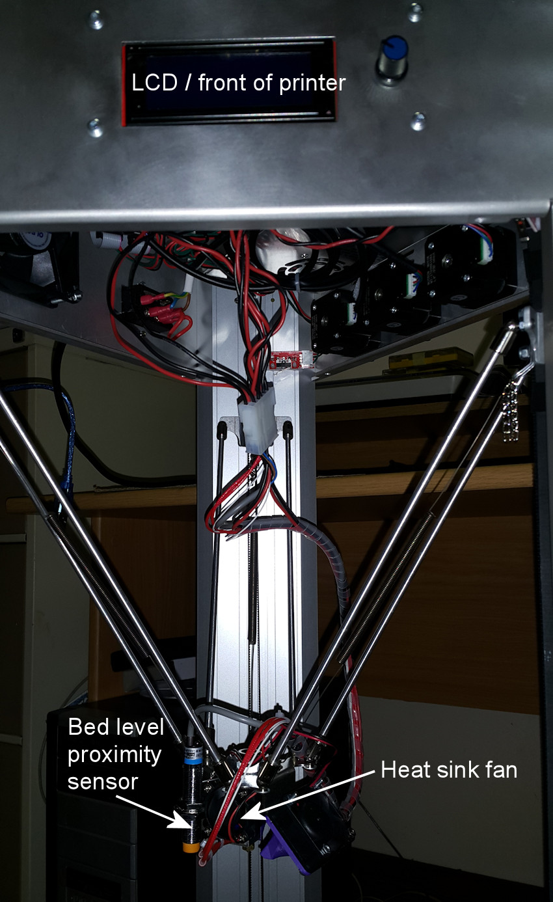

- Fit the springs first, let the platform hang by the springs only.
- Fit the magnetic rods one by one, by stretching the spring.
- Ensure that the nozzle is the lowest part of the assembly; the cooling ducts and bed levelling proximity sensor should clear the bed by some margin.  
- Note that the bed levelling proximity sensor has an operating range up to 1.5-2.0 mm from the aluminium bed, so it should be quite low, but not at the same level as the nozzle.  The sensor heigth will be adjusted later.
- The magnets are glued onto the rods. If they separate, [glue them together](https://www.facebook.com/groups/emergin/permalink/1867354813502278/) again, using another rod for length.
- You should [lubricate](https://www.facebook.com/groups/emergin/permalink/1867097623527997/) the ball joints.

## Diamond Head
The Diamond head poses a [challenge to newcomers](https://www.facebook.com/groups/emergin/permalink/1865763733661386/).  Some recommends to start with the regular head, but others with prior 3D print experience seem to use the diamond hhead with no problems.

I have not yet assembled my Diamond head, details to follow later.

# Setting up the printer

This set up procedure was originally drawn up by [MiR](Read more: http://trium3d.proboards.com/thread/67/notes-building-trium-standard-diamond#ixzz4WNQhjfpo). It comprises:
- Flashing the firmware
- Final checks
- Z-Calibration
- Delta Radius Measurement and calibration
- Manual Bed Leveling
- Auto bed leveling sensor Z offset
- Z correction
- X and Y correction

## Finding the COM port for your printer

Connect the printer to the PC.  The USB cable gives power to the Arduino, so there is no need power up the printer itself (i.e., it is sufficient that only the Aruino board must be working).

When you want to access the printer via Repetier or flash the Arduino, you need to know the COM port number.  There are several options to determine the COM port number:  
- [Create a batch file](http://blog.brush.co.nz/2008/05/com-ports/) with this contents, save the file to ports.bat and then simply run the batch file:
		reg query HKLM\hardware\devicemap\serialcomm
		pause
- Open the Windows device manager and look for the com ports  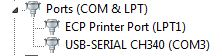. You can open the device manager by 
	- [pressing   ](https://www.lifewire.com/how-to-access-device-manager-from-the-command-prompt-2626360) and then typing the command `devmgmt.msc` in the text box at the bottom left of the screen.
	- [pressing   and the `r` or `R` key at the same time](https://www.lifewire.com/how-to-access-device-manager-from-the-command-prompt-2626360)   and then typing the command `devmgmt.msc` in the text box.
	- You can also open the device manager as explained [here](https://www.lifewire.com/how-to-open-device-manager-2626075).
- open a command window and then type in the `mode` command.

## Flashing the Marlin firmware

If you have not yet flashed the firmware to the Arduino do it now.  See elsewhere in this document for more information.

More information on the Marlin firmware is available [here](https://github.com/MarlinFirmware/Marlin/wiki) and [here](http://marlinfw.org/#)

### Communicating with the printer via the LCD
Rotate to where you want to be, then press to activate.

This diagram supplied by E-Mergin does not seem to match what I see in my LCD. Also, I was unable to find this particular diagram on the internet, so it might refer to some esoteric Marlin version.

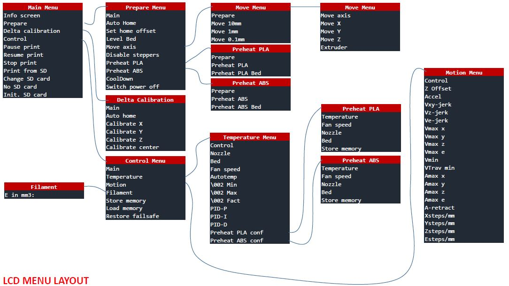

- Note: the LCD shows two temperatures each for the hot-end and bed, separated by a forward slash `/`.  The temperature value before the `/` is the actual measured temperature, whereas the value after the `/` is the set point  or target temperature.

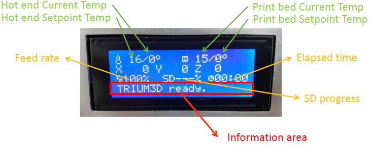

### Communicating with the printer via the Repetier

[digid](http://trium3d.proboards.com/thread/92/draft-version-building-guide#ixzz4XybuJ2SE) found that Repetier is  nice to use for leveling and adjustments.  He had success with the slicers in Reperier with PLA but not with ABS. However he had great success slicing with Simplify3D, both with PLA and ABS. Just don't use the bed leveling wizard it doesn't work: **it drives the motors home and smashes the endstop switches**. Once those end stop reference switches are smashed (moved) your bed level adjustments are ruined and you must start over.

At present I don't have Simplify3D, so I am describing my own experience with Repetier - but only the Manual Control tab. Working with the slicers is beyond the scope of the present document.

- Connect the printer to your computer and power on the printer.
- Start up Repetier. Go to `Printer Settings` and select the COM port you used to flash the firmware. Set the baud rate to 115200. `Apply` and `OK`

- Click on `Connect`. Once connected to the printer, Repetier prints some printer configuration data to the log screen.  The important lines on my printer are shown below.  Get to know the meaning of these lines, it may prove useful later. For example, towards the end of the listing the SD card contents is listed. In this case I had the E-Mergin test file for the cat on the SD card.

		22:00:32.445 : Printer reset detected - initalizing
		22:00:32.487 : start
		22:00:32.487 : echo:Marlin 1.1.0-RC7
		22:00:32.487 : echo: Last Updated: 2016-07-31 12:00 | Author: (EMERGIN)
		22:00:32.487 : Compiled: Feb  4 2017
		22:00:32.487 : echo: Free Memory: 2696  PlannerBufferBytes: 1424
		22:00:32.487 : echo:Hardcoded Default Settings Loaded
		22:00:32.487 : echo:Steps per unit:
		22:00:32.487 : echo:  M92 X160.00 Y160.00 Z160.00 E192.00
		22:00:32.487 : echo:Maximum feedrates (mm/s):
		22:00:32.488 : echo:  M203 X200.00 Y200.00 Z200.00 E200.00
		22:00:32.488 : echo:Maximum Acceleration (mm/s2):
		22:00:32.488 : echo:  M201 X1500 Y1500 Z1500 E1500
		22:00:32.488 : echo:Accelerations: P=printing, R=retract and T=travel
		22:00:32.488 : echo:  M204 P1500.00 R1500.00 T1500.00
		22:00:32.495 : echo:Advanced variables: S=Min feedrate (mm/s), T=Min travel feedrate (mm/s), B=minimum segment time (ms), X=maximum XY jerk (mm/s),  Z=maximum Z jerk (mm/s),  E=maximum E jerk (mm/s)
		22:00:32.500 : echo:  M205 S0.00 T0.00 B20000 X20.00 Z20.00 E20.00
		22:00:32.500 : echo:Home offset (mm)
		22:00:32.503 : echo:  M206 X0.00 Y0.00 Z0.00
		22:00:32.506 : echo:Endstop adjustment (mm):
		22:00:32.509 : echo:  M666 X0.00 Y0.00 Z0.00
		22:00:32.517 : echo:Delta settings: L=diagonal_rod, R=radius, S=segments_per_second, ABC=diagonal_rod_trim_tower_[123]
		22:00:32.522 : echo:  M665 L278.00 R145.50 S100.00 A0.00 B0.00 C0.00
		22:00:32.525 : echo:Material heatup parameters:
		22:00:32.528 : echo:  M145 S0 H200 B70 F0
		22:00:32.531 : echo:  M145 S1 H240 B100 F0
		22:00:32.531 : echo:PID settings:
		22:00:32.534 : echo:  M301 P22.20 I1.08 D114.00
		22:00:32.536 : echo:Filament settings: Disabled
		22:00:32.539 : echo:  M200 D3.00
		22:00:32.539 : echo:  M200 D0
		22:00:32.542 : echo:Z-Probe Offset (mm):
		22:00:32.543 : echo:  M851 Z0.00
		22:00:35.035 : echo:SD card ok
		22:00:35.098 : FIRMWARE_NAME:Marlin 1.1.0-RC7 (Github) SOURCE_CODE_URL:https://github.com/MarlinFirmware/Marlin PROTOCOL_VERSION:1.0 MACHINE_TYPE:TRIUM3D EXTRUDER_COUNT:1 UUID:cede2a2f-41a2-4748-9b12-c55c62f367ff
		22:00:35.196 : X:0.00 Y:0.00 Z:0.00 E:0.00 Count X: 37901 Y:37901 Z:37901
		22:00:35.196 : echo:DEBUG:INFO,ERRORS
		22:00:35.196 : Begin file list
		22:00:35.197 : CAT_TE~1.GCO
		22:00:35.200 : End file list
		22:00:35.200 : Begin file list
		22:00:35.200 : CAT_TE~1.GCO
		22:00:35.200 : End file list
		22:00:35.204 : echo:DEBUG:INFO,ERRORS

- Note that the printer is connected and can be disconnected by clicking on the green button on the left. Now click on `Manual control` to open the tab.  For more info [see here](https://www.repetier.com/documentation/repetier-host/rhmanual-control/).

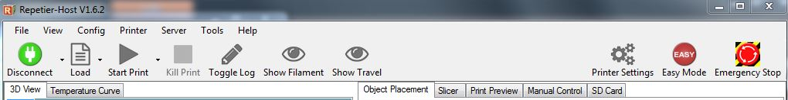

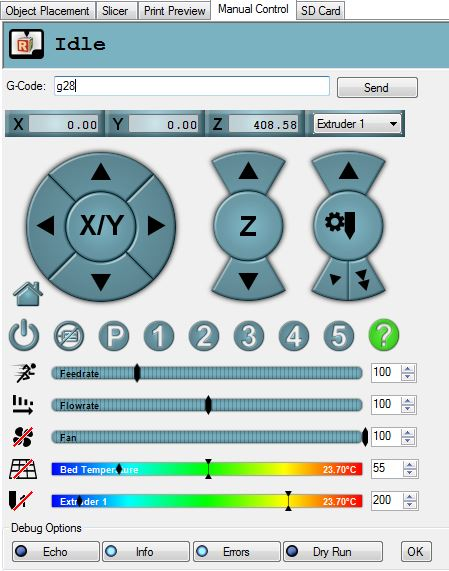

- When sending a command to the printer, you can enter the gcode in the text box and then press `Send`.  In this case the g28 (`Auto Home`) command was sent.  The printer moved the platform and responded to Repetier and in the LCD display to show the nozzle home position:

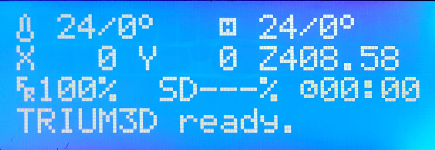

Any other command can be sent to the printer in a similar manner.

In the description below, when the head must be 'jogged' up/down along the x or y axes, move the mouse over the appropriate arrow and see the increment shown in the centre.  My moving the mouse up or down you can change the increment.  Click the mouse to effect the move.

Repetier has the nice facility to store [scripts to buttons](https://www.repetier.com/documentation/repetier-host/gcode-editor/). To do some repeated task, enter the gcode script to a button and then afterwards just click on the button.  Some buttons are pre-programmed, the five numbered buttons you can program yourself.

-  moves the printer to the home position (essentially, it sends the g28 command).
-  shut down the printer - this is not implemented in Trium.
-  disable power to the printer's stepper motors - this is not implemented in Trium.
-  move the nozzle to the park position - this is not implemented in Trium.
-  numbered buttons: execute the script behind this button.
-  enable/disable help bubbles. Click it to be green to display help.

The scripts' code is accessible from the `Printer Settings` menu.  When the printer is connected, individual scripts are accessible by right clicking om the button.

## Final Checking

[MiR made a very nice checklist](http://trium3d.proboards.com/thread/67/notes-building-trium-standard-diamond#ixzz4WNQtOPaf) to ensure that the printer is ready for testing and use.  

- Remove the spring and rods from the printer, we first want to do a dry run with no movement.

- Make sure that your print head is connected to the ramps board. The head must be connected, otherwise the firmware aborts.

- Put the head on a heat-safe surface, make sure that the nozzle points up (why?)

- Important: Do not connect the Trium via USB to your computer. The USB port provides power from the computer to the Arduino, and we do not want the Arduino to stay on when main power is turned off.

- Switch on the power.  The display should light up and after a moment you should see the main menu.

- Ensure that the main case  fan is forcing air *into* the Top Plate assembly.

- Manually move all three sliders to 50% of the tower height, i.e. in the middle of the tower.

- In this step we will confirm the correct direction of slider movement.  But we must switch off the printer once the movement has started to prevent it from moving all the way to the top or bottom.
  - Switch on the printer and keep one hand on the printer's power switch.
  - Use the LCD to go to `Prepare` menu and then select `Auto Home`.   
  - Switch off the printer *before* the sliders reach the end of the towers. 
  - If all three sliders moved up, this test is passed and you can move on to the next test.  If they did not all move up, change the stepper motor connector orientation on the RAMPS board (rotate 180 degrees around) for the sliders that went down.  Ideally, you should fix the belt orientation, so that all belts run by the same convention.  Repeat this step until *all sliders go up* on the `Auto Home` command.  
  - If the stepper motors are not moving [see here](https://www.facebook.com/groups/emergin/permalink/1862392863998473/). Don't try and change the motor direction in the firmware, it can all be done in hardware.  The moment you touch the firmware, it becomes non-standard and hard to maintain.

- Ensure that the end-stop switches work. The LED should light up if the end-stop is activated by hand.  If the LED does not light, check the end-stop wiring.

- Repeat the slider movement test (`Prepare` and `Auto home`), but this time wait until the sliders hit the end stop. If the  slider does not stop at the end-stop then immediately turn of printer and check the end-stop cabling. If all works well then all three sliders will move up, and once all three reached the end-stop, they will move down a bit and then auto homing is done.

- Check that the print head heat sink fan is running at full speed.  The print head heat sink fan is the small fan with the plastic shround forcing air over the heat sink above the nozzle.  

- The two/three PWM cooling fans should be off. If the PWM cooling fans are on, check that the MOSFETS are not touching.

- Now check the heating. First make sure that the display shows valid temperatures for both the bed and  the nozzle. The display should show ambient conditions temperatures, i.e., 16 - 30 degrees C. If you do not see valid temperature values then check cabling for the thermistors.

- Use the LCD to go to `Prepare` then `Preheat PLA`. The nozzle and the bed should heat up now, make sure that the nozzle does not touch anything that could burn or melt. You should see temperatures rising in the display for both the bed and the nozzle. If not, then turn of Trium and check wiring.

- Once everything is heated up, continue by confirming that the extruder work and extrude in the right direction.  - Use the LCD to go to `Prepare` then `Move Axis` then `Move 0.1mm` then `Extruder`. Turn the knob and check that the numbers displayed are positive and increasing. Continue turning and look at the first extruder, the gear should turn anticlockwise (to the left), so any material coming from above will be moved down in the direction of the nozzle.

- Check the PWM cooling fans. Using the LCD go to `Control` then `Temperature` then `Fan Speed`. Set it to 50 and then press the knop in.  The fans should start turning. Make sure that both fans are blowing in direction of the nozzle. Give them a try at full speed (255).  Now turn of fans again by putting speed to 0.  Once the fan speed is set, you must press in the knob to activate the setting.

- You are now ready for Hot Tightening the Nozzle. Follow the instructions elsewhere in this document on hot tightening.

- When hot-end is tightened then let it cool down and assemble it with the springs and the rods, you should now be ready for Z-Calibration.

## Z-axis calibration p65

The top and bottom plates must be located on the three towers with no spaces between the towers ends and the top/bottom plates.  This is important because the frame integrity determines the coordinate system integrity.

Don't use the proximity bed levelling sensor in this procedure.

- This procedure assumes that the Marlin firmware installed on the printer has  `MANUAL_Z_HOME_POS` set to 500.  Open the firmware and search in `configuration.h` for the line similar to `#define MANUAL_Z_HOME_POS 500`.  If the value is not exactly 500, change it to be 500.  This will enable the printer to go down by 500 mm from the home position. This means that the head will move beyond the bed, potentially damaging  the nozzle if the movement is too fast.  So, if and when you move down, be very careful.
- Place a sheet of clean unprinted paper on the bed (75 gms, 100 micron thick).
- Connect the printer to your computer using the USB port.
- Start Repetier on your computer. Go to `Printer Settings` and select the COM port you used to flash the firmware. Set the baud rate to 115200. `Apply` and `OK`
- Auto home: (1) use the LCD to go to `Prepare` menu and then select `Auto Home` or (2) give the `G28` gcode command with Repetier.  The printer does not remember the home position and it must be determined every time you switch on or reset/reboot  the printer.
- Manually take the head down to close to the bed. For a 440mm Trium use the gcode command `G0 Z100 F3000`  to get it down close quickly- but do not go any lower than around 100.   For a 220 mm Trium use the `G0 Z350 F3000` command.  To avoid loosing steps, don't use a feedrate higher than F3000.
- Manually jog down with ever smaller increments until the head just touches the paper.  There must be a very slight friction if you try to move the paper.

- Record the value on the display, say the value is xxxx.  In my printer and the regular head the vaue was 52.575.
- Open the firmware in the Arduino IDE, open the configuration.h file.  Search for 
		#define MANUAL_Z_HOME_POS
 (around line 812 in my file).  Change the entry to read 
        #define MANUAL_Z_HOME_POS (500-xxxx)
 in my case this was 
        #define MANUAL_Z_HOME_POS (500-52.575)
- Upload the new firmware.
- To test the new setting, repeat the above procedure from `Auto Home` and jog down.  The head should stop moving any further down on the paper and the display should show zero.

**Note:** once the value for `MANUAL_Z_HOME_POS` is set, the nozzle will never move below 0.  So even if commanded to go lower, it will stop at 0.

**Note:** at this point we have only set the Z_MIN value in the centre of the bed. If the bed is tilted, it may well happen that the nozzle can crash into a high area of the bed. So even with the value of Z_MIN set, be careful when moving the nozzle towards the bed.

[It seems then on the LCD control ](http://trium3d.proboards.com/thread/72/new-build-fired-today#ixzz4VuxgNRhq) you can move in 10 mm increments in X and Y but not in Z (no 10 mm movement in Z).  The LCD does provide 1mm and 0.1mm movement along the z-axis. Turning the LCD knob one position causes the head to move by 4 increments.  Rather do the 0.1 mm movements with  Repetier  instead.

The distance between the print bed and the nozzle is very important for print quality during the first layers. It seems that with the printer at Z_MIN the distance between the nozzle and bed must be around 0.1 mm.  See [here](https://ultimaker.com/en/community/16792-whats-the-best-distance-between-nozzle-and-bed-when-leveling), [here](https://ultimaker.com/en/community/5941-optimum-nozzle-bed-distance), and  [here](http://forums.reprap.org/read.php?1,582425).  I found it quite hard work to get the bed level and flat to within 0.1 mm.

See [here](https://www.facebook.com/groups/emergin/permalink/1861782507392842/?comment_id=1861803234057436&comment_tracking=%7B%22tn%22%3A%22R9%22%7D) for a long discussion on z calibration.

For another detailed description of the calibration process  [see here](http://reprapandme.blogspot.co.za/2014/02/first-tests-and-calibration.html).

## Manual levelling: adjusting the screws

The material in this section is a variant of the procedure decribed [here](http://minow.blogspot.co.za/index.html#4918805519571907051).

A sheet of paper is used as a feeler guage: lower the nozzle to the point where the paper has some friction when moved under the nozzle.  If the paper is not able to move, the nozzle is too far down and you are in fact pushing the bed down.  If the paper moves freely it means that the nozzle is not yet in the desired location.

By the way, you can calibrate the thickness of your printing paper by taking 10 sheets and then measuring the thickness with a vernier caliper.  Measure the thickness in several different locations, tak the average and then divide by 10.

Program the following Repetier buttons (if the bed is not well manually levelled, you might even set the z value to 5):

|Button 1| Position |Command |
|----|----|----|
|1 | Centre | `g0 z2 x0         y0     f3000`|
|2 | X tower| `g0 z2 x-82.2724  y-47.5 f3000`|
|3 | Y tower| `g0 z2 x 82.2724  y-47.5 f3000`|
|4 | Z tower| `g0 z2 x0         y95    f3000`|

Buttons 2 to 3 move the nozzle towards the X, Y, and Z towers at a radius of  95 mm from the centre.  I don't want to go too close to the bed screw, in case there is a distortion in the plate at the screw position.  The three tower calibration positions on my printer are shown here (about 15 mm from the edge):

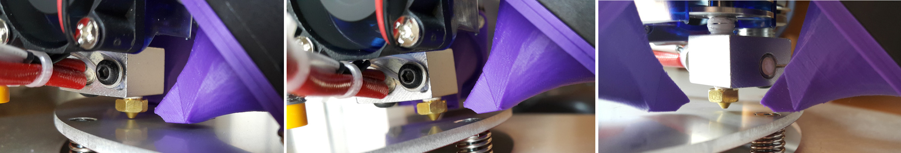

In the previous section we set the value for Z_MIN in the centre of the bed.  At present the bed may still be in a  tilted orientation.  This procedure attempts to adjust the bed heights at the bed mounting screws (aligned with the towers).  The idea is to measure the height of the bed near each of the screws and then adjust the height of that screw. The procedure is as follows:

- If you have not yet installed the bed, measure the pitch on the bed screws. Count the number of thread ridges per measured distance. This gives you the pitch of the tread. If the pitch is known you can calculate the depth of travel for one turn. 
- After installation level the bed manually with a measuring block or a vernier caliper so that the bed is level, relative to the fame, to within 0.5 mm. Measure by hand and adjust till the bed is at the same height at all three screw positions. This step is really important, because it makes the next steps easier and faster.
- [MiR advises](http://trium3d.proboards.com/thread/94/bed-positional-stability-good?page=1#ixzz4YBplrXpU) to  take an allen wrench that is exactly 10mm high and adjust the screws of the bed so that the wrench barely slides through the gap between the bed and the chasis. This is an easy way to make sure that the bed is properly levelled.
- Using the procedure described above for z-calibration, measure the height of the bed at all four positions. This is most easily done using Repetier and the four button scripts. If any of the four positions is at a height of 0 mm it means that the bed could be lower, the firmware just stopped at 0 mm.  In this case change the Z calibration calculated in the previous section. Set the value of xxx to be 0.5 mm smaller, so that the nozzle can move further down (just remember that this could be lower than the bed, so the nozzle or bed can be damaged if you move to z=0).  Repeat the procedure until none of the four readings is zero, every time increasing the value by 0.5 mm.
- Move the nozzle to the X-tower screw (Button 2 `g0 z2 x-82.2724  y-47.5 f3000`), with the nozzle say 2 mm above the expected build plate. 
- Carefully lower the nozzle initially at 0.1 mm and later at 0.01 mm at a time until the nozzle distance is a paper thickness from the plate. When you move a single sheet of paper between the bed and the nozzle it should experience some friction, but not too much (because you are then compressing the paper).
- Take note of the z value. If the z value is zero it means that the bed edge is probably below the centre (remember that the nozzle cannot move below zero), then set the bed level slightly higher (see two steps back).
- By the way, I found that there is considerable hysteresis (0.05 to 0.15mm) between (1) moving the nozzle down to touching the paper and (2) moving the nozzle  up to releasing the paper.  In most fine mechanical systems this is unacceptably large. In the delta printing mechanism this hysteresis is probably acceptable, provided we alway only move in one direction (i.e., avoiding the the hysteresis gap).  So when you do bed levelling always test while movig down. If you moved too far down, go up again by 0.5 mm before dropping the nozzle down again.  When printing the nozzle is always moving up, if it was to go down, it will destroy the print or bed.
- Repeat the procedure for the Centre (button 1),  the Y (button 3) and the Z (button 4) tower positions. Each time taking a note of the z value where the nozzle is paper thickness above the bed.
- Review the three values at X, Y and Z and the centre of the bed then decide at which level you want to set the bed edges.  But all the time make sure that you don't get a false z=0 reading (the nozzle cannot go lower than 0).
	- If the centre is lower than the lowest edge, aim to set the bed edges higher than the centre. In other words use the Z_MIN value at the centre as reference and adjust the edges to be higher. 
	- If the centre is higher than the highest edge, set all the edge heights to be equal but lower than the centre.
-  Repeat the process, iteratively measuring the values at C, X, Y and Z.   Adjust the bed level at each of the towers to get the same value at all three towers. 
- Move the nozzle to home (to calibrate the top end-stops)  and repeat the measurements, until the values at the bed edges settle to the same value.
-  After about three or four iterations around the circle, my bed printer's bed levels settled down on

|C |X |Y|Z|
|----|----|----|----|
|0.72|	1.26|	1.26	|1.26|

The bed is now level (edges at the same height), but it is clear that the centre measures a displacement of 0.55 mm lower than the edges.

Note that the print area is not a 200 mm diameter circle, but a [Reuleau triangle](https://en.m.wikipedia.org/wiki/Reuleaux_triangle).

## Side-note on consistency of nozzle-to-bed distance.

After a few prints I found the nozzle dragged on the bed. I wanted to check the concave/convex status.  I spent some time on measuring the bed height manually using the the above procedure. The table below describe my findings. Columns are: Nozzle temperature, Bed temperature, Shim thickness (single paper), `DELTA_RADIUS`, nozzle height at centre of bed, nozzle X  tower height, nozzle Y tower height, nozzle Z tower height, average of X, Y and Z and difference between centre and edge average.  During this test the printer was physically stable, with no setting changes (other than bed temperature).  The test was completed in about 60-90 minutes.   The X, Y, and Z values here were measured with the nozzle at 95 mm from the centre towards the X, Y and Z towers respectively.

|	TNoz	|	TBed	|	S	|	R	|	C	|	X	|	Y	|	Z	|	(X+Y+Z)/3	|	(X+Y+Z)/3-C	|
|	--------	|	--------	|	--------	|	--------	|	--------	|	--------	|	--------	|	--------	|	--------	|	--------	|
|	25.9	|	25.7	|	0.1	|	147.50	|	0.18	|	0.19	|	0.19	|	0.19	|	0.19	|	0.01	|
|	28	|	70	|	0.1	|	147.50	|	0.18	|	0.09	|	0.19	|	0.18	|	0.15	|	-0.03	|
|	30	|	70	|	0.1	|	147.50	|	0.18	|	0.05	|	0.21	|	0.17	|	0.14	|	-0.04	|
|	25.9	|	27.8	|	0.1	|	147.50	|	0.12	|	0.04	|	0.15	|	0.15	|	0.11	|	-0.01	|
|	25.9	|	26.9	|	0.1	|	147.50	|	0.12	|	0.05	|	0.17	|	0.16	|	0.13	|	0.01	|
|	29	|	70	|	0.1	|	147.50	|	0.16	|	0.06	|	0.18	|	0.16	|	0.13	|	-0.03	|
|	31	|	70	|	0.1	|	147.50	|	0.17	|	0.08	|	0.19	|	0.16	|	0.14	|	-0.03	|
|	30.2	|	71	|	0.1	|	147.50	|	0.19	|	0.15	|	0.18	|	0.15	|	0.16	|	-0.03	|
|	32	|	71	|	0.1	|	147.50	|	0.17	|	0.15	|	0.19	|	0.14	|	0.16	|	-0.01	|
|	27.6	|	51.9	|	0.1	|	147.50	|	-	|	0.19	|	-	|	-	|	-	|	-	|
|	26.4	|	34	|	0.1	|	-	|	0.09	|	0.03	|	0.15	|	0.11	|	-	|	-	|
|	-	|	-	|	0.1	|	-	|	0.08	|	0.03	|	0.15	|	0.11	|	-	|	-	|

Observations:
- The  `DELTA_RADIUS` setting is probably as good as you will get (print nozzle trajectory is not concave/convex).
- The relative movement between the bed and the rest of the printer was effectively 'moved up the bed' by about 0.15 mm, since my last z-height calibration.
- The position of the table is relatively insensitive to the bed temperature - at least no major shifts.
- Study the X coordinates: **it jumped by 0.1 to 0.15 mm**: high, low, high, then low again.  This only happened on the X tower side, not on Y and Z.
- The thermal expansion on the towers should be about 15 micron (0.016mm) per degree celcius. Hence thermal expansion on the towers is not the issue here.

Either the bed is not stable and, it seems, unpredictable in the short term (my X axis here in particular) or, there is some movement in the X-axis that make the bed appear to move up and down.  In other words, instability in the belt or the stepper motor movement. But how can it go up, down, up down like this?

[Feedback](http://trium3d.proboards.com/thread/94/bed-positional-stability-good?page=1&scrollTo=783) from MiR and mikeeitel:  **It  looks like lost steps.**
- Such kind of unprecisenes you can mostly be tracked down either to mechanicals: slipping nuts, too much resistance in slides, to much inertia for given stepper current or to electrials in the step driver control chain: too short step pulses, too short wait time between steps when direction change.
- Keep the feedrate at or below F3000  (I think it's mm/min) and that worked pretty reliable.
- Look at the driver current (the driver calibration voltage). perhaps increase it a bit.
- Consider friction of the sliders in the tower channel.  An easy test could be to turn off the printer, remove the rods and then move the three sliders by hand. Try to find out if all three need the same force to move up/down or if your X-Slider is somehow harder to move. If yes this could perhaps be an indication why steps get lost specially on this tower. In that case you could think about increasing current to the drivers.
- Friction in the beam: one beam needed mecanical adjustment as one slider was too large. Had to sandpaper a tiny bit the side of the alluminium part.

## Carriage trajectory convex/concave: `DELTA_RADIUS` measurement and calibration

[Moniw tells us](http://minow.blogspot.co.za/index.html#4918805519571907051) At this point, it is likely that if the firmware instructs the printer to move the carriage across the build surface, the nozzle tip will not stay true to the build surface.  Even though the nozzle will be at the calibrated correct Z height at each of the three tower locations, it will either be above or below the build surface at the center of the build area.  This is also corrected by adjusting the firmware.  

The printer receives the gcode print commands in cartesian (x,y,z) coordinates.  Marlin translates the cartesian commands to sliding displacements in the three towers.  The math  [described here](http://fab.cba.mit.edu/classes/863.15/section.CBA/people/Spielberg/Rostock_Delta_Kinematics_3.pdf) assumes perfect build geometry with no errors in rod length, displacements, and tower geometry.  This picture, taken from [here](http://fab.cba.mit.edu/classes/863.15/section.CBA/people/Spielberg/Rostock_Delta_Kinematics_3.pdf) shows the key parameters in the geometry.  The length Ad in the figure corresponds to the Marlin `DELTA_RADIUS` parameter.  If the `DELTA_RADIUS` value is incorrect the mathematics will transform a z=c xy plane in gcode to a spherical surface in delta geometry.

I like to avoid the words 'print surface' because it can be confused with the bed's surface. In fact, it has nothing to do with the bed (on the assumption that the bed is flat).  What we talk about here is the trajectory followed by the nozzle through space as the printer keeps its z command constant while it changes (z,y).  Because of differences in the lenghts reported in Marlin and the actual hardware parts' lengths, the physical z value will vary for different (x,y) (for a fixed commanded z value).  This physical z value can describe a convex or concave mathematical surface in space (where the commanded z value will be a plane surface).

If the bed is sufficiently flat (our assumption), we can use the flat bed as a measuring reference to chart the nozzle trajectory. We move the nozzle carefully to within a given distance from the (assumed) flat bed. A commonly used measure is the thickness of a sheet of clean printing paper - about 0.1 mm. We then ask Marlin where it thinks the nozzle is at that time.  So this is the inverse of what I described in the previous paragraph: keep the physical z constant and then see what the commanded z value is for that (x,y).

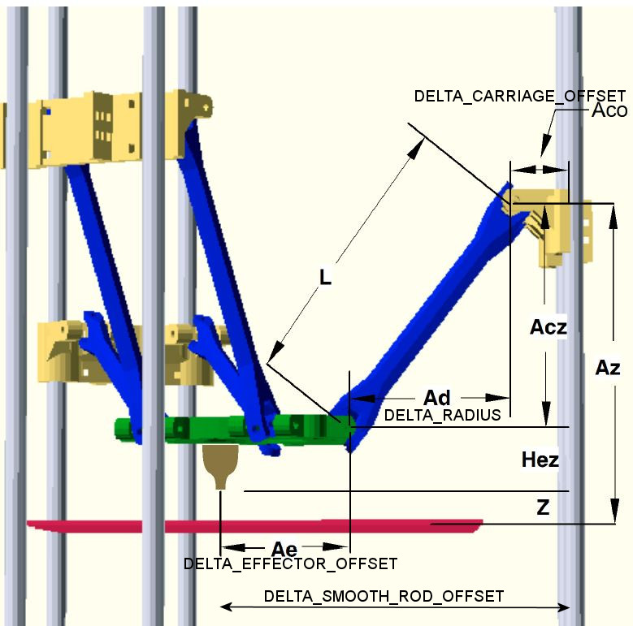

The perfect-geometry the `DELTA_RADIUS` value should be:

	#define DELTA_RADIUS (DELTA_SMOOTH_ROD_OFFSET-DELTA_EFFECTOR_OFFSET -DELTA_CARRIAGE_OFFSET)

where the Trium values are:

|Variable |Value  |
|----|----|
|DELTA_SMOOTH_ROD_OFFSET  | 172.5 |
|DELTA_EFFECTOR_OFFSET  | 27.0 |
|DELTA_CARRIAGE_OFFSET  | 0.0 |
|DELTA_RADIUS (perfect)  |145.5  |
|DELTA_RADIUS (required, see below)  |147.5  |

The following procedure is a mixture of the Trium instruction and the procedure described [here](http://minow.blogspot.co.za/index.html#4918805519571907051).  Initally I use the Trium instruction to determine `DELTA_RADIUS` but then I write it to the firmware, instead of saving to EEPROM.

-  The value in the firmware constant `DELTA_RADIUS` controls the 'flatness' of the movement of the carriage at a given Z height.  If `DELTA_RADIUS` is too large, the extruder nozzle will track below the desired Z height inside the calibrated points X, Y, and Z.  If `DELTA_RADIUS` is too small, the extruder will track above the desired Z height inside the calibrated points X, Y, and Z.
-  Run M501 and look for the current value of `DELTA_RADIUS`
		17:19:24.459 : echo:Delta settings: L=diagonal_rod, R=radius, S=segments_per_second, ABC=diagonal_rod_trim_tower_[123]
		17:19:24.482 : echo:  M665 L278.00 R145.50 S100.00 A0.00 B0.00 C0.00
  In this case it is 145.5 

- Adjust  `DELTA_RADIUS` as follows:
	- To lower the extruder nozzle in the centre:  increase DELTA_RADIUS 
	
	- To raise the extruder nozzle in the centre: decrease DELTA_RADIUS

- Use the `M665 Rxxx` command with new values for xxx to download a new `DELTA_RADIUS` value to the Arduino. After some experimentation the following values were measured:

|Setting|C|X|Y|Z|
|----|------|------|------|------|
|M665 R147.5	|0.9|	0.85|	0.9|	0.85|

- Up to now the value set by M665 is in memory but will be lost when the printer powers down.  So while we update `MANUAL_Z_HOME_POS` in the firmware, we might just as well adjust `DELTA_RADIUS`.  However, [Moniw advises](http://minow.blogspot.co.za/index.html#4918805519571907051) not to change `DELTA_RADIUS` directly (it is derived from other values), but rather change `DELTA_SMOOTH_ROD_OFFSET`. So in the Trium firmware this line (in my printers firmware, yours will be different):

      #define DELTA_SMOOTH_ROD_OFFSET 172.5// mm

   must be changed to 

      #define DELTA_SMOOTH_ROD_OFFSET (172.5 + (147.5 - 145.5)) // mm

- Note that the bed is still 0.85 mm to high, relative to the Z_MIN setting, So a new Z calibration must be made (with the new value for `DELTA_SMOOTH_ROD_OFFSET` in effect, because it changes the geometry calculation). The new value to be subtracted from `MANUAL_Z_HOME_POS` is now 53.24  (it was 52.575 before the change in bed levelling and `DELTA_RADIUS`).

After completion of this process, my printer bed's three edges were within 0.05 mm of each other and the centre was about 0.1 mm lower. I decided to stop here and print first before spending more time on `DELTA_RADIUS`. It turned out that the prints worked well, so the task is completed.

I made a few prints experimenting with glue stick and hairspray and cleaning several times in between. I checked the bed leveling manually and found that the plate that the X-tower position was at 0.1, which meant that the plate was not level any more.  So the bed is not as stable as E-Mergin would have us believe.  After levelling, I found that the relative heights of the three towers compared to the centre was the same as befor. In other words the bed's concave/convex shape was the same as before, meaning that the rest of the printer remained stable.

More information is available here:
-	https://github.com/MarlinFirmware/Marlin/wiki/Delta-kinematics
-	http://3dprinting.stackexchange.com/questions/631/how-are-delta-movements-calculated
-	[Online tool to calculate values](http://escher3d.com/pages/wizards/wizarddelta.php)
-	http://ladvien.github.io/robots/kossel-mini-calibration/ nice!
-	http://minow.blogspot.co.za/index.html#7516958070168615082
-	http://www.thingiverse.com/thing:745523
-	http://boim.com/DeltaUtil/CalDoc/Calibration.html
-	http://wp.boim.com/?p=54
-	http://www.appropedia.org/Delta_calibration
-	http://forum.seemecnc.com/viewtopic.php?t=5321
-	http://ladvien.github.io/robots/kossel-mini-calibration/
-	http://grauonline.de/wordpress/?page_id=1118
-	http://reprap.org/wiki/Delta_geometry
-	https://github.com/hercek/Marlin/blob/Marlin_v1/towerErrors.wxm
-	http://www.thinkyhead.com/_delta/
-	http://blog.rymnd.com/delta-kinematics-1/
-	http://blog.rymnd.com/delta-kinematics-2/
-	http://blog.rymnd.com/delta-kinematics-3/
-   For a detailed description of the calibration process  [see here](http://reprapandme.blogspot.co.za/2014/02/first-tests-and-calibration.html).
-   https://github.com/Mr-What/DeltaUtil
- http://wp.boim.com/?p=54
- http://wp.boim.com/?p=64
- http://wp.boim.com/?p=67
- http://wp.boim.com/?p=94
- http://wp.boim.com/?p=106
- http://wp.boim.com/?p=114
- http://boim.com/DeltaUtil/

Here it says that  [changing delta radius](http://forums.reprap.org/read.php?178,615064) won't alter the nozzle position at 0,0,zmax. It changes the nozzle height out at the towers. You need to get your ZMax set up in firmware so that the nozzle is at the print surface when at 0,0,zmax(in the middle of the bed). Only then can you adjust your delta radius, to bring the tower points into the same plane as the center point. 

## Short detour

At this point I wanted to see a print! The TRIUM cat was printed using Repetier and it went quite well.

### First prints 

Then I printed [this](http://www.thingiverse.com/thing:745523) which tests the geometry of the delta printer.   The first Print1 failed on the small towers but had a good base. The second Print2 was only somewhat better on the towers, but still not acceptable. Both prints provided very good base detail.   Verbatim PLA translucent in regular Trium hot-end. Feedrate: 100. Flowrate:100. Fan: layer 0: 0%,  layer 1: 24%,  layer 2: 40%,  layer 6: 100%.  Bed: 75 C all the time. Hot-end: 230 C. Nozzle: 0.5

It turned out that the TRIUM towers are exactly 120 degrees displaced (which is why we invested in the superb frame!)  The Print1 scale (from leg length=59.88 measured in Blender) was (X:59.58, Y:59.65, Z:59.75)/59.88 =  (X:0.9950, Y:0.9962, Z:0.9978) avg=0.9963. Print2 scale (from tower to tower) was (X:60.14, Y:60.17, Z:60.14)/60 =  (X:1.0023, Y:1.0028, Z:1.0023) avg=1.0025.  The average of the two is 0.9994.  This average implies to 0.12 mm over 220 mm. 

As a result of this finding I decided that 
- The towers are well placed and accurate.
- The scale is  virtually symmetrical in x and y axes (z axis not yet tested)  and very close to unity, but some more investigation is required if dimensionally accurate prints are required.
- The printing of fine detail definately requires more work 230 C seems too high a temperature.

### Bed Preparation

For bed preparation I use hairspray (Perfect Touch, Firm Hold) - this is a non-aerosol, you pump with your finger.  There are some conflicting advice on the internet: some say a thin coat, some say a liberal coat.   First I made a plastic sheet apron around the bed to prevent spray off the bed. I clean the table with water first, then a dab of cotton and surgical spririts/alcohol to remove grease (if necessary). Then apply a [liberal coat](https://www.youtube.com/watch?v=wzCcTCXGiDU) of hairspray up to the bed edges (two to three layers). You must clearly see the layer on the bed. Try to spray evenly over the bed, avoid forming a bump in the middle. I find it easier to go around the edges first and then just touch up in the centre. Let it dry for ten minutes.  After removing the apron, I set the bed temperature to 70 C for some 10-20 minutes (use Repetier or by LCD  `Prepare-> Preheat PLA -> Preheat PLA bed` and afterwards `Prepare-> Cooldown`).  The prints are done at 230 C for the first layer, then dropping to 200 C for the rest.  After printing let the bed cool to room temperature.  The prints do not quite jump of the bed, but it is not to hard to remove with a sharp knife. Removing the hairspray is easy: simply wash off with a little water. Joe Larson believes the hairspray preparation should last for ten to fifteen prints, but I tend to remove and reapply after five or so prints.  I often find that the skirt lines are broken and spotty, but normally the brim and part print adheres well to the hairspray bed.

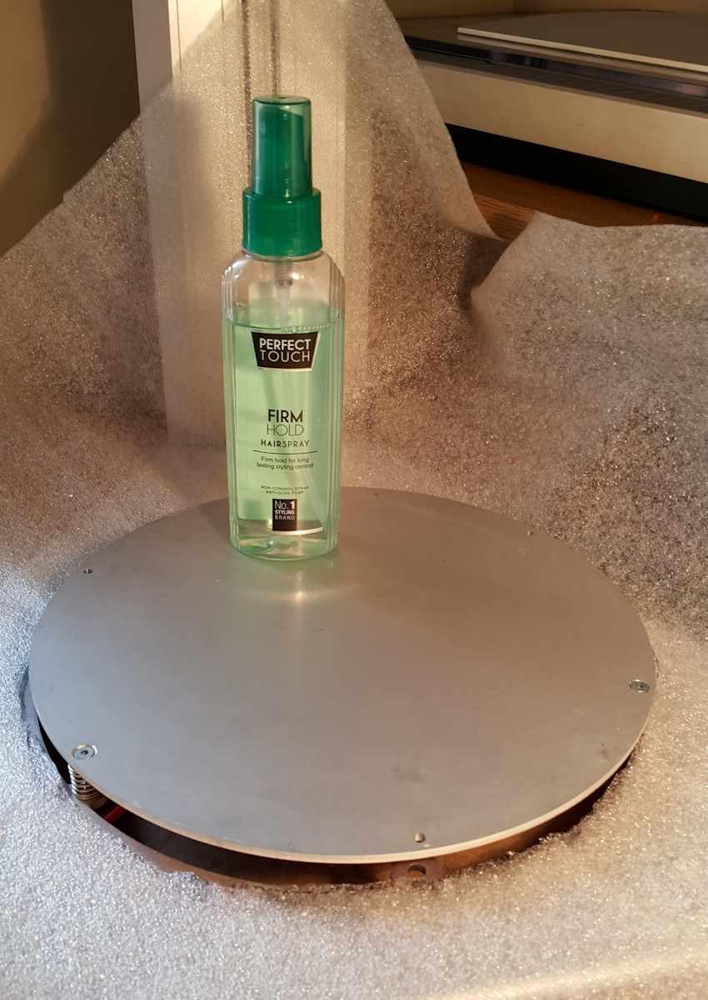

To be completed later as I continue working on the printer.

##  Auto bed levelling sensor Z offset

## Z scale correction
 
## X and Y scale correction

## Extruder calibration

## Hot-end temperature calibration

