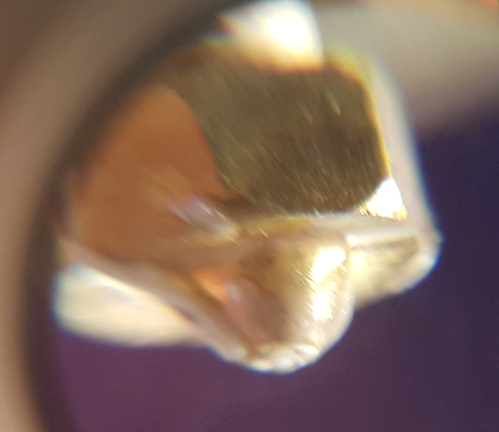

# Z-axis calibration p65

The top and bottom plates must be located on the three towers with no spaces between the towers ends and the top/bottom plates.  This is important because the frame integrity determines the coordinate system integrity.

Don't use the proximity bed levelling sensor in this procedure.

- *Ensure that the printer nozzle is clean*, with no plastic below the nozzle level.  We want to calibrate the nozzle, not some gunk hanging below.  The picture below shows a small amount of filament protruding from the nozzle - this small amount is significant when it comes to z calibration (appologies for the poor quality picture, this is the best I could do with what I had).

- Try to prepare the bed as you would print (hairspray, glue, PEI, or whatever), the bed preparation adds to the bed height.
- This procedure assumes that the Marlin firmware installed on the printer has  `MANUAL_Z_HOME_POS` set to 500.  Open the firmware and search in `configuration.h` for the line similar to `#define MANUAL_Z_HOME_POS 500`.  If the value is not exactly 500, change it to be 500.  This will enable the printer to go down by 500 mm from the home position. This means that the head will move beyond the bed, potentially damaging  the nozzle if the movement is too fast.  So, if and when you move down, be very careful.
- Place a sheet of clean unprinted paper on the bed (75 gms, 100 micron thick).
- Connect the printer to your computer using the USB port.
- Start Repetier on your computer. Go to `Printer Settings` and select the COM port you used to flash the firmware. Set the baud rate to 115200. `Apply` and `OK`
- Auto home: (1) use the LCD to go to `Prepare` menu and then select `Auto Home` or (2) give the `G28` gcode command with Repetier.  The printer does not remember the home position and it must be determined every time you switch on or reset/reboot  the printer.
- Manually take the head down to close to the bed. For a 440mm Trium use the gcode command `G0 Z100 F3000`  to get it down close quickly- but do not go any lower than around 100.   For a 220 mm Trium use the `G0 Z350 F3000` command.  To avoid loosing steps, don't use a feedrate higher than F3000.
- Manually jog down with ever smaller increments until the head just touches the paper.  There must be a very slight friction if you try to move the paper.

- Record the value on the display, say the value is xxxx.  In my printer and the regular head the vaue was 52.575.
- Open the firmware in the Arduino IDE, open the configuration.h file.  Search for 
		#define MANUAL_Z_HOME_POS
 (around line 812 in my file).  Change the entry to read 
        #define MANUAL_Z_HOME_POS (500-xxxx)
 in my case this was 
        #define MANUAL_Z_HOME_POS (500-52.575)
- Upload the new firmware.
- To test the new setting, repeat the above procedure from `Auto Home` and jog down.  The head should stop moving any further down on the paper and the display should show zero.

**Note:** once the value for `MANUAL_Z_HOME_POS` is set, the nozzle will never move below 0.  So even if commanded to go lower, it will stop at 0.

**Note:** at this point we have only set the Z_MIN value in the centre of the bed. If the bed is tilted, it may well happen that the nozzle can crash into a high area of the bed. So even with the value of Z_MIN set, be careful when moving the nozzle towards the bed.

[It seems then on the LCD control ](http://trium3d.proboards.com/thread/72/new-build-fired-today#ixzz4VuxgNRhq) you can move in 10 mm increments in X and Y but not in Z (no 10 mm movement in Z).  The LCD does provide 1mm and 0.1mm movement along the z-axis. Turning the LCD knob one position causes the head to move by 4 increments.  Rather do the 0.1 mm movements with  Repetier  instead.

The distance between the print bed and the nozzle is very important for print quality during the first layers. It seems that with the printer at Z_MIN the distance between the nozzle and bed must be around 0.1 mm.  See [here](https://ultimaker.com/en/community/16792-whats-the-best-distance-between-nozzle-and-bed-when-leveling), [here](https://ultimaker.com/en/community/5941-optimum-nozzle-bed-distance), and  [here](http://forums.reprap.org/read.php?1,582425).  I found it quite hard work to get the bed level and flat to within 0.1 mm.

See [here](https://www.facebook.com/groups/emergin/permalink/1861782507392842/?comment_id=1861803234057436&comment_tracking=%7B%22tn%22%3A%22R9%22%7D) for a long discussion on z calibration.

For another detailed description of the calibration process  [see here](http://reprapandme.blogspot.co.za/2014/02/first-tests-and-calibration.html).

# Manual levelling: adjusting the screws

The material in this section is a variant of the procedure decribed [here](http://minow.blogspot.co.za/index.html#4918805519571907051).

A sheet of paper is used as a feeler guage: lower the nozzle to the point where the paper has some friction when moved under the nozzle.  If the paper is not able to move, the nozzle is too far down and you are in fact pushing the bed down.  If the paper moves freely it means that the nozzle is not yet in the desired location.

By the way, you can calibrate the thickness of your printing paper by taking 10 sheets and then measuring the thickness with a vernier caliper.  Measure the thickness in several different locations, tak the average and then divide by 10.

Program the following Repetier buttons (if the bed is not well manually levelled, you might even set the z value to 5):

|Button 1| Position |Command |
|----|----|----|
|1 | Centre | `g0 z2 x0         y0     f3000`|
|2 | X tower| `g0 z2 x-82.2724  y-47.5 f3000`|
|3 | Y tower| `g0 z2 x 82.2724  y-47.5 f3000`|
|4 | Z tower| `g0 z2 x0         y95    f3000`|

Buttons 2 to 3 move the nozzle towards the X, Y, and Z towers at a radius of  95 mm from the centre.  I don't want to go too close to the bed screw, in case there is a distortion in the plate at the screw position.  The three tower calibration positions on my printer are shown here (about 15 mm from the edge):

If you have not yet installed the bed, measure the pitch on the bed screws. Count the number of thread ridges per measured distance. This gives you the pitch of the tread. If the pitch is known you can calculate the depth of travel for one turn. I counted 34 threads over a distance of 17.2 mm, which means 0.5059 mm pitch.  A quick search on the internet revealed that the M3 thread pitch is 0.5 mm. At a pitch of 0.5 mm, this means as you turn the screw by a certain angle the bed moves 0.5 mm per revolution. Keep this table handy as you level the bed:

| M3 screw turns | Bed displacement|
|------|------|
|1 turn | 0.5 mm |
|1/2 turn | 0.25 mm |
|1/4 turn | 0.125 mm |
|1/8 turn | 0.0625 mm |
|1/16 turn | 0.0313 mm |
|7.2 deg | 0.01 mm |

In the previous section we set the value for Z_MIN in the centre of the bed.  At present the bed may still be in a  tilted orientation.  This procedure attempts to adjust the bed heights at the bed mounting screws (aligned with the towers).  The idea is to measure the height of the bed near each of the screws and then adjust the height of that screw. The procedure is as follows:

- After installation level the bed manually with a measuring block or a vernier caliper so that the bed is level, relative to the fame, to within 0.5 mm. Measure by hand and adjust till the bed is at the same height at all three screw positions. This step is really important, because it makes the next steps easier and faster.
- [MiR advises](http://trium3d.proboards.com/thread/94/bed-positional-stability-good?page=1#ixzz4YBplrXpU) to  take an allen wrench that is exactly 10mm high and adjust the screws of the bed so that the wrench barely slides through the gap between the bed and the chasis. This is an easy way to make sure that the bed is properly levelled.
- Using the procedure described above for z-calibration, measure the height of the bed at all four positions. This is most easily done using Repetier and the four button scripts. If any of the four positions is at a height of 0 mm it means that the bed could be lower, the firmware just stopped at 0 mm.  In this case change the Z calibration calculated in the previous section. Set the value of xxx to be 0.5 mm smaller, so that the nozzle can move further down (just remember that this could be lower than the bed, so the nozzle or bed can be damaged if you move to z=0).  Repeat the procedure until none of the four readings is zero, every time increasing the value by 0.5 mm.
- Move the nozzle to the X-tower screw (Button 2 `g0 z2 x-82.2724  y-47.5 f3000`), with the nozzle say 2 mm above the expected build plate. 
- Carefully lower the nozzle initially at 0.1 mm and later at 0.01 mm at a time until the nozzle distance is a paper thickness from the plate. When you move a single sheet of paper between the bed and the nozzle it should experience some friction, but not too much (because you are then compressing the paper).
- Take note of the z value. If the z value is zero it means that the bed edge is probably below the centre (remember that the nozzle cannot move below zero), then set the bed level slightly higher (see two steps back).
- By the way, I found that there is considerable hysteresis (0.05 to 0.15mm) between (1) moving the nozzle down to touching the paper and (2) moving the nozzle  up to releasing the paper.  In most fine mechanical systems this is unacceptably large. In the delta printing mechanism this hysteresis is probably acceptable, provided we alway only move in one direction (i.e., avoiding the the hysteresis gap).  So when you do bed levelling always test while movig down. If you moved too far down, go up again by 0.5 mm before dropping the nozzle down again.  When printing the nozzle is always moving up, if it was to go down, it will destroy the print or bed.
- Repeat the procedure for the Centre (button 1),  the Y (button 3) and the Z (button 4) tower positions. Each time taking a note of the z value where the nozzle is paper thickness above the bed.
- Review the three values at X, Y and Z and the centre of the bed then decide at which level you want to set the bed edges.  But all the time make sure that you don't get a false z=0 reading (the nozzle cannot go lower than 0).
	- If the centre is lower than the lowest edge, aim to set the bed edges higher than the centre. In other words use the Z_MIN value at the centre as reference and adjust the edges to be higher. 
	- If the centre is higher than the highest edge, set all the edge heights to be equal but lower than the centre.
-  Repeat the process, iteratively measuring the values at C, X, Y and Z.   Adjust the bed level at each of the towers to get the same value at all three towers. 
- Move the nozzle to home (to calibrate the top end-stops)  and repeat the measurements, until the values at the bed edges settle to the same value.
-  After about three or four iterations around the circle, my bed printer's bed levels settled down on

|C |X |Y|Z|
|----|----|----|----|
|0.72|	1.26|	1.26	|1.26|

The bed is now level (edges at the same height), but it is clear that the centre measures a displacement of 0.55 mm lower than the edges.

Note that the print area is not a 200 mm diameter circle, but a [Reuleau triangle](https://en.m.wikipedia.org/wiki/Reuleaux_triangle).

# Carriage trajectory convex/concave: `DELTA_RADIUS` measurement and calibration

[Moniw tells us](http://minow.blogspot.co.za/index.html#4918805519571907051) At this point, it is likely that if the firmware instructs the printer to move the carriage across the build surface, the nozzle tip will not stay true to the build surface.  Even though the nozzle will be at the calibrated correct Z height at each of the three tower locations, it will either be above or below the build surface at the center of the build area.  This is also corrected by adjusting the firmware.  

The printer receives the gcode print commands in cartesian (x,y,z) coordinates.  Marlin translates the cartesian commands to sliding displacements in the three towers.  The math  [described here](http://fab.cba.mit.edu/classes/863.15/section.CBA/people/Spielberg/Rostock_Delta_Kinematics_3.pdf) assumes perfect build geometry with no errors in rod length, displacements, and tower geometry.  This picture, taken from [here](http://fab.cba.mit.edu/classes/863.15/section.CBA/people/Spielberg/Rostock_Delta_Kinematics_3.pdf) shows the key parameters in the geometry.  The length Ad in the figure corresponds to the Marlin `DELTA_RADIUS` parameter.  If the `DELTA_RADIUS` value is incorrect the mathematics will transform a z=c xy plane in gcode to a spherical surface in delta geometry.

I like to avoid the words 'print surface' because it can be confused with the bed's surface. In fact, it has nothing to do with the bed (on the assumption that the bed is flat).  What we talk about here is the trajectory followed by the nozzle through space as the printer keeps its z command constant while it changes (z,y).  Because of differences in the lenghts reported in Marlin and the actual hardware parts' lengths, the physical z value will vary for different (x,y) (for a fixed commanded z value).  This physical z value can describe a convex or concave mathematical surface in space (where the commanded z value will be a plane surface).

If the bed is sufficiently flat (our assumption), we can use the flat bed as a measuring reference to chart the nozzle trajectory. We move the nozzle carefully to within a given distance from the (assumed) flat bed. A commonly used measure is the thickness of a sheet of clean printing paper - about 0.1 mm. We then ask Marlin where it thinks the nozzle is at that time.  So this is the inverse of what I described in the previous paragraph: keep the physical z constant and then see what the commanded z value is for that (x,y).

The perfect-geometry the `DELTA_RADIUS` value should be:

	#define DELTA_RADIUS (DELTA_SMOOTH_ROD_OFFSET-DELTA_EFFECTOR_OFFSET -DELTA_CARRIAGE_OFFSET)

where the Trium values are:

|Variable |Value  |
|----|----|
|DELTA_SMOOTH_ROD_OFFSET  | 172.5 |
|DELTA_EFFECTOR_OFFSET  | 27.0 |
|DELTA_CARRIAGE_OFFSET  | 0.0 |
|DELTA_RADIUS (perfect)  |145.5  |
|DELTA_RADIUS (required, see below)  |147.5  |

The following procedure is a mixture of the Trium instruction and the procedure described [here](http://minow.blogspot.co.za/index.html#4918805519571907051).  Initally I use the Trium instruction to determine `DELTA_RADIUS` but then I write it to the firmware, instead of saving to EEPROM.

-  The value in the firmware constant `DELTA_RADIUS` controls the 'flatness' of the movement of the carriage at a given Z height.  If `DELTA_RADIUS` is too large, the extruder nozzle will track below the desired Z height inside the calibrated points X, Y, and Z.  If `DELTA_RADIUS` is too small, the extruder will track above the desired Z height inside the calibrated points X, Y, and Z.
-  Run M501 and look for the current value of `DELTA_RADIUS`
		17:19:24.459 : echo:Delta settings: L=diagonal_rod, R=radius, S=segments_per_second, ABC=diagonal_rod_trim_tower_[123]
		17:19:24.482 : echo:  M665 L278.00 R145.50 S100.00 A0.00 B0.00 C0.00
  In this case it is 145.5 

- Adjust  `DELTA_RADIUS` as follows:
	- To lower the extruder nozzle in the centre:  increase DELTA_RADIUS 
	
	- To raise the extruder nozzle in the centre: decrease DELTA_RADIUS

- Use the `M665 Rxxx` command with new values for xxx to download a new `DELTA_RADIUS` value to the Arduino. After some experimentation the following values were measured:

|Setting|C|X|Y|Z|
|----|------|------|------|------|
|M665 R147.5	|0.9|	0.85|	0.9|	0.85|

- Up to now the value set by M665 is in memory but will be lost when the printer powers down.  So while we update `MANUAL_Z_HOME_POS` in the firmware, we might just as well adjust `DELTA_RADIUS`.  However, [Moniw advises](http://minow.blogspot.co.za/index.html#4918805519571907051) not to change `DELTA_RADIUS` directly (it is derived from other values), but rather change `DELTA_SMOOTH_ROD_OFFSET`. So in the Trium firmware this line (in my printers firmware, yours will be different):

      #define DELTA_SMOOTH_ROD_OFFSET 172.5// mm

   must be changed to 

      #define DELTA_SMOOTH_ROD_OFFSET (172.5 + (147.5 - 145.5)) // mm

- Note that the bed is still 0.85 mm to high, relative to the Z_MIN setting, So a new Z calibration must be made (with the new value for `DELTA_SMOOTH_ROD_OFFSET` in effect, because it changes the geometry calculation). The new value to be subtracted from `MANUAL_Z_HOME_POS` is now 53.24  (it was 52.575 before the change in bed levelling and `DELTA_RADIUS`).

After completion of this process, my printer bed's three edges were within 0.05 mm of each other and the centre was about 0.1 mm lower. I decided to stop here and print first before spending more time on `DELTA_RADIUS`. It turned out that the prints worked well, so the task is completed.

I made a few prints experimenting with glue stick and hairspray and cleaning several times in between. I checked the bed leveling manually and found that the plate that the X-tower position was at 0.1, which meant that the plate was not level any more.  So the bed is not as stable as E-Mergin would have us believe.  After levelling, I found that the relative heights of the three towers compared to the centre was the same as befor. In other words the bed's concave/convex shape was the same as before, meaning that the rest of the printer remained stable.

More information is available here:
-	https://github.com/MarlinFirmware/Marlin/wiki/Delta-kinematics
-	http://3dprinting.stackexchange.com/questions/631/how-are-delta-movements-calculated
-	[Online tool to calculate values](http://escher3d.com/pages/wizards/wizarddelta.php)
-	http://ladvien.github.io/robots/kossel-mini-calibration/ nice!
-	http://minow.blogspot.co.za/index.html#7516958070168615082
-	http://www.thingiverse.com/thing:745523
-	http://boim.com/DeltaUtil/CalDoc/Calibration.html
-	http://wp.boim.com/?p=54
-	http://www.appropedia.org/Delta_calibration
-	http://forum.seemecnc.com/viewtopic.php?t=5321
-	http://ladvien.github.io/robots/kossel-mini-calibration/
-	http://grauonline.de/wordpress/?page_id=1118
-	http://reprap.org/wiki/Delta_geometry
-	https://github.com/hercek/Marlin/blob/Marlin_v1/towerErrors.wxm
-	http://www.thinkyhead.com/_delta/
-	http://blog.rymnd.com/delta-kinematics-1/
-	http://blog.rymnd.com/delta-kinematics-2/
-	http://blog.rymnd.com/delta-kinematics-3/
-   For a detailed description of the calibration process  [see here](http://reprapandme.blogspot.co.za/2014/02/first-tests-and-calibration.html).
-   https://github.com/Mr-What/DeltaUtil
- http://wp.boim.com/?p=54
- http://wp.boim.com/?p=64
- http://wp.boim.com/?p=67
- http://wp.boim.com/?p=94
- http://wp.boim.com/?p=106
- http://wp.boim.com/?p=114
- http://boim.com/DeltaUtil/

Here it says that  [changing delta radius](http://forums.reprap.org/read.php?178,615064) won't alter the nozzle position at 0,0,zmax. It changes the nozzle height out at the towers. You need to get your ZMax set up in firmware so that the nozzle is at the print surface when at 0,0,zmax(in the middle of the bed). Only then can you adjust your delta radius, to bring the tower points into the same plane as the center point. 

To be completed later as I continue working on the printer.

#  Auto bed levelling sensor Z offset

There is some critisism against the current Trium auto bed levelling design.  The probe is offset too far from the nozzle and as shown in the build document, the hardware does not always work.

[MiR proposed](http://trium3d.proboards.com/post/815/thread) a new z-probe design that uses a microswitch mounted below the nozzle (must be removed before printing).

# Extruder calibration

# Z scale correction
 
# X and Y scale correction

# Hot-end temperature calibration

# Side-note on consistency of nozzle-to-bed distance.

After a few prints I found the nozzle dragged on the bed. I wanted to check the concave/convex status.  I spent some time on measuring the bed height manually using the the bed level measurement procedure. 
What started out as an attempt to measure the z height and convex/concave status ended up in a review of repeatability of accurate z-height measurement.  The procedure used is as follows:

- Do a printer home (g28).
- Move to a position near the X tower (95 mm from the centre) to a z height of 5 mm above the bed. Use the Repetier jogger to move down in units of 1mm to a height of z=1 mm. Then move the nozzle down in steps of 0.1 mm to around 0.1-0.2mm.  The move the nozzle down in steps of 0.01mm until the 0.1mm-thick paper experiences a slight friction between the nozzle and the bed. This is the height of the bed plus the thickness of the paper. Read of the z value in Repetier. Note the value in a table.
- Repeat for the Y tower, the Z tower and the centre of the bed.
- After X, Y, Z and C home again and repeat a few times.
- The idea is to study the repeatability of z-height values in repeated sessions.  The objective here is to see that the values are always within 0.02mm or so from each other (the actual value is not relevant here, but the spread is).

The table below describe my first-round findings. Columns are: Nozzle temperature, Bed temperature, Shim thickness (single paper), `DELTA_RADIUS`, nozzle height at centre of bed, nozzle X  tower height, nozzle Y tower height, nozzle Z tower height, average of X, Y and Z and difference between centre and edge average.  During this test the printer was physically stable, with no setting changes (other than bed temperature).  The test was completed in about 60-90 minutes.   The X, Y, and Z values here were measured with the nozzle at 95 mm from the centre towards the X, Y and Z towers respectively.

|	TNoz	|	TBed	|	S	|	R	|	C	|	X	|	Y	|	Z	|	(X+Y+Z)/3	|	(X+Y+Z)/3-C	|
|	--------	|	--------	|	--------	|	--------	|	--------	|	--------	|	--------	|	--------	|	--------	|	--------	|
|	25.9	|	25.7	|	0.1	|	147.50	|	0.18	|	0.19	|	0.19	|	0.19	|	0.19	|	0.01	|
|	28	|	70	|	0.1	|	147.50	|	0.18	|	0.09	|	0.19	|	0.18	|	0.15	|	-0.03	|
|	30	|	70	|	0.1	|	147.50	|	0.18	|	0.05	|	0.21	|	0.17	|	0.14	|	-0.04	|
|	25.9	|	27.8	|	0.1	|	147.50	|	0.12	|	0.04	|	0.15	|	0.15	|	0.11	|	-0.01	|
|	25.9	|	26.9	|	0.1	|	147.50	|	0.12	|	0.05	|	0.17	|	0.16	|	0.13	|	0.01	|
|	29	|	70	|	0.1	|	147.50	|	0.16	|	0.06	|	0.18	|	0.16	|	0.13	|	-0.03	|
|	31	|	70	|	0.1	|	147.50	|	0.17	|	0.08	|	0.19	|	0.16	|	0.14	|	-0.03	|
|	30.2	|	71	|	0.1	|	147.50	|	0.19	|	0.15	|	0.18	|	0.15	|	0.16	|	-0.03	|
|	32	|	71	|	0.1	|	147.50	|	0.17	|	0.15	|	0.19	|	0.14	|	0.16	|	-0.01	|
|	27.6	|	51.9	|	0.1	|	147.50	|	-	|	0.19	|	-	|	-	|	-	|	-	|
|	26.4	|	34	|	0.1	|	-	|	0.09	|	0.03	|	0.15	|	0.11	|	-	|	-	|
|	-	|	-	|	0.1	|	-	|	0.08	|	0.03	|	0.15	|	0.11	|	-	|	-	|

Observations:
- The  `DELTA_RADIUS` setting is probably as good as you will get (print nozzle trajectory is not concave/convex).
- The relative movement between the bed and the rest of the printer was effectively 'moved up the bed' by about 0.15 mm, since my last z-height calibration.
- The position of the table is relatively insensitive to the bed temperature - at least no major shifts.
- Study the X coordinates: **it jumped by 0.1 to 0.15 mm**: high, low, high, then low again.  This only happened on the X tower side, not on Y and Z. Later measurements showed similar but smaller jumps on the Y tower, but none on the Z tower.
- The thermal expansion on the towers should be about 15 micron (0.016mm) per degree celcius. Hence thermal expansion on the towers is not the issue here.

Either the bed is not stable and, it seems, unpredictable in the short term (my X axis here in particular) or, there is some movement in the X-axis that make the bed appear to move up and down.  In other words, instability in the belt or the stepper motor movement. After a post on the Trium3D Proboard [feedback](http://trium3d.proboards.com/thread/94/bed-positional-stability-good?page=1&scrollTo=783) from MiR and mikeeitel:  **It  looks like lost stepper motor steps.**  Here are some of the comments and remarks they posted on Proboard:
- Such kind of unprecisenes you can mostly be tracked down either to mechanicals: slipping nuts, too much resistance in slides, to much inertia for given stepper current or to electrials in the step driver control chain: too short step pulses, too short wait time between steps when direction change.
- Keep the feedrate at or below F3000  and that worked pretty reliable.
- Look at the driver current (the driver calibration voltage). perhaps increase it a bit.
- Consider friction of the sliders in the tower channel.  An easy test could be to turn off the printer, remove the rods and then move the three sliders by hand. Try to find out if all three need the same force to move up/down or if your X-Slider is somehow harder to move. If yes this could perhaps be an indication why steps get lost specially on this tower. In that case you could think about increasing current to the drivers.
- Friction in the beam: one beam needed mechanical adjustment as one slider was too large. Had to sandpaper a tiny bit the side of the alluminium part.
- I suspected foul play by the mechanical end-stop switches: the lever action seems just not stable and repeatable.  A quick Google search indicated that the switches most probably are not to blame, work by others indicated good repeatability in this role.

At least one other person also has repeatability issues: http://forums.reprap.org/read.php?178,727367 but was unable to resolve his problem.

Attempting to get to the bottom of this issue, I did the following:

- Increased the stepper motor current by 13%.  The Vref value is now 0.965 V, which means that the current is 1.9A. Note that the motor design current is 1.7 A.  This change had no effect on the positioning repeatability.
- Removed the tape from inside the sliders.  The sliders now have much lower friction, but still don't slide down under gravity.  This change had no effect on the positioning repeatability.
- Reduced the GT2 belt tension in the X and Y towers. The Z-tower belt had less tension than X and Y,  and worked well.  After reducing the X-tower belt tension by one notch and the Y-tower belt tension by two notches, they worked as well as before.   This change had no effect on the positioning repeatability.
- Added [cabristor's four-diode circuit](http://cabristor.blogspot.co.za/2015/02/drv8825-missing-steps.html) between the RAMPS board and the stepper motor.  It made no difference to the large shifts on the X tower.

The results after the above experiments are as follows. I did a Home (g28) between each of the lines, so there is no cumulative buildup, every run is fresh from home.

|	Set 1	|	C	|	X	|	Y	|	Z	|
|:------:|	------	|	------	|	------	|	------	|
|	1	|	0.15	|	0.27	|	0.12	|	0.09	|
|	2	|	0.08	|	0.13	|	0.11	|	0.09	|
|	3	|	0.06	|	0.10	|	0.11	|	0.11	|
|	4	|	0.06	|	0.09	|	0.11	|	0.11	|
|	5	|	0.06	|	0.07	|	0.11	|	0.11	|
|	6	|	0.07	|	0.16	|	0.11	|	0.11	|
|	7	|	0.03	|	0.07	|	0.09	|	0.07	|
|	Mean	|	0.07	|	0.13	|	0.11	|	0.10	|
|	Max-Min	|	0.12	|	0.20	|	0.03	|	0.04	|

It is evident that the repeatability in Y and Z is 30-40 microns (almost acceptable) but the repeatability on X is 200 microns (absolutely not acceptable).

So there is more work to be done. My next steps are to 
- Thanks to [MiR for this suggestion](http://trium3d.proboards.com/thread/94/bed-positional-stability-good?page=2&scrollTo=838): As a test you could try if round-robin swapping the motor connectors (X->Y Y->Z Z->X ) also moves the problem. 
**When you swap motor wires (between X, Y, and Z towers), also swap the end-stop switches to go with the motors.  If a stepper motor connects to the X driver, the end-stop on the same tower must connect to the X end-stop pins on the RAMPS board.**
  If problem is still on same axes then it is something mechanical connected to that specific tower, if the problem moves it is related to electronics/software/configuration
- check the motor pulley screws - must be tight.
- replace the X-tower end-stop PCB.
- replace the DRV8825 driver board.
- replace the X-tower stepper motor.

[MiR also advised](http://trium3d.proboards.com/thread/94/bed-positional-stability-good?page=2&scrollTo=838) to automate the process, using the probe: "This is what I used to probe the three corners of the bed, the Y-Axis position is a little extreme. What happens here is that i home, then position 1cm above bed and then probe 5 times the bed distance. I have done this with smoothieboard but when I read correctly it should work the same on Marlin."

	G21
	G90
	G28
	G0 X-57 Y-37 Z10 F4000
	G30
	G30
	G30
	G30
	G30
	G28
	G0 X125 Y-37 Z10 F4000
	G30
	G30
	G30
	G30
	G30
	G28
	G0 X33 Y100 Z10 F4000
	G30
	G30
	G30
	G30
	G30
	G28
	G0 X0 Y0 Z10 F4000
	G30
	G30
	G30
	G30
	G30
	G28

[G30](http://reprap.org/wiki/G-code#G30:_Single_Z-Probe) Probe the bed at the current XY position. When the probe is triggered, set the Z coordinate to the probe trigger height. 
