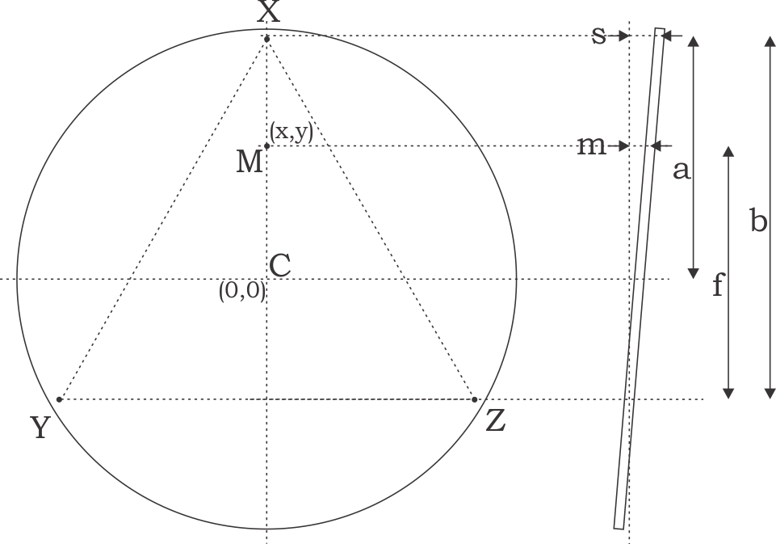

# Initial work

## Calibrating the bed levelling screws
If you have not yet installed the bed, measure the pitch on the bed screws. Count the number of thread ridges per measured distance. This gives you the pitch of the tread. If the pitch is known you can calculate the depth of travel for one turn. I counted 34 threads over a distance of 17.2 mm, which means 0.5059 mm pitch.  A quick search on the Internet revealed that the ISO standard coarse M3 thread pitch is 0.5 mm. At a pitch of 0.5 mm, this means as you turn the screw by a certain angle the bed moves 0.5 mm per revolution. The table below shows how much the screw will move during turning. 

| M3 screw turns | Bed displacement|
|------|------|
|1 turn | 0.5 mm |
|1/2 turn | 0.25 mm |
|1/4 turn | 0.125 mm |
|1/8 turn | 0.0625 mm |
|1/16 turn | 0.0313 mm |
|7.2 deg | 0.01 mm |

The movement in the table above would apply equally to the bed movement at the screw location. Suppose you are measuring the bed height radially at some fraction between the screw and the centre, and this measurement shows that the bed is 0.1 mm too high. The question now is: how much should the screw be turned to effect  required bed height change?

The screw is approximately 4.3 mm (3/8 inch) from the edge of the bed, so the screw radial distance to the centre will be  

a = 110-4.3 = 105.7 mm.  

If you turn the screw at the X tower, the bed movement is around the line drawn between the Y and Z towers. The distance from the screw to this line is  

b = a (1 + sin(30)) = 105.7 x 1.5 = 158.6

If the required vertical movement m at the measuring point is M, the screw vertical movement s will now be 

s = m * b / f

where f is the smallest distance between the measurement point and the YZ line. Using the (x,y) coordinates of the measurement point the screw movement becomes

s = m * 158.6 / (sqrt(x^2+y^2) +  52.85)

# Z-axis calibration p65

The top and bottom plates must be located on the three towers with no spaces between the towers ends and the top/bottom plates.  This is important because the frame integrity determines the coordinate system integrity.

Don't use the z-probe proximity bed levelling sensor in this procedure. The z-probe sensor will be adjusted and set up later.

- *Ensure that the printer nozzle is clean*, with no plastic below the nozzle level.  We want to calibrate the nozzle, not some gunk hanging below.  The picture below shows a small amount of filament protruding from the nozzle - this small amount is significant when it comes to z calibration (apologies for the poor quality picture, this is the best I could do with what I had).

- Try to prepare the bed as you would print (hairspray, glue, PEI, or whatever), the bed preparation adds to the bed height.
- This procedure assumes that the Marlin firmware installed on the printer has  `MANUAL_Z_HOME_POS` set to 500.  Open the firmware and search in `configuration.h` for the line similar to `#define MANUAL_Z_HOME_POS 500`.  If the value is not exactly 500, change it to be 500.  This will enable the printer to go down by 500 mm from the home position. This means that the head will move beyond the bed, potentially damaging  the nozzle if the movement is too fast.  So, if and when you move down, be very careful.
- Place a sheet of clean unprinted paper on the bed (75 gms, 100 micron thick).
- Connect the printer to your computer using the USB port.
- Start Repetier on your computer. Go to `Printer Settings` and select the COM port you used to flash the firmware. Set the baud rate to 115200. `Apply` and `OK`
- Auto home: (1) use the LCD to go to `Prepare` menu and then select `Auto Home` or (2) give the `G28` gcode command with Repetier.  The printer does not remember the home position and it must be determined every time you switch on or reset/reboot  the printer.
- Manually take the head down to close to the bed. For a 440mm Trium use the gcode command `G0 Z100 F3000`  to get it down close quickly- but do not go any lower than around 100.   For a 220 mm Trium use the `G0 Z350 F3000` command.  To avoid loosing steps, don't use a feedrate higher than F3000.
- Manually jog down with ever smaller increments until the head just touches the paper.  There must be a very slight friction if you try to move the paper.

- Record the value on the display, say the value is xxxx.  In my printer and the regular head the value was 52.575.
- Open the firmware in the Arduino IDE, open the configuration.h file.  Search for 
		#define MANUAL_Z_HOME_POS
 (around line 812 in my file).  Change the entry to read 
        #define MANUAL_Z_HOME_POS (500-xxxx)
 in my case this was 
        #define MANUAL_Z_HOME_POS (500-52.575)
- Upload the new firmware.
- To test the new setting, repeat the above procedure from `Auto Home` and jog down.  The head should stop moving any further down on the paper and the display should show zero.

**Note:** once the value for `MANUAL_Z_HOME_POS` is set, the nozzle will never move below 0.  So even if commanded to go lower, it will stop at 0.

**Note:** at this point we have only set the Z_MIN value in the centre of the bed. If the bed is tilted, it may well happen that the nozzle can crash into a high area of the bed. So even with the value of Z_MIN set, be careful when moving the nozzle towards the bed.

[It seems then on the LCD control ](http://trium3d.proboards.com/thread/72/new-build-fired-today#ixzz4VuxgNRhq) you can move in 10 mm increments in X and Y but not in Z (no 10 mm movement in Z).  The LCD does provide 1mm and 0.1mm movement along the z-axis. Turning the LCD knob one position causes the head to move by 4 increments.  Rather do the 0.1 mm movements with  Repetier  instead.

The distance between the print bed and the nozzle is very important for print quality during the first layers. It seems that with the printer at Z_MIN the distance between the nozzle and bed must be around 0.1 mm.  See [here](https://ultimaker.com/en/community/16792-whats-the-best-distance-between-nozzle-and-bed-when-levelling), [here](https://ultimaker.com/en/community/5941-optimum-nozzle-bed-distance), and  [here](http://forums.reprap.org/read.php?1,582425).  I found it quite hard work to get the bed level and flat to within 0.1 mm.

See [here](https://www.facebook.com/groups/emergin/permalink/1861782507392842/?comment_id=1861803234057436&comment_tracking=%7B%22tn%22%3A%22R9%22%7D) for a long discussion on z calibration.

For another detailed description of the calibration process  [see here](http://reprapandme.blogspot.co.za/2014/02/first-tests-and-calibration.html).

# Z Probe

## Firmware 

The firmware is set up to use three max endstops (the three switches) and one min endstop (the z-probe)

	//#define USE_XMIN_PLUG
	//#define USE_YMIN_PLUG
	#define USE_ZMIN_PLUG // a Z probe
	#define USE_XMAX_PLUG
	#define USE_YMAX_PLUG
	#define USE_ZMAX_PLUG
	#define Z_MIN_ENDSTOP_INVERTING false  // set to true to invert the logic of the endstop.

Depending on the logic of your endstop the value of `Z_MIN_ENDSTOP_INVERTING` must be set true or false. Note that `Z_MIN_PROBE_ENDSTOP_INVERTING` has no effect on the probe logic, it is not compiled into the Trium firmware.

For inductive sensors with an offset relative to the nozzle:

	#define FIX_MOUNTED_PROBE
	// Z Probe to nozzle (X,Y) offset, relative to (0, 0).
	// X and Y offsets must be integers.
	//
	// In the following example the X and Y offsets are both positive:
	// #define X_PROBE_OFFSET_FROM_EXTRUDER 10
	// #define Y_PROBE_OFFSET_FROM_EXTRUDER 10
	//
	//    +-- BACK ---+
	//    |           |
	//  L |    (+) P  | R <-- probe (20,20)
	//  E |           | I
	//  F | (-) N (+) | G <-- nozzle (10,10)
	//  T |           | H
	//    |    (-)    | T
	//    |           |
	//    O-- FRONT --+
	//  (0,0)
	#define X_PROBE_OFFSET_FROM_EXTRUDER -33.5     // X offset: -left  +right  [of the nozzle]
	#define Y_PROBE_OFFSET_FROM_EXTRUDER -5   // Y offset: -front +behind [the nozzle]
	#define Z_PROBE_OFFSET_FROM_EXTRUDER 0  // Z offset: -below +above  [the nozzle]

The (x,y) offsets is known from the design: how far is the probe centre displaced from the nozzle in x and y. The standard Trium design is (-33.5,-5).  Initially, however, the z probe z offset is not known. The sensor is mounted with some tolerance in the z direction, hence the z-height is not normally fixed by design (see below for z-probe calibration).

The z probe is connected to the zmin endstop inputs on RAMPS:

	#define Z_MIN_PROBE_USES_Z_MIN_ENDSTOP_PIN

The changes in z height used when deploying, stowing, and using the z probe are set here:

	#define Z_PROBE_DEPLOY_HEIGHT 15 // Raise to make room for the probe to deploy / stow
	#define Z_PROBE_TRAVEL_HEIGHT 5  // Raise between probing points.

You can adjust the vertical (z) offset between the nozzle and the z probe (see M851 below).  The allowable limits for the z probe vertical offset is defined in the firmware here:

	#define Z_PROBE_OFFSET_RANGE_MIN -20
	#define Z_PROBE_OFFSET_RANGE_MAX 20

The g30 work is done in the function `run_z_probe()` in `Marlin_main.cpp`. The essential contents are:
- At the current (x,y) position move fast to `home_bump_mm(Z_AXIS)`, which appears to be z=5. Speed is `Z_PROBE_SPEED_FAST` is (50*60)=3000.
- Move slowly from the current position by twice `home_bump_mm(Z_AXIS)`, i.e., to z=-5. Speed is `Z_PROBE_SPEED_SLOW` which is `Z_PROBE_SPEED_FAST`/2 is (50*60/2)=1500.
- Clear the z endstop bits to suppress a report.
- When the z probe triggers (sensed as a z endstop hit), stop movement, get the current z axis position, process and then return the value as z height.

It appears that `run_z_probe()` resets the bed levelling parameters (at least temporarily when doing g30).

## Calibrating the z probe offset

First check that the probe works. Send it an [M119 gcode](reprap.org/wiki/G-code#M119:_Get_Endstop_Status): Returns the current state of the configured X, Y, Z endstops. Takes into account any 'inverted endstop' settings, so one can confirm that the machine is interpreting the endstops correctly.  So send M119 and see that z probe shows a “L” for low = not triggered. Now trigger it by hand while sending M119 again. Now probe value should show a “H” for high = triggered. If it is the other way around you need to change `Z_MIN_PROBE_ENDSTOP_INVERTING`. If nothing changes you need to fix the hardware problem (wiring, power supply, etc.).

The rest of the z-probe calibration section must still be completed.

The user can enter an offset between the nozzle height and probe height by using the M851 command:

-  [M851](http://reprap.org/wiki/G-code#M851:_Set_Z-Probe_Offset) reads and displays the current z probe offset. After setting the limits with M851, store the value permanently with M500 to EEPROM

	M851 Z-0.6
	M500

- [M212](http://reprap.org/wiki/G-code#M212:_Set_Bed_Level_Sensor_Offset) 

 https://forum.lulzbot.com/viewtopic.php?t=3151

https://build3dparts.com/wp/?page_id=551

https://printrbot.zendesk.com/hc/en-us/articles/203333360-Troubleshooting-Your-Auto-Levelling-Probe

https://printrbot.com/wp-content/uploads/2015/06/4.-Using-Cura-to-Set-Up-the-Auto-Levelling-Probe.pdf

http://forums.reprap.org/read.php?178,282375

https://github.com/MarlinFirmware/Marlin/issues/3647

https://forum.repetier.com/discussion/1290/auto-level-and-z-homing

http://forum.seemecnc.com/viewtopic.php?t=4328

https://www.repetier.com/documentation/repetier-firmware/z-probing/ (this is for Repetier, not Marlin).  

http://reprap.org/wiki/G-code#G30:_Single_Z-Probe  

http://forums.reprap.org/read.php?178,601436  

fix / remove this calibration and redeem:

http://boim.com/DeltaUtil/CalDoc/Calibration.html

http://wiki.thing-printer.com/index.php?title=Redeem   Using G33 for auto-calibration

When you have a working G29 probing setup in place, you can improve several parameters of your delta printer with the G33 command. The parameters to improve is end stop offsets, delta radius, tower angular position correction and diagonal rod length.

G33 will use the probe offset in the [Probe] section to adjust the end stops offsets, so be sure to set this to 0 initially to avoid offset errors.

The G33 in Redeem is an implementation of the calculations found in this web site: http://escher3d.com/pages/wizards/wizarddelta.php 

http://wiki.thing-printer.com/index.php?title=Redeem#M665:_Set_delta_arm_calibration_values

L sets the length of the arm. If the objects printed are too small, try increasing(?) the length of the armR sets the radius of the towers. If the measured points are too convex, try increasing the radius 

# Manual bed levelling: adjusting the screws

The material in this section is a variant of the procedure described [here](http://minow.blogspot.co.za/index.html#4918805519571907051).

A sheet of paper is used as a feeler gauge: lower the nozzle to the point where the paper has some friction when moved under the nozzle.  If the paper is not able to move, the nozzle is too far down and you are in fact pushing the bed down.  If the paper moves freely it means that the nozzle is not yet in the desired location.

By the way, you can calibrate the thickness of your printing paper by taking 10 sheets and then measuring the thickness with a vernier caliper.  Measure the thickness in several different locations, take the average and then divide by 10.

Program the following Repetier buttons (if the bed is well manually levelled, you might set the z value to 2):

|Button 1| Position |Command |
|----|----|----|
|1 | Centre | `g0 z52 x0         y0     f3000`|
|2 | X tower| `g0 z5 x-82.2724  y-47.5 f3000`|
|3 | Y tower| `g0 z5 x 82.2724  y-47.5 f3000`|
|4 | Z tower| `g0 z5 x0         y95    f3000`|

Button 1 moves the nozzle to the centre.
Buttons 2 to 3 move the nozzle towards the X, Y, and Z towers at a radius of  95 mm from the centre.  I don't want to go too close to the bed screw, in case there is a distortion in the plate at the screw position.  The three tower calibration positions on my printer are shown here (about 15 mm from the edge):

In the previous section we set the value for Z_MIN in the centre of the bed.  At present the bed may still be in a  tilted orientation.  This procedure attempts to adjust the bed heights at the bed mounting screws (aligned with the towers).  The idea is to measure the height of the bed near each of the screws and then adjust the height of that screw. The procedure is as follows:

- After installation level the bed manually with a measuring block or a vernier caliper so that the bed is level, relative to the fame, to within 0.5 mm. Measure by hand and adjust till the bed is at the same height at all three screw positions. This step is really important, because it makes the next steps easier and faster.
- [MiR advises](http://trium3d.proboards.com/thread/94/bed-positional-stability-good?page=1#ixzz4YBplrXpU) to  take an Allen wrench that is exactly 10mm high and adjust the screws of the bed so that the wrench barely slides through the gap between the bed and the chassis. This is an easy way to make sure that the bed is properly levelled.
- Using the procedure described above for z-calibration, measure the height of the bed at all four positions. This is most easily done using Repetier and the four button scripts. If any of the four positions is at a height of 0 mm it means that the bed could be lower, the firmware just stopped at 0 mm.  In this case change the Z calibration calculated in the previous section. Set the value of xxx to be 0.5 mm smaller, so that the nozzle can move further down (just remember that this could be lower than the bed, so the nozzle or bed can be damaged if you move to z=0).  Repeat the procedure until none of the four readings is zero, every time increasing the value by 0.5 mm.
- Move the nozzle to the X-tower screw (Button 2 `g0 z5 x-82.2724  y-47.5 f3000`), with the nozzle say 5 mm above the expected build plate. 
- Carefully lower the nozzle initially at 0.1 mm and later at 0.01 mm at a time until the nozzle distance is a paper thickness from the plate. When you move a single sheet of paper between the bed and the nozzle it should experience some friction, but not too much (because you are then compressing the paper).
- Take note of the z value. If the z value is zero it means that the bed edge is probably below the centre (remember that the nozzle cannot move below zero), then set the bed level slightly higher (see two steps back).
- By the way, I found that there is considerable hysteresis (0.05 to 0.15mm) between (1) moving the nozzle down to touching the paper and (2) moving the nozzle  up to releasing the paper.  In most fine mechanical systems this is unacceptably large. In the delta printing mechanism this hysteresis is probably acceptable, provided we always only move in one direction (i.e., avoiding the the hysteresis gap).  So when you do bed levelling always test while moving down. If you moved too far down, go up again by 0.5 mm before dropping the nozzle down again.  When printing the nozzle is always moving up, if it was to go down, it will destroy the print or bed.
- Repeat the procedure for the Centre (button 1),  the Y (button 3) and the Z (button 4) tower positions. Each time taking a note of the z value where the nozzle is paper thickness above the bed.
- Review the three values at X, Y and Z and the centre of the bed then decide at which level you want to set the bed edges.  But all the time make sure that you don't get a false z=0 reading (the nozzle cannot go lower than 0).
	- If the centre is lower than the lowest edge, aim to set the bed edges higher than the centre. In other words use the Z_MIN value at the centre as reference and adjust the edges to be higher. 
	- If the centre is higher than the highest edge, set all the edge heights to be equal but lower than the centre.
-  Repeat the process, iteratively measuring the values at C, X, Y and Z.   Adjust the bed level at each of the towers to get the same value at all three towers. 
- Move the nozzle to home (to calibrate the top endstops)  and repeat the measurements, until the values at the bed edges settle to the same value.
-  After about three or four iterations around the circle, my bed printer's bed levels settled down on

|C |X |Y|Z|
|----|----|----|----|
|0.72|	1.26|	1.26	|1.26|

The bed is now level (edges at the same height), but it is clear that the centre measures a displacement of 0.55 mm lower than the edges.

Note that the print area is not a 200 mm diameter circle, but a [Reuleaux triangle](https://en.m.wikipedia.org/wiki/Reuleaux_triangle).

#  Automated probing for manual bed levelling

[MiR  advised](http://trium3d.proboards.com/thread/94/bed-positional-stability-good?page=2&scrollTo=838) to automate the process, using the probe. He provided a script to probe the bed near each of the corners and in the centre.  The probe is moved to 10 mm above the bed at the required locations. The bed is then probed five times. I modified the script slightly to change the (x,y) coordinates to be radially in line to the tower.  The X and Z tower positions are quite close, but the Y tower position is somewhat far from the edge because of the fan protrusion.   The [G30](http://reprap.org/wiki/G-code#G30:_Single_Z-Probe) gcode probes the bed at the current XY position. When the probe is triggered, set the Z coordinate to the probe trigger height and then lifts up again. The script on my PC does ten `G30` probes, not five as shown below - you decide how many you want to do. Load the script to one of the buttons on the Repetier Manual Control tab.

	M119 ; print a clearly visible separator in the log file
	G21  ; set units to mm
	G90  ; absolute positioning
	G28  ; home: reset coord sys by reading MAX endstops
	G0 X-52 Y-42 Z10 F3000 ; move to X tower 10 mm above bed
	G30  ; do a single z probe at current (x,y)
	G30
	G30
	G30
	G30
	G28 ; home: reset coord sys by reading MAX endstops
	G0 X106 Y-39 Z10 F3000 ; move to Y tower 10 mm above bed
	G30
	G30
	G30
	G30
	G30
	G28 ; home: reset coord sys by reading MAX endstops
	G0 X33.4 Y100 Z10 F3000
	G30
	G30
	G30
	G30
	G30
	G28 ; home: reset coord sys by reading MAX endstops
	G0 X33.5 Y5 Z10 F3000 ; move to centre 10 mm above bed
	G30
	G30
	G30
	G30
	G30
	G28 ; home: reset coord sys by reading MAX endstops

I wanted to log the temperature during the measurement: M105 should give the bed and nozzle temperature. However this does not show results in the Repetier log screen, unless you click on the `ACK` button.  The reason for this is that the M105 response is not handled in the normal manner.  M105 is actually sent every few seconds but the return value is not displayed other than as an acknowledgement of the M105 request. So, to get the temperature values, click on `ACK` in Repetier to activate, then run the script and finally again click on `ACK` in Repetier to de-activate the temperature display.

When this script is run in Repetier host the (x,y,z) positions are reported in the log screen.  I copy the relevant section from the log screen to a text file and process with a Python script. The script gives the mean value and standard deviation around the mean for each of the probe points plus some other information. This is the current version of the script:

	# cSpell:disable	
	
	################################################################################
	# label the towers
	def label_tower (row):
	   if row['x'] < -80. :
	      return 'X'
	   if row['y'] > 80. :
	      return 'Z'
	   if row['x'] > 60. :
	      return 'Y'
	   return 'C'
	
	################################################################################
	# process one sample set
	def processOneFile(filename,zProbeTrigger,shimThickness,reftower=None,locmarg=0.05):
		print('{}\n{}\n\n'.format(79*'-',filename))
		validlines = []
		tdone = False
		with open(filename,'r') as fin:
			lines = fin.readlines()
			for line in lines:
				line = line.strip()
				lstl = line.split(' ')
				# only use lines with Bed X: in them for dataframe
				if 'Bed X:' in line:
					# remove unwanted clutter, keep only x,y,z
					validlines.append([float(lstl[i]) for i in [4,6,8]])
				# if temperature lines, get values
				if not tdone and 'ok' in line and 'T:' in line and 'B:' in line:
					print('Time {} '.format(lstl[0]))
					print('Bed temperature is {} deg C'.format(lstl[5].split(':')[1]))
					print('Nozzle temperature is {} deg C'.format(lstl[3].split(':')[1]))
					tdone = True

		# make pandas dataframe
		df = pd.DataFrame(validlines,columns=['x','y','z'])
		# correct for probe offset and friction shim to get to metal
		df['z'] = df['z'] - (zProbeTrigger - shimThickness)
		# get height at screw
		df['S'] = df['z'] * 158.6 / (52.85 + np.sqrt(df['x']**2 + df['y']**2))
		#name the towers
		df['Tower'] = df.apply(label_tower,axis=1)
		# get required turn magnitude
		df['Trns(deg)'] = 360. * df['S'] / 0.5
		df['Trns/0.25'] = (df['S'] / 0.5) / 0.25

		# from now on work with aggregates
		dfg = df.groupby(['Tower'])
		dfr = dfg.aggregate(np.mean)
		dfr['Std dev'] = dfg.aggregate(np.std)['S']
		dfr['Spread'] = dfg.aggregate(np.max)['S'] - dfg.aggregate(np.min)['S']
		# centre does not require slant correction
		dfr['S'].ix['C'] = dfr['z'].ix['C']

		# if a reference tower is given, calc turn offset for other towers
		if reftower:
			reftower = reftower.upper()
			print("All turns to set other towers' S equal to {} tower S".format(reftower))
			# for t in ['X','Y','Z']:
			dfr['Trns(deg)R'] = dfr['Trns(deg)'] - dfr.ix[reftower]['Trns(deg)']
			dfr['Trns/0.25R'] = dfr['Trns/0.25'] - dfr.ix[reftower]['Trns/0.25']
			dfr['Trns(deg)'] = dfr['Trns(deg)R'] 
			dfr['Trns/0.25'] = dfr['Trns/0.25R']
			dfr.drop(['Trns(deg)R','Trns/0.25R'],axis=1,inplace=True)
		else:
			print("All turns to set towers' S equal to zero")

		# remove value for C turns
		dfr.ix['C']['Trns(deg)'] = np.nan
		dfr.ix['C']['Trns/0.25'] =  np.nan

		print(dfr)
		print('')

		# get mean, min and max of the tower averages
		twrMean = np.mean((dfr['S']).T[['X','Y','Z']])
		twrMin = np.min((dfr['S']).T[['X','Y','Z',]])
		twrMax = np.max((dfr['S']).T[['X','Y','Z']])
		print('Tower/edge mean height (Sx+Sy+Sz)/3 is {:.3f} mm'.format(twrMean))
		print('Tower/edge (Sx,Sy,Sz)  min={:.3f}, max={:.3f}, spread={:.3f} mm'.format(twrMin,twrMax,twrMax-twrMin))
	
		bedMean = np.mean((dfr['S']).T[['X','Y','Z','C']])
		bedMin = np.min((dfr['S']).T[['X','Y','Z','C']])
		bedMax = np.max((dfr['S']).T[['X','Y','Z','C']])
		
		print('\nBed mean height (Sx+Sy+Sz+Sz)/4. is {:.3f} mm'.format(bedMean))
		print('Bed (Sx,Sy,Sz,Sc)  min={:.3f}, max={:.3f}, spread={:.3f} mm'.format(bedMin,bedMax,bedMax-bedMin))
		# if level to within margin calc the convex/concave
		if twrMax-twrMin < locmarg:
			convex = twrMean - dfr.ix['C']['S']
			direc = 'mountain' if convex < 0 else 'valley'
			print('\nBed edges level to within {} mm'.format(locmarg))
			print('Print locus convexity (mean edge - centre) is {:.3f} mm'.format(convex))
			print('Bed appears to be a {}'.format(direc))
		print('\n')

	
	processOneFile(infile, zProbeTrigger=0.7,shimThickness=0.1)
	# cSpell:enable	

where   

- `zProbeTrigger` the the z value when the probe triggers. The probe trigger height was determined by moving the hot end slowly down and noting the z value where the probe triggers 90.7 mm in the above example). 
- `shimThickness` is the thickness of the paper/shim when doing the nozzle friction test. 
- This means that the distance from the nozzle tip to the probe trigger height is `zProbeTrigger - shimThickness`.
- `reftower` tells the code to calculate the corrective turn magnitudes relative to one of the towers, X, Y or Z. By default, `reftower` is `None` and all towers are adjusted to zero.  So if `reftower` is X the movement on the Y and Z towers will bring the bed to the same height as X.  This save us a little arithmetic and removes the confusion of which direction to move.

A typical output of the Python script looks as follows:

	Time 00:02:43.390
	Bed temperature is 25.2 deg C
	Nozzle temperature is 25.2 deg C
	All turns to set towers' S equal to zero
			x     y      z      S  Trns(deg)  Trns/0.25  Std dev  Spread
	Tower
	C       0.0   0.0  0.090  0.090        NaN        NaN    0.000   0.000
	X     -85.5 -47.0  0.019  0.020     14.424      0.160    0.003   0.011
	Y      72.5 -44.0  0.023  0.026     19.079      0.212    0.008   0.023
	Z      -0.1  95.0  0.010  0.011      7.724      0.086    0.000   0.000

	Tower/edge mean height (Sx+Sy+Sz)/3 is 0.019 mm
	Tower/edge (Sx,Sy,Sz)  min=0.011, max=0.026, spread=0.016 mm

	Bed mean height (Sx+Sy+Sz+Sz)/4. is 0.037 mm
	Bed (Sx,Sy,Sz,Sc)  min=0.011, max=0.090, spread=0.079 mm

	Bed edges level to within 0.05 mm
	Print locus convexity (mean edge - centre) is -0.071 mm
	Bed appears to be a mountain

where   
`x` and  `y` are the *probe* coordinates during measurement (not the nozzle coordinates),   
`z` is the mean distance between the nozzle and the bed at (`x`,`y`),   
`S` is the mean distance between the nozzle and the bed at the tower screw,   
`Trns(deg)` is the number of degrees that the M3 screw must be turned to bring `S` to zero (positive means clockwise and negative anticlockwise),   
`Trns/0.25` is the number of quarter turns to turn the screw. So `1.585` is just a tad more than one   3/8 of a clockwise turn,  
`Std dev` is the standard deviation around the mean value at the specified tower,   
`Spread` is the spread within the measured points at the specified tower,  
`Tower/edge mean height` is the mean height of the three screws near the towers,  
`Tower/edge min` is the minimum edge height at the towers,  
`Tower/edge max` is the maximum edge height at the towers,    
`Tower/edge spread` is the edge max minus the edge minimum,   
`Bed mean height` is the mean height of the three screws and centre,  
`Bed min` is the minimum height at the towers or centre,  
`Bed max` is the maximum height at the towers or centre,  and  
`Bed spread` is the bed max minus the bed minimum. 

If the three edge-heights are within some margin of each other the print locus convexity is calculated as the mean edge height minus the centre height.  A negative convexity means that the bed centre appears higher than the edges (a mountain). Positive convexity implies an apparent bed valley. The next section has more detail on  the print locus and its correction.

Note the ratios between `z` and `S`: the ratio for the Y tower is larger, because the Y tower measurement is closer to the centre than those of the X and Z towers.

Note: when using this routine do not adjust the `S` values to exactly zero, because the nozzle cannot move lower than zero

How stable is this calibration? The towers' thermal expansion is about -0.015 mm / deg C.  Movement between towers (such as with thermal expansion) can be corrected for by auto bed levelling.   However, if manual bed levelling is used, any movement is problematic and must be corrected.

The procedure outlined here makes it possible to do an automated bed measurement and then do a manual bed levelling in a relatively short time. The measurement and data analysis give a clear indication of how much each of the screws must be turned.  I found that two measurement iterations, taking a couple of minutes, can provide levelling to better than 0.05 mm. Thanks to MiR for sharing the concept and his gcode script.

# Carriage trajectory convex/concave: `DELTA_RADIUS` measurement and calibration

[Moniw tells us](http://minow.blogspot.co.za/index.html#4918805519571907051) At this point, it is likely that if the firmware instructs the printer to move the carriage across the build surface, the nozzle tip will not stay true to the build surface.  Even though the nozzle will be at the calibrated correct Z height at each of the three tower locations, it will either be above or below the build surface at the center of the build area.  This is also corrected by adjusting the firmware.  

The printer receives the gcode print commands in Cartesian (x,y,z) coordinates.  Marlin translates the Cartesian commands to sliding displacements in the three towers.  The math  [described here](http://fab.cba.mit.edu/classes/863.15/section.CBA/people/Spielberg/Rostock_Delta_Kinematics_3.pdf) assumes perfect build geometry with no errors in rod length, displacements, and tower geometry.  This picture, taken from [here](http://fab.cba.mit.edu/classes/863.15/section.CBA/people/Spielberg/Rostock_Delta_Kinematics_3.pdf) shows the key parameters in the geometry.  The length Ad in the figure corresponds to the Marlin `DELTA_RADIUS` parameter.  If the `DELTA_RADIUS` value is incorrect the mathematics will transform a z=c xy plane in gcode to a spherical surface in delta geometry.

I like to avoid the words 'print surface' because it can be confused with the bed's surface. In fact, it has nothing to do with the bed (on the assumption that the bed is flat).  What we talk about here is the trajectory followed by the nozzle through space as the printer keeps its z command constant while it changes (z,y).  Because of differences in the lengths reported in Marlin and the actual hardware parts' lengths, the physical z value will vary for different (x,y) (for a fixed commanded z value).  This physical z value can describe a convex or concave mathematical surface in space (where the commanded z value will be a plane surface).

If the bed is sufficiently flat (our assumption), we can use the flat bed as a measuring reference to chart the nozzle trajectory. We move the nozzle carefully to within a given distance from the (assumed) flat bed. A commonly used measure is the thickness of a sheet of clean printing paper - about 0.1 mm. We then ask Marlin where it thinks the nozzle is at that time.  So this is the inverse of what I described in the previous paragraph: keep the physical z constant and then see what the commanded z value is for that (x,y).

The perfect-geometry the `DELTA_RADIUS` value should be:

	#define DELTA_RADIUS (DELTA_SMOOTH_ROD_OFFSET-DELTA_EFFECTOR_OFFSET -DELTA_CARRIAGE_OFFSET)

where the Trium values are:

|Variable |Value  |
|----|----|
|DELTA_SMOOTH_ROD_OFFSET  | 172.5 |
|DELTA_EFFECTOR_OFFSET  | 27.0 |
|DELTA_CARRIAGE_OFFSET  | 0.0 |
|DELTA_RADIUS (perfect)  |145.5  |
|DELTA_RADIUS (required, see below)  |147.5  |

The following procedure is a mixture of the Trium instruction and the procedure described [here](http://minow.blogspot.co.za/index.html#4918805519571907051).  Initially I use the Trium instruction to determine `DELTA_RADIUS` but then I write it to the firmware, instead of saving to EEPROM.

-  The value in the firmware constant `DELTA_RADIUS` controls the 'flatness' of the movement of the carriage at a given Z height.  If `DELTA_RADIUS` is too large, the extruder nozzle will track below the desired Z height inside the calibrated points X, Y, and Z.  If `DELTA_RADIUS` is too small, the extruder will track above the desired Z height inside the calibrated points X, Y, and Z.
-  Run M501 and look for the current value of `DELTA_RADIUS`
		17:19:24.459 : echo:Delta settings: L=diagonal_rod, R=radius, S=segments_per_second, ABC=diagonal_rod_trim_tower_[123]
		17:19:24.482 : echo:  M665 L278.00 R145.50 S100.00 A0.00 B0.00 C0.00
  In this case it is 145.5 

- Adjust  `DELTA_RADIUS` as follows:
	- To lower the extruder nozzle in the centre:  increase DELTA_RADIUS 
	
	- To raise the extruder nozzle in the centre: decrease DELTA_RADIUS

- Use the `M665 Rxxx` command with new values for xxx to download a new `DELTA_RADIUS` value to the Arduino. After some experimentation the following values were measured:

|Setting|C|X|Y|Z|
|----|------|------|------|------|
|M665 R147.5	|0.9|	0.85|	0.9|	0.85|

- Up to now the value set by M665 is in memory but will be lost when the printer powers down.  So while we update `MANUAL_Z_HOME_POS` in the firmware, we might just as well adjust `DELTA_RADIUS`.  However, [Moniw advises](http://minow.blogspot.co.za/index.html#4918805519571907051) not to change `DELTA_RADIUS` directly (it is derived from other values), but rather change `DELTA_SMOOTH_ROD_OFFSET`. So in the Trium firmware this line (in my printers firmware, yours will be different):

      #define DELTA_SMOOTH_ROD_OFFSET 172.5// mm

   must be changed to 

      #define DELTA_SMOOTH_ROD_OFFSET (172.5 + (147.5 - 145.5)) // mm

- Note that the bed is still 0.85 mm to high, relative to the Z_MIN setting, So a new Z calibration must be made (with the new value for `DELTA_SMOOTH_ROD_OFFSET` in effect, because it changes the geometry calculation). The new value to be subtracted from `MANUAL_Z_HOME_POS` is now 53.24  (it was 52.575 before the change in bed levelling and `DELTA_RADIUS`).

After completion of this process, my printer bed's three edges were within 0.05 mm of each other and the centre was about 0.1 mm lower. I decided to stop here and print first before spending more time on `DELTA_RADIUS`. It turned out that the prints worked well, so the task is completed.

I made a few prints experimenting with glue stick and hairspray and cleaning several times in between. I checked the bed levelling manually and found that the plate that the X-tower position was at 0.1, which meant that the plate was not level any more.  So the bed is not as stable as E-Mergin would have us believe.  After levelling, I found that the relative heights of the three towers compared to the centre was the same as before. In other words the bed's concave/convex shape was the same as before, meaning that the rest of the printer remained stable.

More information is available here:
-	https://github.com/MarlinFirmware/Marlin/wiki/Delta-kinematics
-	http://3dprinting.stackexchange.com/questions/631/how-are-delta-movements-calculated
-	[Online tool to calculate values](http://escher3d.com/pages/wizards/wizarddelta.php)
-	http://ladvien.github.io/robots/kossel-mini-calibration/ nice!
-	http://minow.blogspot.co.za/index.html#7516958070168615082
-	http://www.thingiverse.com/thing:745523
-	http://boim.com/DeltaUtil/CalDoc/Calibration.html
-	http://wp.boim.com/?p=54
-	http://www.appropedia.org/Delta_calibration
-	http://forum.seemecnc.com/viewtopic.php?t=5321
-	http://ladvien.github.io/robots/kossel-mini-calibration/
-	http://grauonline.de/wordpress/?page_id=1118
-	http://reprap.org/wiki/Delta_geometry
-	https://github.com/hercek/Marlin/blob/Marlin_v1/towerErrors.wxm
-	http://www.thinkyhead.com/_delta/
-	http://blog.rymnd.com/delta-kinematics-1/
-	http://blog.rymnd.com/delta-kinematics-2/
-	http://blog.rymnd.com/delta-kinematics-3/
-   For a detailed description of the calibration process  [see here](http://reprapandme.blogspot.co.za/2014/02/first-tests-and-calibration.html).
-   https://github.com/Mr-What/DeltaUtil
- http://wp.boim.com/?p=54
- http://wp.boim.com/?p=64
- http://wp.boim.com/?p=67
- http://wp.boim.com/?p=94
- http://wp.boim.com/?p=106
- http://wp.boim.com/?p=114
- http://boim.com/DeltaUtil/

[Changing delta radius](http://forums.reprap.org/read.php?178,615064) won't alter the nozzle position at 0,0,zmax. It changes the nozzle height out at the towers. You need to get your ZMax set up in firmware so that the nozzle is at the print surface when at 0,0,zmax(in the middle of the bed). Only then can you adjust your delta radius, to bring the tower points into the same plane as the center point. 

# Automated bed levelling

There is general agreement that good good manual bed levelling is a prerequisite for a good print, even when using auto bed levelling.  You cannot properly correct a poorly levelled bed.

Trium's Marlin firmware is set up to do bed levelling using the grid sampling mode (deltas can only use grid mode).

The following is set in my software:

	#define AUTO_BED_LEVELING_FEATURE
	#define AUTO_BED_LEVELING_GRID

    // Set the rectangle in which to probe
    #define DELTA_PRINTABLE_RADIUS 110.0
    #define DELTA_PROBEABLE_RADIUS (DELTA_PRINTABLE_RADIUS - 40)
    #define LEFT_PROBE_BED_POSITION -(DELTA_PROBEABLE_RADIUS)
    #define RIGHT_PROBE_BED_POSITION DELTA_PROBEABLE_RADIUS
    #define FRONT_PROBE_BED_POSITION -(DELTA_PROBEABLE_RADIUS)
    #define BACK_PROBE_BED_POSITION DELTA_PROBEABLE_RADIUS

    #define MIN_PROBE_EDGE 40 // The Z probe minimum square sides can be no smaller than this.

    #define AUTO_BED_LEVELING_GRID_POINTS 10

The above values mean that ten points will be sampled in a 140x140 mm rectangle around the centre of the bed [140 = 2 x (110-40)].

When printing put the following code in the start-gcode section in your slicer:

	G28 ; home all axis
	G29 ; Auto Level
	G92 Z.9 ; Lower = Z Pos, Lift = Z Neg 

The first line [G28](http://reprap.org/wiki/G-code#G28:_Move_to_Origin_.28Home.29) in the code homes the printer and sets the coordinate system relative to the endstops. 
The second line [G29](http://reprap.org/wiki/G-code#G29:_Detailed_Z-Probe) executes the auto levelling procedure
The last line G92 may be required to inform the printer of the difference between the level sensor z-height and the nozzle z-height.  If the nozzle is too high when printing, raise the Znumber. If it's too close, lower it.

https://github.com/MarlinFirmware/Marlin/wiki/Mesh-Bed-Levelling

http://www.instructables.com/id/Enable-Auto-Levelling-for-your-3D-Printer-Marlin-Fi/?ALLSTEPS

There is some criticism against the current Trium auto bed levelling design.  The probe is offset too far from the nozzle and as shown in the build document, the hardware does not always work.

[MiR proposed](http://trium3d.proboards.com/post/815/thread) a new z-probe design that uses a micro switch mounted below the nozzle (must be removed before printing). See also the switch-under-the-nozzle design given [here](http://www.thingiverse.com/thing:1729523)

To be completed later as I continue working on the printer.

# Extruder calibration

# Z scale correction
 
# X and Y scale correction

# Hot-end temperature calibration

# Side-note on consistency of nozzle-to-bed distance.

During early printing I noticed that the X tower had a random variation in apparent bed height.  The bed height at X would remain reasonably stable and then suddenly jump up or down by 100 or even 150 microns.  There was some change in the X-tower that make the bed appear to move up and down.  After a post on the Trium3D Proboard [feedback](http://trium3d.proboards.com/thread/94/bed-positional-stability-good?page=1&scrollTo=783) from MiR and mikeeitel: :
- Such kind of imprecisenesses you can mostly be tracked down either to mechanicals: slipping nuts, too much resistance in slides, to much inertia for given stepper current or to electrical issues in the step driver control chain: too short step pulses, too short wait time between steps when direction change.
- Keep the feedrate at or below F3000  and that worked pretty reliable.
- Look at the driver current (the driver calibration voltage). perhaps increase it a bit.
- Consider friction of the sliders in the tower channel.  An easy test could be to turn off the printer, remove the rods and then move the three sliders by hand. Try to find out if all three need the same force to move up/down or if your X-Slider is somehow harder to move. If yes this could perhaps be an indication why steps get lost specially on this tower. In that case you could think about increasing current to the drivers.
- Friction in the beam: one beam needed mechanical adjustment as one slider was too large. Had to sandpaper a tiny bit the side of the aluminum part.
- Check the X-tower stepper motor noise damper. The damper mounts by only two screws to the motor and two screws to the tower.
- Replace the DRV8825 driver board.
- Replace the X-tower stepper motor.
- I suspected foul play by the mechanical endstop switches: the lever action seems just not stable and repeatable.  A quick Google search indicated that the switches most probably are not to blame, work by others indicated good repeatability in this role.  **Eventually, it was discovered that this was in fact the reason for my problem.**

Attempting to get to the bottom of this issue, I did the following:

- Increased the stepper motor current by 13%.  The Vref value is now 0.965 V, which means that the current is 1.9A. Note that the motor design current is 1.7 A.  This change had no effect on the positioning repeatability.
- Removed the tape from inside the sliders.  The sliders now have much lower friction, but still don't slide down under gravity.  This change had no effect on the positioning repeatability.
- Reduced the GT2 belt tension in the X and Y towers. The Z-tower belt had less tension than X and Y,  and worked well.  After reducing the X-tower belt tension by one notch and the Y-tower belt tension by two notches, they worked as well as before.   This change had no effect on the positioning repeatability.
- Added [cabristor's four-diode circuit](http://cabristor.blogspot.co.za/2015/02/drv8825-missing-steps.html) between the RAMPS board and the stepper motor.  It made no difference to the large shifts on the X tower.
- Checked and confirmed that the motor pulley screws were tight.
- Checked and confirmed that the motor mounting screws were tight.
- Checked and confirmed that the Top Plate and Bottom Plate were tightly screwed to the tower extrusions.
- Put the printer on a stable and hard table surface (previously it was on a corrugated carton sheet to protect the table).
- [MiR advised](http://trium3d.proboards.com/thread/94/bed-positional-stability-good?page=2&scrollTo=838): As a test you could try if round-robin swapping the motor connectors (X->Y Y->Z Z->X ) also moves the problem. 
**When you swap motor wires (between X, Y, and Z towers), also swap the endstop switches to go with the motors.  If a stepper motor connects to the X driver, the endstop on the same tower must connect to the X endstop pins on the RAMPS board.**   If problem is still on same axes then it is something mechanical connected to that specific tower, if the problem moves it is related to electronics/software/configuration.  The swapping did not show conclusive results: but it did show that the bed, even while 'levelled' is not perpendicular to the towers.  Major re-adjustment was required to re-level the bed and my available time cut the experiment short.

Replacement of the endstop PCB on the X tower solved the problem:  the endstop did not have sufficient repeatability.

